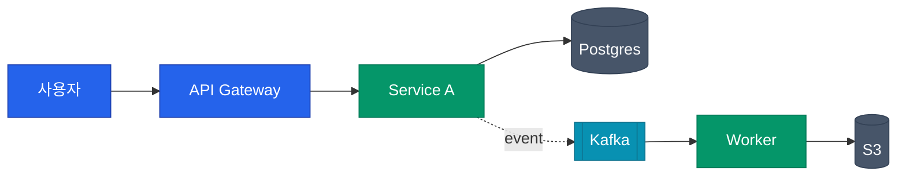
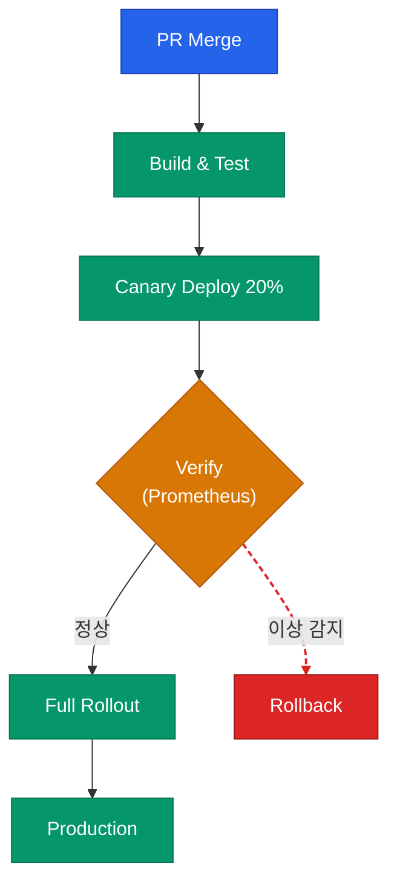
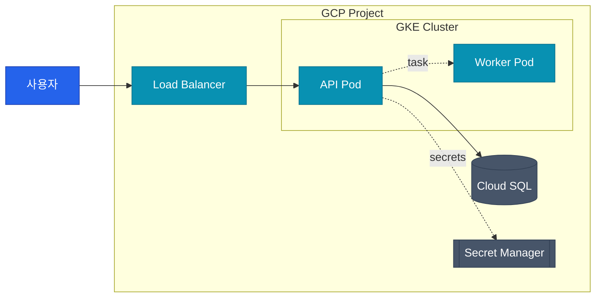
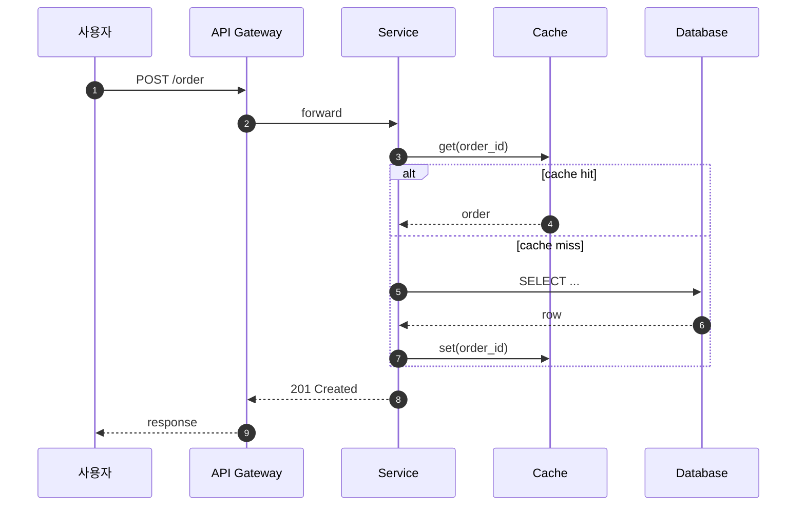

Author or improve a mermaid diagram for a blog post. The goal is not just to draw — it is to **visually distinguish information by assigning colors and edge styles per node role**.

## When to use

- Adding an architecture, flow, or dependency diagram to a post.
- Improving a dull existing mermaid block with visual emphasis.
- Converting an ASCII art diagram into mermaid.

## Principles

1. **No ASCII art** — all graph-style diagrams go in ```` ```mermaid ```` blocks.
2. **Directory trees and config hierarchies are exceptions** — if the structure is inherently textual, keep it in a plain code block.
3. **Color by node role** — nodes of the same category share a color; critical nodes get an accent color.
4. **Edge style encodes relationship type** — use solid/dashed, thickness, and color to distinguish sync vs async, success vs failure, data vs control flow.
5. **Short labels**. Put long explanations in the surrounding prose. If a node needs two lines, use `<br/>`.

## Diagram type selection

| Purpose | mermaid type |
|---------|--------------|
| Architecture, flow, dependencies | `flowchart TD` (vertical) / `flowchart LR` (horizontal) |
| Time-ordered call flow | `sequenceDiagram` |
| State transitions | `stateDiagram-v2` |
| Component relationships | `classDiagram` |
| Data models | `erDiagram` |
| Timelines | `timeline` |

Flowchart direction: **many steps → LR**, **deep hierarchy → TD**.

## Color palette (harmonized with the blog theme)

The blog auto-switches between dark and light modes, so use **colors readable in both**. Use this palette as the default.

### Base palette

```
primary  (core / user entry point)     fill:#2563eb  stroke:#1e40af  color:#ffffff
success  (happy path / completion)     fill:#059669  stroke:#047857  color:#ffffff
warn     (verification / gates)        fill:#d97706  stroke:#b45309  color:#ffffff
danger   (failure / rollback / block)  fill:#dc2626  stroke:#991b1b  color:#ffffff
info     (external systems / SaaS)     fill:#0891b2  stroke:#0e7490  color:#ffffff
neutral  (resources / storage / config) fill:#475569  stroke:#334155  color:#ffffff
muted    (reference / auxiliary)       fill:#e2e8f0  stroke:#94a3b8  color:#0f172a
```

### Role mapping

| Node role | Palette | Examples |
|-----------|---------|----------|
| User, client, trigger | primary | User, Webhook, PR Merge |
| Platform, main component | primary or info | Harness Platform, API Gateway |
| External SaaS / API | info | GitHub, GCP, Datadog |
| Success / happy path | success | Deploy Success, Approved |
| Verification / approval | warn | Verify, Approval, Review |
| Failure / rollback / reject | danger | Rollback, Reject, Fail |
| Storage / DB / cache | neutral | S3, Redis, Secret Manager |
| Annotations / optional steps | muted | Optional, Deprecated |

## Edge style rules

```
Normal flow:            A --> B
Emphasized main path:   A ==> B            (bold solid)
Async / polling:        A -. polling .-> B (dashed)
Conditional / failure:  A -.->|on fail| B  (dashed + label)
Bidirectional:          A <--> B
Labeled relationship:   A -->|kubectl| B
```

### linkStyle colors

When the graph is complex, color edges with `linkStyle`. Edge indices start at 0 in the order written.

```
linkStyle 0 stroke:#059669,stroke-width:2px;                              /* normal */
linkStyle 1 stroke:#dc2626,stroke-width:2px,stroke-dasharray:5 3;         /* failure */
linkStyle 2 stroke:#0891b2,stroke-width:1.5px;                            /* data flow */
```

## Structure rules

1. **Node IDs are short ASCII**. Labels may be Korean — `A["서비스 A"]`.
2. **Always double-quote labels**. Required when the label contains parentheses, colons, or slashes. For consistency, always use quotes.
3. **Wrap boundaries in subgraphs** — cloud boundaries, cluster boundaries, security zones.
4. **Left→right or top→bottom flow**. Avoid reversed arrows (`<-`); express feedback loops with labeled edges instead.
5. **Split once you exceed 15 nodes in a diagram** — one big-picture view plus a zoomed-in view.

## Standard templates

### 1. Basic flowchart with color classes



### 2. Deploy pipeline (with verify and rollback)



### 3. Architecture with cloud boundary



### 4. Sequence diagram (call flow)



## Node shape semantics

Mermaid node shapes give an additional category cue.

| Syntax | Shape | Recommended use |
|--------|-------|-----------------|
| `A[text]` | Rectangle | Generic component / step |
| `A(text)` | Rounded rectangle | External / SaaS |
| `A([text])` | Stadium | Start / end |
| `A[[text]]` | Subroutine | Queue / worker |
| `A[(text)]` | Cylinder | DB / storage |
| `A((text))` | Circle | Event / trigger |
| `A{text}` | Diamond | Decision / gate |
| `A{{text}}` | Hexagon | Configuration / policy |

Combining shape with color communicates meaning without a legend. e.g., DB = cylinder + neutral.

## Workflow

1. Identify the diagram's **purpose** — what should the reader see?
2. Compress to ≤10 nodes. If more, split into parent/child diagrams.
3. Pick the type (flowchart/sequence/...).
4. Map each node role to the palette.
5. Encode relationship types via edge styles.
6. Group bounded regions with subgraphs.
7. Apply visuals with `classDef` + `class` and, if needed, `linkStyle`.
8. Mentally render: is the critical path obvious at a glance? Are the colors within 4–5?

## Prohibitions

- Never use more than 6 colors in one diagram (information overload).
- Never distinguish nodes by thin borders alone without fill color (poor dark-mode contrast).
- No ASCII art diagrams.
- Do not override themes globally with `%%{init: ... }%%` — it conflicts with the blog's auto (`dark`/`default`) theme setup.
- Do not end node labels with a period — use names or noun phrases.
- Avoid unnecessary direction changes (`flowchart RL`, `flowchart BT`).

## Checklist for improving an existing mermaid block

Go through in order:

- [ ] Is there a `classDef` per node role?
- [ ] Is the critical path visible at a glance (bold edge or accent color)?
- [ ] Are failure/rollback paths visually distinct (`danger` + dashed)?
- [ ] Are external systems separated from internal ones (`info` color or subgraph)?
- [ ] Are storage/DB nodes cylinder + neutral?
- [ ] Are labels concise (one line; use `<br/>` when needed)?
- [ ] Is the total color count ≤5?
