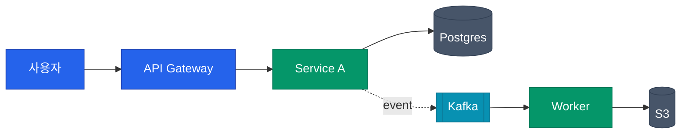
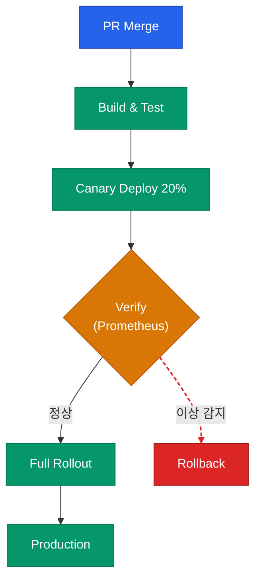
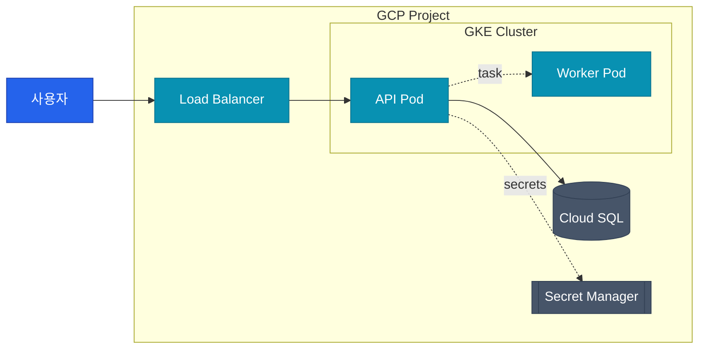
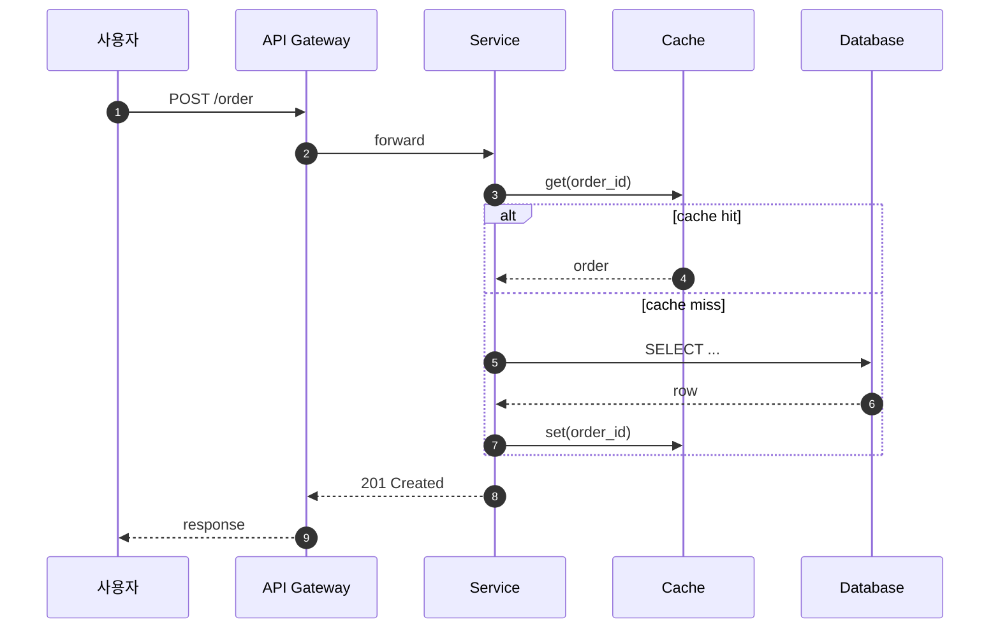

블로그 포스트에 들어갈 mermaid 다이어그램을 작성·개선한다. 단순히 그리는 것이 아니라 **노드 종류별 색상·선 스타일로 정보를 시각적으로 구분**하는 것이 목적이다.

## 언제 사용하는가

- 포스트에 아키텍처/흐름도/의존 관계 등을 넣을 때.
- 기존 포스트의 mermaid 블록이 단조로울 때 시각 강조를 추가할 때.
- ASCII art 다이어그램을 mermaid로 전환할 때.

## 기본 원칙

1. **ASCII art 금지**: 그래프성 다이어그램은 전부 ```` ```mermaid ```` 블록.
2. **디렉토리 트리·설정 계층은 예외**: 구조 자체가 텍스트 표현이면 plain code block 유지.
3. **노드 역할에 따라 색을 다르게** — 같은 카테고리 노드는 같은 색, 눈에 띄어야 할 핵심 노드는 강조색.
4. **선(edge) 스타일로 관계 종류 구분** — 실선·점선·굵기·색으로 동기/비동기, 정상/실패 경로, 데이터/제어 흐름을 구분.
5. **라벨은 짧게**. 긴 설명은 본문 산문으로. 한 노드에 2줄 이상이면 `<br/>` 사용.

## 다이어그램 유형 선택

| 용도 | mermaid 타입 |
|------|--------------|
| 아키텍처, 흐름도, 의존 관계 | `flowchart TD` (세로) / `flowchart LR` (가로) |
| 시간 순 호출 흐름 | `sequenceDiagram` |
| 상태 전이 | `stateDiagram-v2` |
| 컴포넌트 관계 | `classDiagram` |
| 데이터 모델 | `erDiagram` |
| 타임라인 | `timeline` |

flowchart 방향: **단계가 많으면 LR**, **계층이 깊으면 TD**.

## 색상 팔레트 (블로그 테마와 조화)

블로그가 dark/light 자동 전환이라 **양쪽에서 모두 가독성 있는 색**을 사용한다. 아래 팔레트를 기본값으로 쓴다.

### 기본 팔레트

```
primary  (핵심·사용자 진입점)   fill:#2563eb  stroke:#1e40af  color:#ffffff
success  (정상 경로·완료)       fill:#059669  stroke:#047857  color:#ffffff
warn     (검증·게이트)          fill:#d97706  stroke:#b45309  color:#ffffff
danger   (실패·롤백·차단)       fill:#dc2626  stroke:#991b1b  color:#ffffff
info     (외부 시스템·SaaS)     fill:#0891b2  stroke:#0e7490  color:#ffffff
neutral  (리소스·저장소·설정)   fill:#475569  stroke:#334155  color:#ffffff
muted    (참고·부가 노드)       fill:#e2e8f0  stroke:#94a3b8  color:#0f172a
```

### 역할 매핑 가이드

| 노드 성격 | 팔레트 | 예시 |
|-----------|--------|------|
| 사용자·클라이언트·트리거 | primary | 사용자, Webhook, PR 머지 |
| 플랫폼·주 컴포넌트 | primary 또는 info | Harness Platform, API Gateway |
| 외부 SaaS·API | info | GitHub, GCP, Datadog |
| 정상 결과·성공 경로 | success | Deploy Success, Approved |
| 검증·승인 단계 | warn | Verify, Approval, Review |
| 실패·롤백·거부 | danger | Rollback, Reject, Fail |
| 저장소·DB·캐시 | neutral | S3, Redis, Secret Manager |
| 주석·선택적 단계 | muted | Optional, Deprecated |

## 선(edge) 스타일 규칙

```
정상 플로우:       A --> B
강조된 주 경로:    A ==> B           (굵은 실선)
비동기/polling:    A -. polling .-> B  (점선)
조건부/실패:       A -.->|on fail| B   (점선 + 라벨)
양방향 통신:       A <--> B
라벨이 있는 관계:  A -->|kubectl| B
```

### linkStyle 색상

구조가 복잡할 땐 `linkStyle` 로 선 색을 지정한다. 선 인덱스는 0부터 작성 순서.

```
linkStyle 0 stroke:#059669,stroke-width:2px;   /* 정상 */
linkStyle 1 stroke:#dc2626,stroke-width:2px,stroke-dasharray:5 3;   /* 실패 */
linkStyle 2 stroke:#0891b2,stroke-width:1.5px;   /* 데이터 흐름 */
```

## 구조 규칙

1. **노드 ID는 짧은 영문**. 라벨만 한글 허용 — `A["서비스 A"]`.
2. **라벨은 반드시 쌍따옴표**. 괄호·콜론·슬래시가 들어가면 필수. 일관성 위해 항상 사용 권장.
3. **서브그래프(subgraph)** 로 경계 영역을 묶는다. 클라우드 경계, 클러스터 경계, 보안 영역 등.
4. **좌→우 or 위→아래 흐름**. 중간에 역행 화살표는 `<-` 사용 대신 피드백 루프 라벨로 표현.
5. **한 다이어그램에 노드 15개 이상이면 분할**. 큰 그림 한 번, 상세 한 번.

## 표준 템플릿

### 1. 기본 flowchart with 색상 클래스



### 2. 배포 파이프라인 (검증·롤백 포함)



### 3. 클라우드 경계를 가진 아키텍처



### 4. 시퀀스 다이어그램 (호출 흐름)



## 노드 모양 의미

mermaid 노드 모양으로 카테고리 추가 힌트 제공 가능.

| 구문 | 모양 | 권장 용도 |
|------|------|-----------|
| `A[text]` | 사각형 | 일반 컴포넌트·스텝 |
| `A(text)` | 둥근 사각형 | 외부·SaaS |
| `A([text])` | 스타디움 | 시작·종료 |
| `A[[text]]` | 서브루틴 | 큐·워커 |
| `A[(text)]` | 원통 | DB·저장소 |
| `A((text))` | 원 | 이벤트·트리거 |
| `A{text}` | 다이아몬드 | 판단·게이트 |
| `A{{text}}` | 육각형 | 설정·정책 |

모양과 색을 함께 쓰면 범례 없이도 의미가 전달된다. 예: DB는 원통 + neutral 색.

## 작업 순서

1. 다이어그램의 **목적**을 파악 (뭘 보여주려는지).
2. 노드 수 10개 이하로 압축. 넘치면 상위/하위로 분할.
3. 타입 선택 (flowchart/sequence/…).
4. 노드 역할별로 색상 팔레트 매핑.
5. 선 스타일로 관계 종류 표현.
6. 서브그래프로 경계가 있으면 묶기.
7. `classDef` + `class` + 필요하면 `linkStyle` 로 시각 스타일 적용.
8. 렌더 결과를 머릿속으로 점검 — 한눈에 핵심 경로가 보이는지, 색이 너무 많지 않은지(4~5색 이내).

## 금지 사항

- 한 다이어그램에 색상 6개 이상 사용 금지 (정보 과잉).
- 배경색 없이 얇은 선만으로 노드 구분 금지 (dark 모드에서 가독성 저하).
- ASCII art 다이어그램 사용 금지.
- `%%{init: ... }%%` 로 테마 전역 덮어쓰기 금지 — 블로그 전역 테마(`dark`/`default` 자동) 설정과 충돌.
- 노드 라벨에 마침표로 끝나는 문장 사용 금지 — 이름·명사구로.
- 불필요한 방향 변경 (`flowchart RL`, `flowchart BT`) 금지.

## 기존 mermaid 블록 개선 체크리스트

기존 그래프를 다듬을 때 순서대로 확인:

- [ ] 노드 역할별로 `classDef` 가 있는가?
- [ ] 핵심 경로가 한눈에 보이는가? (굵은 선 or 강조색)
- [ ] 실패/롤백 경로가 시각적으로 구분되는가? (`danger` + 점선)
- [ ] 외부 시스템이 내부와 구분되는가? (`info` 색 또는 subgraph)
- [ ] 저장소·DB는 원통 모양 + neutral 색인가?
- [ ] 라벨이 간결한가? (한 줄 원칙, 길면 `<br/>`)
- [ ] 전체 색상 수가 5개 이하인가?
