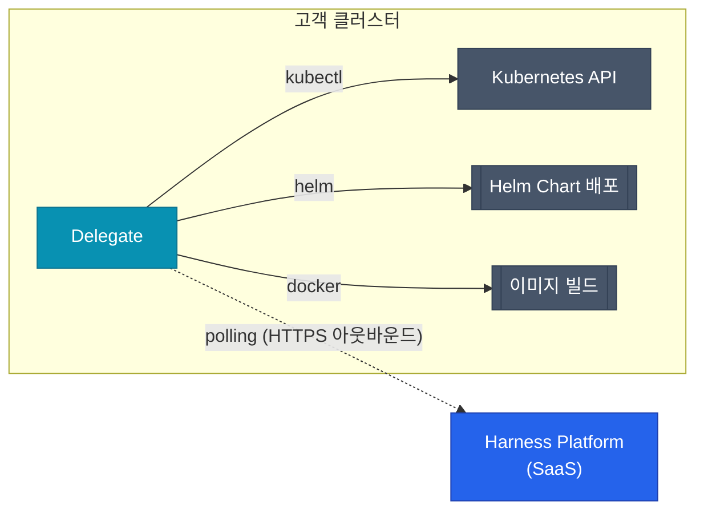

## 문제의 시작 — 기존 도구의 한계

Jenkins를 오래 운영해본 팀이라면 공통적으로 겪는 문제가 있어요.

- **플러그인 지옥**: 기능 하나를 추가할 때마다 플러그인 의존성이 쌓이고, 버전 충돌이 발생해요.
- **배포 전략의 부재**: Canary나 Blue/Green 배포를 직접 스크립트로 구현해야 하고, 롤백 로직도 수동이에요.
- **상태 추적 불가**: 현재 어느 버전이 어느 환경에 배포되어 있는지 파이프라인 밖에서 추적하기 어려워요.

GitHub Actions는 이 문제를 일부 해결했어요. YAML 기반의 선언적 설정, Marketplace 액션, PR 연동은 큰 개선이었어요. 하지만 여전히 복잡한 배포 전략, 자동 검증, 롤백은 직접 구현해야 해요.

Harness는 이 지점에서 출발해요. **"빌드·배포 자동화"가 아니라 "소프트웨어 딜리버리 전체를 제품으로 만든다"** 는 철학이에요.

## Harness가 다른 이유

  
핵심 차이

  Jenkins와 GitHub Actions는 파이프라인을 실행하는 도구예요. Harness는 파이프라인 실행 결과를 기반으로 배포의 안전성을 판단하고, 문제가 생기면 스스로 롤백해요. 도구가 아니라 플랫폼이에요.

| 비교 항목 | Jenkins | GitHub Actions | Harness |
|-----------|---------|----------------|---------|
| 배포 전략 | 플러그인 또는 스크립트 | 수동 구현 | Canary·Blue/Green 기본 내장 |
| 자동 롤백 | 없음 | 없음 | ML 기반 이상 감지 후 자동 롤백 |
| 배포 검증 | 없음 | 없음 | Prometheus·Datadog 연동 자동 검증 |
| Feature Flags | 없음 | 없음 | 기본 모듈로 제공 |
| 클라우드 비용 | 없음 | 없음 | Cloud Cost Management 모듈 |
| 거버넌스 | 없음 | 제한적 | OPA 정책, Approval 게이트 |
| 설정 방식 | Groovy DSL | YAML | YAML + UI (동기화) |
| 서비스 카탈로그 | 없음 | 없음 | Internal Developer Portal |

## Harness의 구조

Harness는 여러 모듈의 집합이에요. 필요한 모듈만 선택해서 사용할 수 있어요.

| 모듈 | 약자 | 역할 |
|------|------|------|
| Continuous Integration | CI | 빌드, 테스트, 이미지 빌드·푸시 |
| Continuous Delivery | CD | Kubernetes, ECS, Lambda, VM 배포 |
| Feature Flags | FF | 런타임 기능 플래그 관리 |
| Cloud Cost Management | CCM | 클라우드 비용 가시성 및 최적화 |
| Security Testing Orchestration | STO | SAST·DAST·SCA 결과 통합 |
| Chaos Engineering | CE | 장애 주입과 복원력 검증 |
| Internal Developer Portal | IDP | 서비스 카탈로그, 개발자 포털 |
| Service Reliability Management | SRM | SLO·에러 버짓 관리 |

## 핵심 개념 — Pipeline부터 Delegate까지

### Pipeline

Harness의 기본 실행 단위예요. **Stage** 의 묶음으로 구성되고, UI에서 만들거나 YAML로 직접 작성할 수 있어요. Git 저장소에 YAML로 저장해 코드로 관리하는 것을 권장해요.

### Stage

파이프라인 안의 독립적인 실행 블록이에요. 타입에 따라 동작이 달라져요.

| Stage 타입 | 설명 |
|------------|------|
| `CI` | 빌드, 테스트, 이미지 푸시 |
| `Deployment` | 서비스 배포 (Kubernetes, ECS 등) |
| `Approval` | 사람 또는 Jira·ServiceNow 승인 게이트 |
| `Custom` | 임의 스크립트 실행 |
| `Feature Flag` | FF 활성화·비활성화 |

### Step

Stage 안의 개별 작업 단위예요. Harness는 100개 이상의 내장 Step 타입을 제공하고, Shell Script Step으로 커스텀 작업도 가능해요.

### Connector

GitHub, GCP, AWS, Docker Hub 등 외부 서비스와의 인증 정보를 저장하는 설정이에요. 한 번 등록하면 모든 파이프라인에서 재사용해요. 인증 정보는 Harness Secret Manager에 암호화 저장돼요.

### Delegate

Harness 플랫폼이 실제 인프라에 명령을 실행하기 위해 사용하는 **에이전트**예요. Kubernetes 클러스터나 VM에 설치하고, Harness 플랫폼은 Delegate를 통해 kubectl, helm, terraform 등의 명령을 실행해요.

Delegate는 **아웃바운드 연결만** 사용해요. 인바운드 포트를 열 필요가 없어 방화벽 정책이 단순해요.

### Service와 Environment

- **Service**: 배포할 애플리케이션 정의. 이미지, Helm 값, manifest를 포함해요.
- **Environment**: 배포 대상 환경. `Production`, `Staging`, `Development` 타입으로 구분해요.
- **Infrastructure**: Environment 안의 실제 인프라 연결 정보 (클러스터, 네임스페이스 등).

## Harness가 적합한 팀

Harness가 특히 효과적인 상황:

- 여러 팀이 동일한 배포 플랫폼을 공유해야 할 때
- Canary·Blue/Green 배포를 신뢰성 있게 운영하고 싶을 때
- 배포 실패 시 자동 롤백이 필요할 때
- Feature Flags로 배포와 릴리즈를 분리하고 싶을 때
- 클라우드 비용을 파이프라인 수준에서 추적하고 싶을 때

반면 단순한 빌드·배포 자동화만 필요하다면 GitHub Actions가 더 가볍고 빨라요. Harness는 그 위에 **엔지니어링 플랫폼** 이 필요한 시점에 도입하는 게 적절해요.

다음 글에서는 Harness의 핵심 컴포넌트인 Delegate를 실제로 설치하고 환경을 구성하는 방법을 다뤄요.
