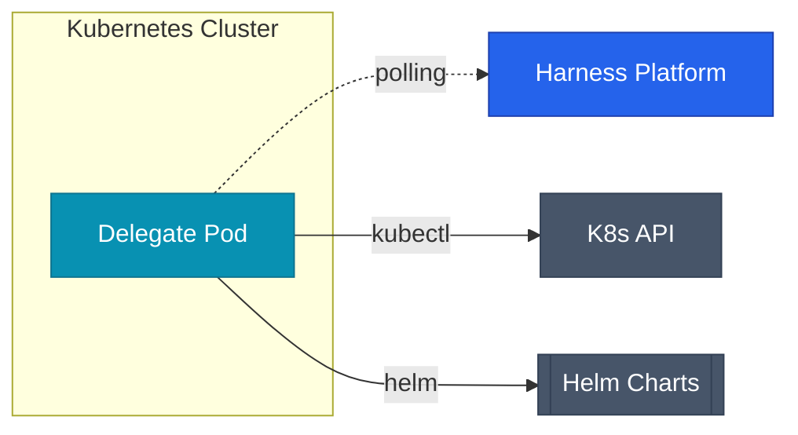

## Delegate란 무엇인가

Harness는 SaaS 플랫폼이지만, 실제 배포 명령은 사용자 인프라 안에서 실행돼요. 이 역할을 하는 게 **Delegate**예요.

Delegate는 Kubernetes Pod 또는 VM에 설치되는 경량 에이전트로, Harness 플랫폼과 **아웃바운드 HTTPS 연결**만 유지해요. 인바운드 포트를 열 필요가 없어서 네트워크 보안 정책을 그대로 유지할 수 있어요.



Delegate가 Harness로부터 태스크를 받으면, 실제 인프라에 kubectl·helm·terraform 등의 명령을 실행하고 결과를 다시 플랫폼으로 전송해요.

## 사전 요구사항

| 항목 | 요구 사양 |
|------|-----------|
| Kubernetes | 1.24 이상 |
| Helm | 3.x |
| Delegate Pod CPU | 최소 0.5 vCPU, 권장 1 vCPU |
| Delegate Pod Memory | 최소 768Mi, 권장 2Gi |
| 아웃바운드 연결 | `app.harness.io:443`, `storage.googleapis.com:443` |
| 클러스터 권한 | `cluster-admin` 또는 커스텀 RBAC |

## 1단계 — Harness 계정 준비

`app.harness.io` 에서 계정을 생성해요. Free Plan은 제한이 있지만 PoC에는 충분해요.

설치에 필요한 두 가지 값을 미리 확인해요.

- **Account ID**: `Account Settings > Overview`
- **Delegate Token**: `Account Settings > Delegates > Tokens > New Token`

<div class="callout why">
  <div class="callout-title">Token vs Account Secret</div>
  Delegate Token은 Delegate 전용 인증 토큰이에요. Account Secret과 별개로 관리되고, Delegate별로 다른 토큰을 발급해 권한을 분리할 수 있어요. 프로덕션 환경과 스테이징 환경의 Delegate는 토큰을 분리하는 걸 권장해요.
</div>

## 2단계 — Kubernetes Delegate 설치

### Helm 레포지토리 추가

```bash
helm repo add harness https://app.harness.io/storage/harness-download/harness-helm-charts/
helm repo update
```

### Delegate 설치

```bash
helm install harness-delegate harness/harness-delegate-ng \
  --namespace harness-delegate \
  --create-namespace \
  --set delegateName=k8s-prod-delegate \
  --set accountId=YOUR_ACCOUNT_ID \
  --set delegateToken=YOUR_DELEGATE_TOKEN \
  --set managerEndpoint=https://app.harness.io \
  --set delegateDockerImage=harness/delegate:24.10.84200 \
  --set replicas=2 \
  --set upgrader.enabled=true
```

- `replicas=2`: Delegate HA 구성. 최소 2개 이상을 권장해요.
- `upgrader.enabled=true`: Delegate 자동 업그레이드 활성화.

### 설치 확인

```bash
kubectl get pods -n harness-delegate

# 정상 출력
NAME                                    READY   STATUS    RESTARTS   AGE
k8s-prod-delegate-7d9f8b6c4-xk2jm      1/1     Running   0          2m
k8s-prod-delegate-7d9f8b6c4-zp8nq      1/1     Running   0          2m
```

Harness UI에서도 확인해요: `Account Settings > Delegates` 에서 `CONNECTED` 상태인지 확인해요.

### Delegate RBAC 커스터마이징

기본 설치는 `cluster-admin` 권한을 사용해요. 최소 권한 원칙을 따르려면 별도 ClusterRole을 생성해요.

```yaml
apiVersion: rbac.authorization.k8s.io/v1
kind: ClusterRole
metadata:
  name: harness-delegate-role
rules:
  - apiGroups: ["*"]
    resources: ["deployments", "services", "configmaps", "secrets",
                "pods", "replicasets", "statefulsets", "daemonsets",
                "ingresses", "horizontalpodautoscalers"]
    verbs: ["get", "list", "watch", "create", "update", "patch", "delete"]
  - apiGroups: ["apps"]
    resources: ["deployments", "replicasets"]
    verbs: ["get", "list", "watch", "create", "update", "patch", "delete"]
```

## 3단계 — Connector 등록

Connector는 외부 서비스와의 인증 정보를 저장해요. 한 번 등록하면 모든 파이프라인에서 재사용해요.

### GitHub Connector

```yaml
connector:
  name: github-main
  identifier: github_main
  type: Github
  spec:
    url: https://github.com/your-org
    connectionType: Account
    authentication:
      type: Http
      spec:
        type: UsernameToken
        spec:
          username: your-github-username
          tokenRef: account.github_pat
    apiAccess:
      type: Token
      spec:
        tokenRef: account.github_pat
```

`tokenRef` 는 Secret Manager에 저장된 시크릿을 참조해요. YAML에 토큰을 직접 쓰지 않아요.

### GCP Connector (Service Account Key 방식)

```yaml
connector:
  name: gcp-prod
  identifier: gcp_prod
  type: Gcp
  spec:
    credential:
      type: ManualConfig
      spec:
        secretKeyRef: account.gcp_sa_key_prod
```

### Artifact Registry Connector

GCP Artifact Registry에서 이미지를 pull/push하는 Connector예요.

```yaml
connector:
  name: gar-prod
  identifier: gar_prod
  type: GcpContainerRegistry
  spec:
    url: asia-northeast3-docker.pkg.dev
    credentialType: ManualConfig
    manualConfig:
      usernameRef: account.gar_username
      passwordRef: account.gcp_sa_key_prod
```

## 4단계 — Secret Manager 설정

Harness는 기본 내장 Secret Manager를 제공하지만, 프로덕션에서는 GCP Secret Manager 또는 HashiCorp Vault 연동을 권장해요.

### GCP Secret Manager 연동

```yaml
secretManager:
  name: gcp-secret-manager-prod
  identifier: gcp_sm_prod
  type: GcpSecretManager
  spec:
    credentialsRef: account.gcp_prod
    projectId: your-gcp-project-id
    isDefault: true
```

`isDefault: true` 로 설정하면 새로 생성하는 모든 시크릿이 이 Secret Manager에 저장돼요.

### 시크릿 등록 예시

```yaml
secret:
  name: github-pat
  identifier: github_pat
  type: SecretText
  spec:
    secretManagerIdentifier: gcp_sm_prod
    valueType: Reference
    value: projects/your-project/secrets/github-pat/versions/latest
```

## 5단계 — Environment와 Infrastructure 정의

배포 대상 환경을 정의해요. Environment는 논리적 환경이고, Infrastructure는 실제 클러스터 연결 정보예요.

```yaml
environment:
  name: production
  identifier: production
  type: Production

---

infrastructureDefinition:
  name: k8s-prod-cluster
  identifier: k8s_prod_cluster
  environmentRef: production
  deploymentType: Kubernetes
  spec:
    type: KubernetesDirect
    spec:
      connectorRef: account.gcp_prod
      namespace: production
      releaseName: release-<+INFRA_KEY>
```

`<+INFRA_KEY>` 는 Harness가 자동 생성하는 인프라 식별자로, 같은 클러스터에 여러 서비스를 배포할 때 릴리즈 이름 충돌을 방지해요.

## Delegate 운영 팁

### 버전 관리

Harness Platform과 Delegate 간 버전 차이는 최대 **3 minor 버전** 이내로 유지해야 해요. `upgrader.enabled=true` 설정으로 자동 업그레이드를 활성화하거나, 주기적으로 수동 업그레이드해요.

```bash
# 현재 Delegate 버전 확인
kubectl exec -n harness-delegate \
  $(kubectl get pod -n harness-delegate -l app=harness-delegate -o jsonpath='{.items[0].metadata.name}') \
  -- cat /opt/harness-delegate/version
```

### 로그 모니터링

```bash
# 실시간 로그
kubectl logs -f -n harness-delegate -l app=harness-delegate

# 특정 태스크 로그 필터링
kubectl logs -n harness-delegate -l app=harness-delegate | grep "TASK_ID"
```

### Delegate Selector

여러 Delegate가 있을 때 특정 파이프라인이 특정 Delegate를 사용하도록 제한할 수 있어요.

```yaml
# Delegate에 태그 설정 (Helm values)
delegateTags:
  - prod-cluster
  - gcp-region-kr

# 파이프라인에서 Selector 사용
delegateSelectors:
  - prod-cluster
```

다음 글에서는 이 환경 위에 실제 CI/CD 파이프라인을 설계하고 Canary 배포를 구현해요.
