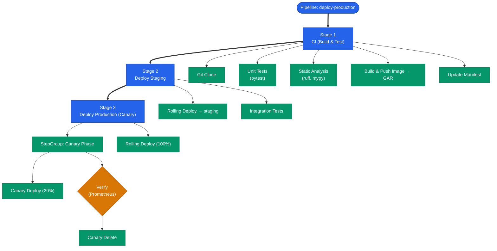
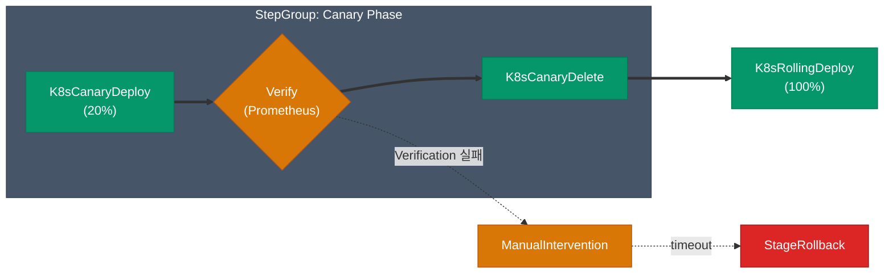
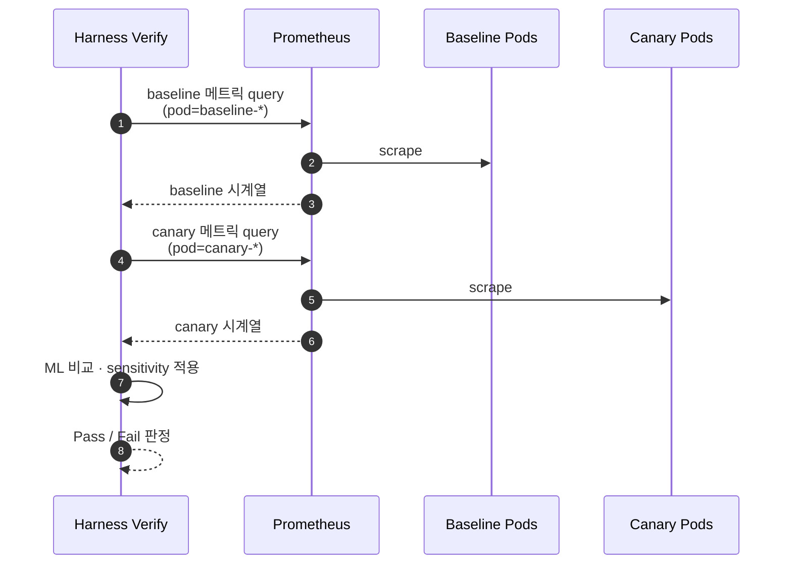

## 파이프라인 설계 원칙

Harness 파이프라인을 설계할 때 고려해야 할 세 가지 원칙이 있어요.

1. **관심사 분리**: CI Stage와 CD Stage는 명확히 분리해요. 빌드 결과물(이미지 태그)을 CD Stage로 전달하는 방식을 표준화해요.
2. **검증 자동화**: 배포 후 사람이 직접 확인하는 대신, 메트릭과 로그를 기반으로 자동 검증해요.
3. **Failure Strategy 명시**: 모든 Stage에 실패 시 동작을 명시적으로 정의해요.

## 전체 파이프라인 구조



## CI Stage 구성

CI Stage는 **전용 빌드 네임스페이스의 Kubernetes Pod 위에서** 실행돼요. `infrastructure.spec` 에 `connectorRef` 와 `namespace` 를 지정하고, 캐시 경로를 선언하면 Run 간 의존성이 보존돼요.

Step은 세 가지 조합이면 대부분 덮여요.

| Step 타입 | 역할 | 핵심 필드 |
|-----------|------|-----------|
| `Run` | 컨테이너에서 임의 명령 | `image`, `command`, `reports` |
| `BuildAndPushGAR` | GAR에 이미지 빌드·푸시 | `projectID`, `imageName`, `tags` |
| `BuildAndPushDockerRegistry` | 일반 레지스트리 | `connectorRef`, `repo`, `tags` |

가장 자주 쓰는 이미지 빌드·푸시 Step의 핵심만 보면 이렇게 끝나요.

```yaml
- step:
    name: Build and Push Image
    type: BuildAndPushGAR
    spec:
      connectorRef: account.gcp_prod
      host: asia-northeast3-docker.pkg.dev
      projectID: your-gcp-project
      imageName: your-service
      tags:
        - <+pipeline.sequenceId>
        - <+trigger.commitSha>
```

테스트·정적 분석은 `Run` Step으로 `pytest` / `ruff` / `mypy` 를 돌리고 JUnit 리포트를 `reports.spec.paths` 로 수집해요.

<div class="callout why">
  <div class="callout-title">이미지 태그 전략</div>
  <code>latest</code> 태그 대신 <code>pipeline.sequenceId</code>와 <code>commitSha</code>를 함께 붙여요. sequenceId는 사람이 읽기 쉽고, commitSha는 정확한 코드 추적을 가능하게 해요. 나중에 OPA 정책으로 <code>latest</code> 태그 사용을 차단할 수 있어요.
</div>

## Staging 배포 Stage

Deployment Stage는 **Service + Environment + Infrastructure** 세 참조로 배포 대상을 묶어요. CI Stage에서 만든 이미지 태그를 `artifacts.primary.sources.spec.tag` 로 주입해요. 실행 순서는 `K8sRollingDeploy` → `Run`(통합 테스트) 이고, 실패 시 `K8sRollingRollback` 이 `rollbackSteps` 에서 자동 실행돼요.

```yaml
execution:
  steps:
    - step: { type: K8sRollingDeploy, spec: { pruningEnabled: true } }
    - step:
        name: Integration Tests
        type: Run
        spec:
          image: python:3.12-slim
          command: uv run pytest tests/integration/ --base-url=https://staging.your-service.internal
rollbackSteps:
  - step: { type: K8sRollingRollback }
```

## Production Canary 배포 Stage

Canary 배포의 핵심은 **소량의 트래픽으로 먼저 검증하고, 문제가 없을 때만 전체로 확장** 하는 거예요. Harness에서는 세 개의 Step을 하나의 StepGroup으로 묶어 "카나리 단계"를 만들고, 그 뒤에 전체 롤아웃을 이어붙여요.



StepGroup 내부의 핵심 필드만 추리면 이런 구조예요.

```yaml
- stepGroup:
    name: Canary Phase
    steps:
      - step:
          type: K8sCanaryDeploy
          spec:
            instanceSelection: { type: Percentage, spec: { percentage: 20 } }
      - step:
          type: Verify
          timeout: 10m
          spec:
            type: Canary
            healthSources: [ { identifier: prometheus_prod } ]
            sensitivity: MEDIUM
          failureStrategies:
            - onFailure:
                errors: [ Verification ]
                action:
                  type: ManualIntervention
                  spec: { timeout: 30m, onTimeout: { action: { type: StageRollback } } }
      - step: { type: K8sCanaryDelete }

- step: { type: K8sRollingDeploy }   # 100% 롤아웃
```

`rollbackSteps` 에는 `K8sCanaryDelete` → `K8sRollingRollback` 순서로 넣어 부분 실패와 완전 롤아웃 후 실패를 모두 커버해요.

## Prometheus 검증 설정

Verify Step은 **기존 Pod(baseline)** 과 **Canary Pod** 의 동일 메트릭을 같은 시간 창에서 비교해요. 단순 임계값 초과가 아니라 패턴의 유의미한 차이를 ML 모델로 판단해요.



Harness가 baseline과 canary를 구분할 수 있도록 **`serviceInstanceFieldName`** 에 Pod 라벨을 지정해요. 메트릭 정의는 여러 개를 붙일 수 있지만 구조는 동일해요.

```yaml
healthSources:
  - identifier: prometheus_prod
    type: Prometheus
    spec:
      connectorRef: account.prometheus_prod
      metricDefinitions:
        - identifier: error_rate
          query: |
            sum(rate(http_requests_total{service="your-service",status=~"5.."}[5m]))
            / sum(rate(http_requests_total{service="your-service"}[5m]))
          analysis:
            deploymentVerification: { serviceInstanceFieldName: pod }
            riskProfile: { category: Performance, thresholdTypes: [FailImmediately] }
```

`thresholdTypes` 는 메트릭 성격에 따라 골라요.

| 값 | 의미 | 적합한 메트릭 |
|----|------|---------------|
| `FailImmediately` | 즉시 실패 | 5xx 에러율 |
| `ObserveForever` | 관찰만, 실패 유발 안 함 | 대시보드용 정보 지표 |
| `Ignore` | 분석 제외 | 노이즈 큰 지표 |

<div class="callout why">
  <div class="callout-title">sensitivity 선택 기준</div>
  <code>LOW</code> 는 큰 변화만 탐지(오탐 낮음·위험 통과 가능), <code>HIGH</code> 는 작은 변화도 잡음(오탐 증가). 초기에는 <code>MEDIUM</code> 으로 두고, 자주 ManualIntervention이 뜨는 팀은 <code>LOW</code> 로 완화하는 게 현실적이에요.
</div>

## Harness 표현식 활용

Harness는 `<+ >` 문법으로 런타임 값을 참조해요.

| 표현식 | 값 |
|--------|----|
| `<+pipeline.sequenceId>` | 파이프라인 실행 번호 (1, 2, 3...) |
| `<+pipeline.executionId>` | 파이프라인 실행 UUID |
| `<+artifact.tag>` | 배포 중인 이미지 태그 |
| `<+artifact.image>` | 이미지 전체 경로 |
| `<+env.name>` | 현재 환경 이름 |
| `<+env.type>` | 환경 타입 (Production, Staging 등) |
| `<+trigger.commitSha>` | 트리거된 Git 커밋 SHA |
| `<+trigger.targetBranch>` | PR 대상 브랜치 |
| `<+secrets.getValue("key")>` | Secret Manager에서 값 조회 |
| `<+stage.output.outputVariables.IMAGE_TAG>` | 이전 Stage 출력 변수 |

### Stage 간 데이터 전달

CI Stage에서 `outputVariables` 로 내보낸 값은 CD Stage에서 `<+pipeline.stages.<stage>.spec.execution.steps.<step>.output.outputVariables.<name>>` 경로로 참조해요. 이미지 태그는 대부분 `<+pipeline.sequenceId>` 를 그대로 쓰면 되지만, 빌드 시 동적으로 생성한 태그가 필요하다면 이 패턴으로 넘겨요.

## Failure Strategy 설계

| 에러 유형 | 권장 액션 | 이유 |
|-----------|-----------|------|
| `AllErrors` | `StageRollback` | 예상치 못한 오류는 안전하게 롤백 |
| `Verification` | `ManualIntervention` → timeout 후 `StageRollback` | 메트릭 이상은 사람이 판단할 여지를 줌 |
| `Timeout` | `StageRollback` | 타임아웃은 무조건 롤백 |
| `ApprovalRejection` | `PipelineRollback` | 승인 거부는 전체 파이프라인 중단 |

Verify 실패는 사람이 판단할 여지를 주고(30분 대기), Timeout·AllErrors는 바로 롤백으로 잇는 조합이 실전에서 가장 안전해요.

## 파이프라인 트리거 설정

GitHub Webhook 트리거는 `payloadConditions` 로 브랜치·경로를 좁히고, `autoAbortPreviousExecutions: true` 로 연속 push 시 이전 실행을 자동 취소해요. 이 두 옵션만 챙기면 트리거 설정은 끝이에요.

다음 글에서는 Feature Flags로 배포와 릴리즈를 분리하는 방법과 OPA 기반 거버넌스 정책을 다뤄요.
