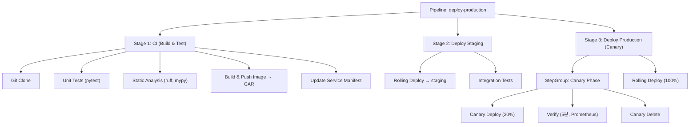

## 파이프라인 설계 원칙

Harness 파이프라인을 설계할 때 고려해야 할 세 가지 원칙이 있습니다.

1. **관심사 분리**: CI Stage와 CD Stage는 명확히 분리합니다. 빌드 결과물(이미지 태그)을 CD Stage로 전달하는 방식을 표준화합니다.
2. **검증 자동화**: 배포 후 사람이 직접 확인하는 대신, 메트릭과 로그를 기반으로 자동 검증합니다.
3. **Failure Strategy 명시**: 모든 Stage에 실패 시 동작을 명시적으로 정의합니다.

## 전체 파이프라인 구조



## CI Stage 구성

```yaml
stages:
  - stage:
      name: Build and Test
      identifier: build_and_test
      type: CI
      spec:
        cloneCodebase: true
        caching:
          enabled: true
          paths:
            - /root/.cache/pip
            - /root/.cache/uv
        infrastructure:
          type: KubernetesDirect
          spec:
            connectorRef: account.gcp_prod
            namespace: harness-builds
            automountServiceAccountToken: true
            nodeSelector:
              cloud.google.com/gke-nodepool: build-pool
        execution:
          steps:
            - step:
                name: Unit Tests
                identifier: unit_tests
                type: Run
                spec:
                  connectorRef: account.gar_prod
                  image: python:3.12-slim
                  command: |
                    pip install uv
                    uv sync --frozen
                    uv run pytest tests/unit/ -v \
                      --tb=short \
                      --junit-xml=test-results.xml
                  reports:
                    type: JUnit
                    spec:
                      paths:
                        - test-results.xml

            - step:
                name: Static Analysis
                identifier: static_analysis
                type: Run
                spec:
                  connectorRef: account.gar_prod
                  image: python:3.12-slim
                  command: |
                    pip install uv
                    uv sync --frozen
                    uv run ruff check .
                    uv run mypy src/

            - step:
                name: Build and Push Image
                identifier: build_push
                type: BuildAndPushGAR
                spec:
                  connectorRef: account.gcp_prod
                  host: asia-northeast3-docker.pkg.dev
                  projectID: your-gcp-project
                  imageName: your-service
                  tags:
                    - <+pipeline.sequenceId>
                    - <+trigger.commitSha>
                  dockerfile: Dockerfile
                  buildArgs:
                    APP_VERSION: <+pipeline.sequenceId>
```

<div class="callout why">
  <div class="callout-title">이미지 태그 전략</div>
  <code>latest</code> 태그 대신 <code>pipeline.sequenceId</code>와 <code>commitSha</code>를 함께 붙입니다. sequenceId는 사람이 읽기 쉽고, commitSha는 정확한 코드 추적을 가능하게 합니다. 나중에 OPA 정책으로 <code>latest</code> 태그 사용을 차단할 수 있습니다.
</div>

## Staging 배포 Stage

```yaml
  - stage:
      name: Deploy Staging
      identifier: deploy_staging
      type: Deployment
      spec:
        deploymentType: Kubernetes
        service:
          serviceRef: your-service
          serviceInputs:
            serviceDefinition:
              spec:
                artifacts:
                  primary:
                    primaryArtifactRef: primary
                    sources:
                      - identifier: primary
                        spec:
                          tag: <+pipeline.sequenceId>
        environment:
          environmentRef: staging
          infrastructureDefinitions:
            - identifier: k8s_staging_cluster
        execution:
          steps:
            - step:
                name: Rolling Deploy
                type: K8sRollingDeploy
                spec:
                  skipDryRun: false
                  pruningEnabled: true

            - step:
                name: Integration Tests
                type: Run
                spec:
                  image: python:3.12-slim
                  command: |
                    pip install uv
                    uv run pytest tests/integration/ \
                      --base-url=https://staging.your-service.internal \
                      -v --timeout=60
          rollbackSteps:
            - step:
                name: Rollback
                type: K8sRollingRollback
```

## Production Canary 배포 Stage

Canary 배포의 핵심은 **소량의 트래픽으로 먼저 검증하고, 문제가 없을 때만 전체로 확장** 하는 것입니다.

```yaml
  - stage:
      name: Deploy Production
      identifier: deploy_production
      type: Deployment
      spec:
        deploymentType: Kubernetes
        service:
          serviceRef: your-service
          serviceInputs:
            serviceDefinition:
              spec:
                artifacts:
                  primary:
                    primaryArtifactRef: primary
                    sources:
                      - identifier: primary
                        spec:
                          tag: <+pipeline.sequenceId>
        environment:
          environmentRef: production
          infrastructureDefinitions:
            - identifier: k8s_prod_cluster
        execution:
          steps:
            - stepGroup:
                name: Canary Phase
                identifier: canary_phase
                steps:
                  - step:
                      name: Canary Deploy
                      identifier: canary_deploy
                      type: K8sCanaryDeploy
                      spec:
                        instanceSelection:
                          type: Percentage
                          spec:
                            percentage: 20
                        skipDryRun: false

                  - step:
                      name: Canary Verification
                      identifier: canary_verify
                      type: Verify
                      timeout: 10m
                      spec:
                        type: Canary
                        monitoredService:
                          type: Default
                        healthSources:
                          - identifier: prometheus_prod
                        analysisMode: Auto
                        sensitivity: MEDIUM
                      failureStrategies:
                        - onFailure:
                            errors:
                              - Verification
                            action:
                              type: ManualIntervention
                              spec:
                                timeout: 30m
                                onTimeout:
                                  action:
                                    type: StageRollback

                  - step:
                      name: Canary Delete
                      identifier: canary_delete
                      type: K8sCanaryDelete

            - step:
                name: Full Rollout
                identifier: full_rollout
                type: K8sRollingDeploy
                spec:
                  skipDryRun: false

          rollbackSteps:
            - step:
                name: Canary Delete on Rollback
                type: K8sCanaryDelete
            - step:
                name: Rolling Rollback
                type: K8sRollingRollback

      failureStrategies:
        - onFailure:
            errors:
              - AllErrors
            action:
              type: StageRollback
```

## Prometheus 검증 설정

Harness Verify Step은 배포 전후의 메트릭을 비교합니다. Prometheus를 Health Source로 연결하는 설정입니다.

```yaml
monitoredService:
  name: your-service-prod
  type: Application
  spec:
    sources:
      healthSources:
        - name: Prometheus
          identifier: prometheus_prod
          type: Prometheus
          spec:
            connectorRef: account.prometheus_prod
            metricDefinitions:
              - identifier: error_rate
                metricName: Error Rate
                query: |
                  sum(rate(http_requests_total{
                    service="your-service",
                    status=~"5.."
                  }[5m])) /
                  sum(rate(http_requests_total{
                    service="your-service"
                  }[5m]))
                analysis:
                  deploymentVerification:
                    serviceInstanceFieldName: pod
                    serviceInstanceMetricPath: error_rate
                  riskProfile:
                    category: Performance
                    thresholdTypes:
                      - FailImmediately

              - identifier: p99_latency
                metricName: P99 Latency
                query: |
                  histogram_quantile(0.99,
                    sum(rate(http_request_duration_seconds_bucket{
                      service="your-service"
                    }[5m])) by (le)
                  )
                analysis:
                  riskProfile:
                    category: Performance
                    thresholdTypes:
                      - ObserveForever
```

<div class="callout why">
  <div class="callout-title">Verify Step의 동작 방식</div>
  Harness는 배포 전 기간(baseline)과 Canary 배포 후 기간(canary)의 메트릭을 ML 모델로 비교합니다. 단순히 임계값을 초과하는지 여부가 아니라, 패턴의 유의미한 변화를 감지합니다. sensitivity를 MEDIUM으로 설정하면 작은 노이즈는 무시하고 실질적인 이상만 탐지합니다.
</div>

## Harness 표현식 활용

Harness는 `<+ >` 문법으로 런타임 값을 참조합니다.

| 표현식 | 값 |
|--------|----|
| `<+pipeline.sequenceId>` | 파이프라인 실행 번호 (1, 2, 3...) |
| `<+pipeline.executionId>` | 파이프라인 실행 UUID |
| `<+artifact.tag>` | 배포 중인 이미지 태그 |
| `<+artifact.image>` | 이미지 전체 경로 |
| `<+env.name>` | 현재 환경 이름 |
| `<+env.type>` | 환경 타입 (Production, Staging 등) |
| `<+trigger.commitSha>` | 트리거된 Git 커밋 SHA |
| `<+trigger.targetBranch>` | PR 대상 브랜치 |
| `<+secrets.getValue("key")>` | Secret Manager에서 값 조회 |
| `<+stage.output.outputVariables.IMAGE_TAG>` | 이전 Stage 출력 변수 |

### Stage 간 데이터 전달

CI Stage에서 빌드한 이미지 태그를 CD Stage로 전달하는 방법입니다.

```yaml
# CI Stage에서 출력 변수 설정
- step:
    name: Export Image Tag
    type: Run
    spec:
      command: echo "IMAGE_TAG=<+pipeline.sequenceId>"
      outputVariables:
        - name: IMAGE_TAG

# CD Stage에서 참조
tag: <+pipeline.stages.build_and_test.spec.execution.steps.export_image_tag.output.outputVariables.IMAGE_TAG>
```

## Failure Strategy 설계

| 에러 유형 | 권장 액션 | 이유 |
|-----------|-----------|------|
| `AllErrors` | `StageRollback` | 예상치 못한 오류는 안전하게 롤백 |
| `Verification` | `ManualIntervention` → timeout 후 `StageRollback` | 메트릭 이상은 사람이 판단할 여지를 줌 |
| `Timeout` | `StageRollback` | 타임아웃은 무조건 롤백 |
| `ApprovalRejection` | `PipelineRollback` | 승인 거부는 전체 파이프라인 중단 |

```yaml
failureStrategies:
  - onFailure:
      errors:
        - Timeout
        - AllErrors
      action:
        type: StageRollback
  - onFailure:
      errors:
        - Verification
      action:
        type: ManualIntervention
        spec:
          timeout: 1800000  # 30분 (밀리초)
          onTimeout:
            action:
              type: StageRollback
```

## 파이프라인 트리거 설정

GitHub PR 머지 시 자동으로 파이프라인을 실행하는 트리거입니다.

```yaml
trigger:
  name: on-main-merge
  identifier: on_main_merge
  type: Webhook
  spec:
    type: Github
    spec:
      type: Push
      spec:
        connectorRef: account.github_main
        autoAbortPreviousExecutions: true
        payloadConditions:
          - key: targetBranch
            operator: Equals
            value: main
```

다음 글에서는 Feature Flags로 배포와 릴리즈를 분리하는 방법과 OPA 기반 거버넌스 정책을 다룹니다.
