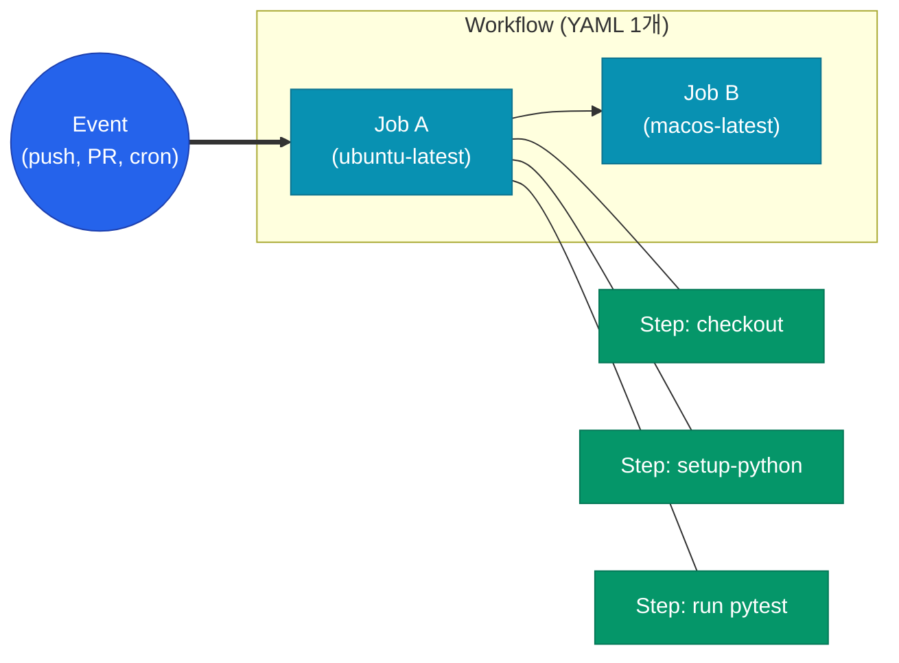

## GitHub Actions를 왜 쓰는가

저장소와 CI/CD가 한 플랫폼에 있어 세팅 비용이 거의 없어요. Pull Request·이슈·릴리즈 같은 이벤트에 바로 훅을 걸 수 있고, `actions/` 마켓플레이스 덕분에 대부분의 도구가 이미 빌딩 블록으로 존재해요. 소규모 프로젝트에서는 Jenkins·CircleCI보다 압도적으로 빠르게 시작할 수 있어요.

반면 복잡한 배포 오케스트레이션(Approval·Canary·Rollback)이 필요한 시점에는 Harness·ArgoCD 같은 전용 플랫폼이 더 적합해요. GitHub Actions는 **빌드·테스트·간단한 배포까지가 스위트 스폿**이에요.

## 핵심 개념



- **Workflow**: `.github/workflows/` 하위의 YAML 파일 하나. 이벤트로 트리거돼요.
- **Job**: 하나의 Runner(VM 또는 컨테이너)에서 실행되는 단위. Job 간 의존은 `needs` 로 표현해요.
- **Step**: Job 안의 순차 단계. Shell 명령이나 Action을 호출해요.
- **Action**: 재사용 가능한 작업 단위. 마켓플레이스(`actions/checkout@v4`) 또는 커스텀 리포로 배포돼요.
- **Runner**: 실제 실행 환경. GitHub-hosted(무료 한도 존재) 또는 Self-hosted.

## 트리거와 이벤트

| 이벤트 | 용도 | 비고 |
|--------|------|------|
| `push` | 브랜치에 커밋이 올라갔을 때 | 경로/브랜치 필터 가능 |
| `pull_request` | PR 오픈·업데이트 | `types` 로 세분화 |
| `workflow_dispatch` | 수동 실행 | UI 또는 API로 트리거 |
| `schedule` | cron 스케줄 | UTC 기준 |
| `release` | 릴리즈 생성 시 | 아티팩트 업로드에 자주 사용 |
| `workflow_call` | 다른 워크플로우에서 호출 | Reusable Workflow 용 |

```yaml
name: CI

on:
  push:
    branches: [main]
    paths-ignore:
      - "docs/**"
  pull_request:
    branches: [main]
  workflow_dispatch:
    inputs:
      environment:
        description: "Target environment"
        required: true
        default: staging
        type: choice
        options: [staging, production]
  schedule:
    - cron: "0 18 * * 1-5"  # 평일 UTC 18:00 (KST 03:00)
```

## 실전 워크플로우 — Python 서비스

Python 서비스의 Lint·Test·Build·Push 까지 한 파이프로 묶은 예시예요.

```yaml
name: python-service-ci

on:
  push:
    branches: [main]
  pull_request:

jobs:
  test:
    runs-on: ubuntu-latest
    timeout-minutes: 10
    steps:
      - uses: actions/checkout@v4

      - uses: actions/setup-python@v5
        with:
          python-version: "3.12"

      - name: Install uv
        run: pip install uv

      - name: Cache uv
        uses: actions/cache@v4
        with:
          path: ~/.cache/uv
          key: uv-${{ runner.os }}-${{ hashFiles('uv.lock') }}

      - name: Install deps
        run: uv sync --frozen

      - name: Lint
        run: |
          uv run ruff check .
          uv run mypy src/

      - name: Unit tests
        run: uv run pytest tests/unit/ --junit-xml=report.xml

      - name: Upload report
        if: always()
        uses: actions/upload-artifact@v4
        with:
          name: junit-report
          path: report.xml

  build-and-push:
    needs: test
    if: github.event_name == 'push'
    runs-on: ubuntu-latest
    permissions:
      contents: read
      id-token: write
    steps:
      - uses: actions/checkout@v4

      - name: Authenticate to GCP
        uses: google-github-actions/auth@v2
        with:
          workload_identity_provider: ${{ vars.GCP_WIF_PROVIDER }}
          service_account: ${{ vars.GCP_DEPLOY_SA }}

      - name: Configure docker for GAR
        run: gcloud auth configure-docker asia-northeast3-docker.pkg.dev -q

      - name: Build & Push
        run: |
          IMAGE=asia-northeast3-docker.pkg.dev/${{ vars.GCP_PROJECT }}/app/service:${{ github.sha }}
          docker build -t "$IMAGE" .
          docker push "$IMAGE"
```

## Matrix Strategy

여러 버전·OS 조합을 한 Job 선언으로 병렬 실행해요.

```yaml
jobs:
  test:
    runs-on: ${{ matrix.os }}
    strategy:
      fail-fast: false
      matrix:
        os: [ubuntu-latest, macos-latest]
        python: ["3.11", "3.12"]
        include:
          - os: ubuntu-latest
            python: "3.13"
            experimental: true
        exclude:
          - os: macos-latest
            python: "3.11"
    continue-on-error: ${{ matrix.experimental == true }}
    steps:
      - uses: actions/checkout@v4
      - uses: actions/setup-python@v5
        with:
          python-version: ${{ matrix.python }}
      - run: pytest
```

- `fail-fast: false` — 한 조합이 실패해도 나머지는 계속 실행. 장애 원인 파악에 유리해요.
- `include` / `exclude` — 조합을 세밀히 조정.
- `continue-on-error` — 실험적 조합이 실패해도 전체 워크플로우는 성공 처리.

## Secrets와 OIDC

### 일반 Secret

```yaml
- run: echo "token=${{ secrets.NPM_TOKEN }}" >> .npmrc
  env:
    NPM_TOKEN: ${{ secrets.NPM_TOKEN }}
```

Secret은 로그에 자동 마스킹돼요. Organization·Repository·Environment 레벨로 스코프를 나눠 저장해요.

### OIDC로 클라우드 인증

장기 Access Key 대신 워크플로우 실행마다 단기 토큰을 발급받아요. 키 유출 위험이 사라지고 감사(Audit) 추적도 쉬워져요.

<div class="callout why">
  <div class="callout-title">왜 OIDC인가</div>
  GitHub이 발급한 JWT를 클라우드 IdP가 검증해 IAM Role을 임시로 부여해요. <code>AWS_ACCESS_KEY_ID</code> 같은 정적 키를 Secret에 저장할 필요가 없어요. 실수로 로그에 출력하거나 외부로 유출되는 사고를 구조적으로 차단해요.
</div>

```yaml
# AWS
permissions:
  id-token: write
  contents: read

jobs:
  deploy:
    runs-on: ubuntu-latest
    steps:
      - uses: aws-actions/configure-aws-credentials@v4
        with:
          role-to-assume: arn:aws:iam::123456789012:role/github-deploy
          aws-region: ap-northeast-2
      - run: aws s3 sync ./build s3://my-bucket/
```

```yaml
# GCP
jobs:
  deploy:
    runs-on: ubuntu-latest
    permissions:
      id-token: write
      contents: read
    steps:
      - uses: google-github-actions/auth@v2
        with:
          workload_identity_provider: projects/123/locations/global/workloadIdentityPools/gh/providers/gh-prov
          service_account: deployer@your-project.iam.gserviceaccount.com
```

## Cache와 Artifact

Runner는 매 Job마다 깨끗한 상태로 시작해요. 의존성 다운로드를 매번 반복하면 느려지니 캐시 Action을 써요.

```yaml
- uses: actions/cache@v4
  with:
    path: |
      ~/.cache/pip
      ~/.cache/uv
    key: deps-${{ runner.os }}-${{ hashFiles('**/uv.lock', '**/requirements*.txt') }}
    restore-keys: |
      deps-${{ runner.os }}-
```

- `key`: 의존성 파일 해시로 구성. 파일이 바뀌면 새 캐시 생성.
- `restore-keys`: 정확한 키가 없을 때 prefix 매칭으로 이전 캐시 복구.
- 캐시는 리포별 10GB 한도. 7일 미사용 시 자동 삭제.

Artifact는 Job 간·워크플로우 간 파일 전달에 써요.

```yaml
- uses: actions/upload-artifact@v4
  with:
    name: build-output
    path: dist/

# 다른 Job에서
- uses: actions/download-artifact@v4
  with:
    name: build-output
    path: dist/
```

## Reusable Workflow

여러 리포·워크플로우가 같은 로직을 쓴다면 중앙화해요. `workflow_call` 트리거를 쓴 워크플로우는 다른 워크플로우에서 호출할 수 있어요.

```yaml
# .github/workflows/reusable-build.yml
name: reusable-build

on:
  workflow_call:
    inputs:
      python-version:
        required: false
        type: string
        default: "3.12"
    secrets:
      GAR_CREDENTIALS:
        required: true
    outputs:
      image-tag:
        description: "Built image tag"
        value: ${{ jobs.build.outputs.tag }}

jobs:
  build:
    runs-on: ubuntu-latest
    outputs:
      tag: ${{ steps.meta.outputs.tag }}
    steps:
      - uses: actions/checkout@v4
      - uses: actions/setup-python@v5
        with:
          python-version: ${{ inputs.python-version }}
      - id: meta
        run: echo "tag=${{ github.sha }}" >> "$GITHUB_OUTPUT"
```

호출 측:

```yaml
# .github/workflows/deploy.yml
jobs:
  build:
    uses: ./.github/workflows/reusable-build.yml
    with:
      python-version: "3.12"
    secrets:
      GAR_CREDENTIALS: ${{ secrets.GAR_CREDENTIALS }}

  deploy:
    needs: build
    runs-on: ubuntu-latest
    steps:
      - run: echo "Deploying image ${{ needs.build.outputs.image-tag }}"
```

Composite Action(`action.yml`)도 비슷한 역할을 하지만, Composite은 Step 단위 재사용이고 Reusable Workflow는 Job 전체·matrix·병렬성까지 포함한 재사용이에요.

## Self-hosted Runner

| 구분 | GitHub-hosted | Self-hosted |
|------|---------------|-------------|
| 관리 부담 | 없음 | OS·패치·보안 직접 관리 |
| 성능 | 2코어 기본 (상향 요금제) | 원하는 스펙 |
| 네트워크 | 퍼블릭만 | VPC 내부 접근 가능 |
| 비용 | 무료 한도 + 분당 과금 | 인프라 비용 |
| 보안 | GitHub 격리 | 격리 정책 직접 구성 필수 |

프라이빗 리소스(사내 DB, 내부 API)에 접근하거나 큰 리소스가 필요한 빌드에만 Self-hosted를 써요. 퍼블릭 리포에서 Self-hosted Runner는 PR 공격에 취약하니 반드시 **승인된 Organization 멤버 PR에서만 실행**으로 제한해야 해요.

```yaml
jobs:
  build:
    runs-on: [self-hosted, linux, gpu]
    steps:
      - uses: actions/checkout@v4
```

`runs-on` 에 라벨을 배열로 넘기면 모든 라벨을 가진 Runner만 매칭돼요.

## 보안·운영 체크리스트

- Action은 `@v4` 같은 태그보다 **커밋 SHA로 핀 고정** 하는 게 안전해요. 태그는 재할당될 수 있어요.
- `GITHUB_TOKEN` 의 `permissions` 는 기본값에 의존하지 말고 워크플로우마다 명시해요.
- 타사 Action은 소스 리뷰 후 도입. 마켓플레이스 인기 순위가 안전성의 보장은 아니에요.
- `pull_request_target` 은 PR 브랜치 코드를 포크의 PR에서 실행할 수 있어 매우 위험해요. 정말 필요할 때만 쓰고, PR 코드 체크아웃 시 `ref` 를 명시해요.
- Secret은 echo·환경 변수 덤프를 하지 않도록 주의. 로그 마스킹은 실수 예방 장치일 뿐 공개된 Secret은 즉시 회전해요.

## 정리

| 주제 | 핵심 포인트 |
|------|-------------|
| 구조 | Workflow > Job > Step > Action 계층 |
| 트리거 | `push`, `pull_request`, `workflow_dispatch`, `schedule`, `workflow_call` |
| 인증 | OIDC로 클라우드 인증해 정적 키 제거 |
| 캐시 | 의존성 해시 기반 `key` + `restore-keys` prefix |
| 재사용 | Reusable Workflow(Job 단위) vs Composite Action(Step 단위) |
| Runner | GitHub-hosted 기본, 내부 리소스·GPU만 Self-hosted |
| 보안 | Action은 SHA 핀, `permissions` 명시, `pull_request_target` 주의 |

다음 글에서는 GitHub Actions로 멀티 환경(Staging·Production) 배포 파이프라인을 설계하고, Environments + Approval + Deploy Protection Rule을 조합하는 방법을 다뤄요.
