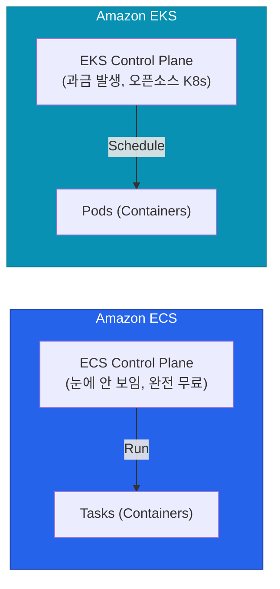

AWS에는 코드를 실행시킬 수 있는 컴퓨트 엔진이 너무 많습니다. 그냥 EC2에 띄우면 안 될까 싶다가도 남들은 EKS를 쓴다니 뒤처지는 기분이 들죠. 하지만 도구에는 각자 맞는 용도가 있어요.

워크로드의 성격과 팀의 인프라 역량에 따라 가장 적합한 컴퓨트(Compute) 옵션을 고르는 기준을 정리해 볼게요.

## 책임 모델에 따른 스펙트럼

AWS의 컴퓨트 옵션은 **"누가 서버(인프라)를 관리할 것인가"**에 따라 나열할 수 있어요.

| 컴퓨트 옵션 | 실행 형태 | 관리 주체 (OS 패치 등) | 인프라 자유도 | 언제 쓰는가? |
|---|---|---|---|---|
| **EC2** | 가상 머신(VM) | 개발자/운영자 (100% 본인 책임) | 가장 높음 | 레거시, 특정 OS 환경 필요, 윈도우 워크로드 |
| **ECS (EC2 Mode)** | 컨테이너 | 개발자 (인스턴스) + AWS (스케줄러) | 높음 | 도커가 친숙하고 커스텀 인스턴스가 필요한 도메인 |
| **EKS** | 쿠버네티스 | 클러스터 운영팀 | 매우 높음 | 대규모 마이크로서비스, 기존 쿠버네티스 자산 재사용 |
| **Fargate (ECS/EKS)** | 서버리스 컨테이너 | AWS가 서버리스로 프로비저닝 | 중간 | 인프라 운영 없이 "컨테이너만" 실행하고 싶을 때 |
| **Lambda** | 함수 (Function) | AWS 100% 관리 | 낮음 (언어 종속) | 이벤트 기반 비동기 작업, 짧은 트리거 작업 |

자유도가 높을수록 운영자가 밤낮없이 보안 패치와 디스크 알람에 시달려야 하고, 자유도가 낮을수록 서비스에만 집중할 수 있어요.

## ECS vs EKS (컨테이너 오케스트레이션)

도커 기반 워크로드로 넘어왔다면 대부분 이 두 가지 사이에서 고민하게 됩니다.

- **ECS**는 AWS가 자체 개발한 스케줄러예요. Control Plane 비용이 없고, ALB(로드밸런서)나 IAM 같은 다른 AWS 서비스와 기가 막히게 통합되어 있어요. **중소 규모 조직이거나 AWS 바깥으로 나갈 일이 없다면 ECS가 압도적으로 효율적**이에요.
- **EKS**는 오픈소스 Kubernetes를 AWS가 매니지드 형태로 제공하는 서비스예요. 강력하지만 러닝 커브가 꽤 가파르죠. 오픈소스 생태계(Helm, Istio, ArgoCD)를 누리고 싶은 플랫폼 조직에게 필수적이에요.

  
Fargate의 위력과 한계

  ECS든 EKS든 백엔드에 EC2를 띄워야 한다면(EC2 Mode), 결국 그 인스턴스의 패치와 확장은 개발자가 책임져야 해요. 하지만 데이터 플레인을 <strong>Fargate</strong>로 두면 서버라는 개념 자체가 사라집니다. "CPU 2코어, 4GB 메모리 컨테이너 띄워줘!" 하면 AWS가 띄워주고 그 초단위만큼 과금해요. 단, EC2보다 시간당 단가가 비싸고 특수한 스토리지 레이어를 붙이기 까다롭다는 트레이드오프가 있습니다.

## 컴퓨트 마이그레이션 진화 경로

일반적으로 조직의 클라우드 성숙도에 따라 컴퓨트 자원 활용은 다음과 같이 진화합니다.

1. **Phase 1: Lift and Shift** — 기존 온프레미스 서버를 있는 그대로 EC2로 마이그레이션
2. **Phase 2: Containerization** — 애플리케이션 코드를 도커 이미지로 만들어 ECS(또는 EKS)로 배포
3. **Phase 3: Serverless** — 이벤트 중심 아키텍처나 API 모듈을 Lambda 단위로 쪼개어 서버리스로 전환 (또는 완전 관리형 Fargate 전환)

한 번에 모든 걸 EKS로 올리는 것은 "이력서 지향 개발"일 위험이 커요. 현재 팀의 역량과 유지보수 코스트를 고려해 선택해야 합니다.

## 정리

- **EC2**는 높은 제어권이 필요할 때 여전히 훌륭합니다.
- 복잡함 없이 컨테이너만 손쉽게 돌리고 싶고 AWS만 쓴다면 **ECS**를 선택하세요.
- 거대한 MSA 환경과 풍부한 오픈소스 K8s 툴체인이 필요하다면 **EKS**입니다.
- 운영 부담을 줄이기 위해 가능한 한 **Fargate**나 **Lambda** 같은 서버리스 모델 도입을 적극 검토해야 해요.

컴퓨트로 애플리케이션을 돌렸다면, 이제 생성된 애플리케이션 데이터와 파일들을 어딘가에 온전하게 보관해야겠죠. 다음 글에서는 가장 대중적인 저장소, **S3 스토리지와 RDS 데이터베이스**의 운영 포인트를 살펴볼게요.
