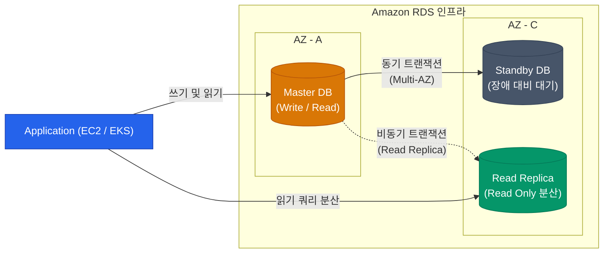

컴퓨트 자원은 삭제되었다가 다시 띄워도 무방하지만(Stateless), 사진, 로그, 유저 정보가 들어있는 스토리지와 데이터베이스는 한 번 파괴되면 돌이킬 수 없습니다. 이 영구적인 데이터를 안전하면서도 가성비 있게 관리하는 AWS의 두 축, S3와 RDS에 대해 알아봅니다.

## S3 (Simple Storage Service): 객체 스토리지의 모든 것

무제한의 확장이 가능한 인터넷 스토리지 S3는 AWS 환경의 중심 데이터 레이크 역할을 합니다. S3를 쓸 때 비용을 아끼고 보안을 강화하려면 두 가지 개념을 알아야 해요.

### 1. 스토리지 클래스 (수명 주기 관리를 통한 비용 최적화)

모든 데이터가 1년 내내 활발하게 조회되는 건 아니에요. 한 달만 지나도 거의 보지 않는 로그 데이터는 저렴한 **스토리지 클래스**로 옮겨 보관료를 획기적으로 낮춥니다.

| 스토리지 클래스 | 비용 (보관 / 검색) | 검색 시간 | 용도 |
|---|---|---|---|
| **S3 Standard** | 보관: 높음 / 검색: 무료 | 즉시 | 자주 쓰는 일반 데이터 (썸네일, 자바스크립트 등) |
| **S3 Infrequent Access (IA)** | 보관: 낮음 / 검색: 과금 | 즉시 | 한 달에 1~2번 정도 접근하는 백업, 오래된 영상 |
| **S3 Glacier Flexible / Deep Archive** | 보관: **매우 매우 저렴** / 검색: 비쌈 | 수 시간 소요 | 규제 준수를 위한 장기 보관, 최후의 백업 |

이 과정은 수동으로 할 필요 없이, **S3 Lifecycle Policy(수명 주기 규칙)**를 통해 "30일이 지나면 IA로 이동하고, 1년 뒤엔 Glacier로 보내고, 5년 뒤엔 삭제하라"라고 자동화할 수 있어요.

### 2. 버저닝(Versioning)과 잠금

사용자의 실수 또는 램섬웨어 공격으로 S3 파일이 덮어씌워지거나 삭제될 수 있죠.
버저닝 옵션을 켜두면 같은 이름의 파일이 덮어씌워져도, 숨김 형태로 `버전 ID`가 기록되어 옛날 상태로 복원할 수 있어요.

## RDS (Relational Database Service) 선택 가이드

서버에 직접 MySQL을 깔아본 적 있다면 백업, OS 패치, 이중화를 구성하는 데 얼마나 많은 밤을 새워야 하는지 아실 거예요. RDS는 이런 관리 포인트를 대부분 AWS가 대신해 주는 매니지드 관계형 DB 서비스예요.

### 상용 환경의 RDS 필수 구성 원칙

1. **Multi-AZ (다중 가용 영역 배포)**
   - 마스터 DB가 위치한 AZ 데이터 센터가 무너지면, 동기식으로 백업되고 있던 Standby DB 세션을 즉각적인 페일오버(Failover)로 살려냅니다.
   - 평소엔 Standby 쪽에 쿼리를 날릴 수 없습니다. (순수 장애 대비용 정책)
2. **Read Replica (읽기 복제본)**
   - DB 부하의 80%는 데이터를 읽어오는 `SELECT`에서 일어납니다. 부하 분산을 위해 읽기 전용 DB를 복제하여 성능 한계를 뚫어낼 수 있어요. 비동기로 복제되기 때문에 아주 미세한 지연은 존재해요.
3. **Automated Backup (자동 스냅샷)**
   - 하루 단위로 스냅샷을 뜨고 트랜잭션 로그를 저장합니다. 장애가 나면 5분 전의 특정 시점(Point-in-time)으로 DB를 통째로 되살릴 수 있습니다.

  
Aurora vs 일반 RDS 오픈소스 엔진

  AWS는 MySQL/PostgreSQL 엔진 기반을 클라우드에 맞게 뼈대부터 재설계한 <strong>Amazon Aurora</strong>를 제공해요. 일반 RDS보다 스토리지 층위 복제 방식이 빠르고 가용성이 높아서 I/O 성능이 월등히 뛰어납니다. 과금 체계가 조금 다르지만 트래픽이 많고 핵심적인 서비스라면 Aurora 도입이 비용 대비 더 유리할 때가 많아요.

## 정리

- 스토리지 아키텍처의 기본은 **S3 스토리지 클래스와 라이프사이클 정책**을 통해 비용 효율을 달성하는 것입니다.
- 랜섬웨어나 휴먼 에러를 방지하기 위해 중요 버킷의 S3 **Versioning**은 꼭 켜두세요.
- **RDS**는 매니지드 서비스이지만, 가용성을 위해 **Multi-AZ** 옵션 활성화는 필수입니다.
- 읽기 부하가 심하다면, EC2 인스턴스를 올리지 말고 **Read Replica**를 증설하는 걸 먼저 고려하세요.

안정적인 상태(State) 저장을 위한 인프라 지식을 쌓았습니다. 이런 서버 중심 인프라도 좋지만 모던 백엔드는 점차 서버 유지보수 부담을 줄이려 하고 있죠. 마지막 글로 **AWS Lambda를 활용한 서버리스 패턴**에 대해 알아봅니다.
