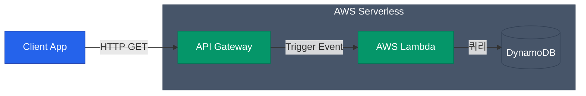

서버리스(Serverless)는 말 그대로 "서버가 없다"는 것이 아니라, "개발자가 관리하고 패치해야 할 가상머신(서버) 레이어가 사라졌다"는 뜻이에요. 개발자는 오직 자신의 비즈니스 코드에만 집중하고, 그 코드 단위가 호출(Event)될 때만 밀리초(ms) 단위로 과금하는 아키텍처입니다. 

그 중심에 **AWS Lambda**가 있어요.

## Lambda 실행 모델과 Cold Start

EC2가 24시간 내내 돌면서 요청을 기다리는 식당 종업원이라면, Lambda는 호출 벨을 누를 때마다 뒤에서 대기하던 알바생이 등장해 1회성 작업을 하고 사라지는 식이에요.

| 특징 | Lambda 함수의 특성 |
|---|---|
| **트리거 (Trigger)** | API 호출, S3 파일 업로드, 메시지 큐 등 이벤트에 기인해 100% 호출(Invoke) |
| **스케일링 (Scaling)** | 트래픽이 0이면 리소스 소모 0, 트래픽 10,000이면 즉시 컨테이너 10,000개 병렬 생성 |
| **무상태 (Stateless)** | 함수가 종료되면 메모리 상태가 폐기됨. 지속 보관할 데이터는 S3나 DynamoDB로 저장해야 함 |

하지만 Lambda에는 **Cold Start**라는 고질적인 문제가 있습니다. 
Lambda 컨테이너가 처음 초기화되고 코드를 다운받아 구동하는 수 초의 지연 시간을 의미해요. 한 번 뜨면 웜 상태가 되어 응답이 빠르지만 오래 안 부르면 다시 식어버립니다. 이를 피하기 위해 함수 경량화, 런타임 최적화(Go, Rust 선호) 등의 튜닝을 하거나 비용을 지불해 `Provisioned Concurrency`(미리 데워두는 설정)를 켜기도 합니다.

## 대표적인 서버리스 연동 패턴

Lambda 단독으로는 허공의 함수일 뿐입니다. 강력한 AWS 관리형 서비스들과 블록처럼 엮어 쓰일 때 진정한 위력이 나옵니다.

### 1. API 패턴 (API Gateway + Lambda)

가장 보편적인 웹 백엔드 구축 패턴입니다. HTTP 요청을 받아 라우팅, 인증, 스로틀링을 `API Gateway`가 먼저 다 처리하고, 순수 비즈니스 로직(조회, 저장 등)만 `Lambda`에 트리거해요.

### 2. 비동기 이벤트 처리 패턴 (EventBridge / SQS / SNS)

"유저가 회원 가입을 하면, 5분 뒤에 웰컴 이메일을 보내고 DB에 통계 레코드를 쌓아라" 같은 지연 작업이나 여러 관심사에 대한 동시 작업 모델에 적합합니다.

- **EventBridge**: 클라우드 전반에 퍼진 다양한 이벤트를 라우팅하는 거대한 이벤트 버스입니다. (ex: 매일 오전 9시 정각 실행)
- **SQS (Queue)**와 **SNS (Pub/Sub)**: 갑작스러운 대규모 트래픽 스파이크를 메시지 큐에 모아두고, Lambda가 소화할 수 있는 속도만큼 폴링(polling)하여 DB 병목사태를 예방합니다.

### 3. 복잡한 워크플로우 오케스트레이션 (Step Functions)

이벤트가 꼬리를 물다 보면, "A가 성공하면 B를 하고 실패하면 C를 해라" 같은 상태 기계(State Machine) 흐름이 필요해져요. 이를 각 Lambda 코드끼리 사슬처럼 연결하면 유지보수가 지옥이 됩니다. (Lambda Pinball 현상)

이럴 때는 시각적인 워크플로우 엔진인 **AWS Step Functions**를 이용해 큰 그림의 제어를 맡기고, 각 과정의 작은 조각만 Lambda가 수행하도록 구성하는 것이 정석입니다.

  
서버리스 개발의 한계

  관리할 인프라가 없다는 장점 이면에는 치명적인 단점이 존재해요. 클라우드 벤더(AWS)에 완전히 <strong>종속(Lock-in)</strong>되며, 디버깅을 로컬 PC 환경에 재현해 내기가 굉장히 복잡합니다. 게다가 긴 소요 시간(15분 이상)이 필요한 무거운 통계/학습 워크로드의 경우 실행 자체가 불가능하여 EC2나 ECS 기반으로 돌아가야 합니다.

## 정리

- **Lambda**는 이벤트 트리거에 응답해 일회성 컨테이너를 띄우는 함수 단위 컴퓨팅입니다. 비용 효율과 자동 확장이 최대 장점입니다.
- **API Gateway**와 결합해 강력한 REST/HTTP API를 손쉽게 제공할 수 있습니다.
- 갑작스러운 부하 분산과 에러 전파를 방지하기 위해선 **SQS/SNS**를 중간에 두고 비동기로 처리하세요.
- 여러 Lambda 간 얽힌 복잡한 로직은 개별 코드 내에서 흐름 제어를 하지 말고 **Step Functions**에 중앙 통제 권한을 넘기는 편이 좋습니다.

지금까지 5편에 걸쳐 계정 권한(IAM)부터 네트워크, 컴퓨트, 스토리지, 서버리스에 이르기까지 핵심적인 **AWS Cloud Infrastructure** 블록을 설계하는 원리를 짚어보았습니다.
