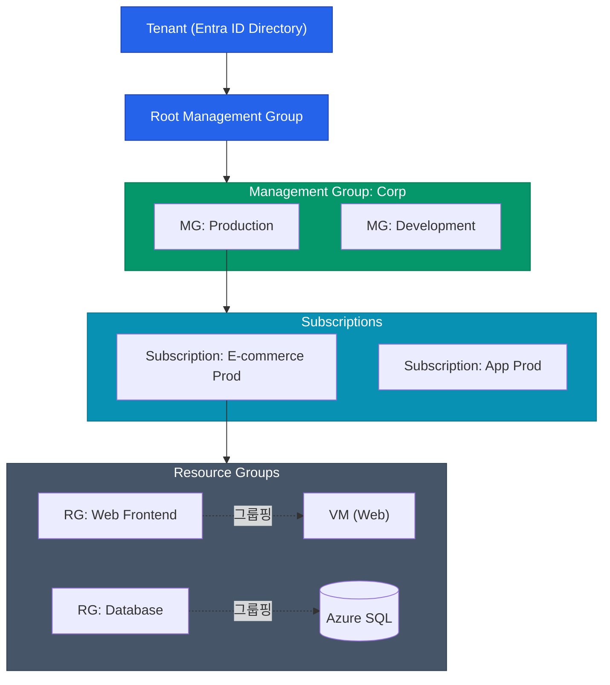

마이크로소프트의 클라우드, Azure(애저)는 윈도우 환경에 친숙한 기업들에게 사실상 유일한 대안으로 꼽힙니다. Azure가 강력한 이유는 이미 대부분의 대기업이 쓰고 있는 사내 Active Directory(AD)를 클라우드 권한 모델로 부드럽게 확장할 수 있다는 점이에요.

이번 글에서는 Azure의 계층형 자원 관리 모델과 Entra ID(구 Azure AD)를 기반으로 하는 RBAC 구조를 살펴봅니다.

## Azure의 논리적 계층 구조

GCP와 비슷하게 Azure도 자원을 트리(Tree) 형태로 매핑하여 거버넌스를 위에서 아래로 상속(Inherit)시킵니다.

1. **Management Group (관리 그룹)**: 여러 구독(Subscription)을 하나로 묶어 정책이나 권한을 일괄 통제하는 폴더입니다.
2. **Subscription (구독)**: 청구(Billing) 및 권한 확장의 기본 단위예요. AWS의 Account와 유사합니다. 보통 프로덕션/개발 별로 분리합니다.
3. **Resource Group (리소스 그룹)**: Azure만의 독특한 개념입니다. 앱에서 사용되는 `VM`, `Load Balancer`, `DB` 등 라이프사이클이 동일한 자원들을 논리적으로 거미줄처럼 묶어주는 논리적 바구니입니다. (삭제할 때 Resource Group만 날리면 안에 있는 자원이 싹 날아가요!)

## Azure RBAC (역할 기반 액세스 제어)

Azure의 권한 관리는 **Entra ID(Azure AD)**가 인증(Authentication)을 맡고, **Azure RBAC** 체계가 인가(Authorization)를 결정하는 형태입니다. 

누구에게 권한을 줄 것인가를 결정할 때 세 가지 조합이 필요해요.
**`Security Principal(누가)` + `Role Definition(어떤 역할을)` + `Scope(어느 범위에)`**

| 구성 요소 | 설명 |
|---|---|
| **Security Principal** | User, Group, Service Principal(앱), Managed Identity(자원) |
| **Role Definition** | Built-in Role(Owner, Contributor, Reader 등) 또는 Custom Role |
| **Scope** | Management Group 수준부터 가장 작은 하나의 VM 수준까지 정할 수 있음 (위에서 받은 권한은 아래로 모두 상속됨!) |

실무에서는 개별 유저에게 구독 단위로 권한을 주기보다, **Entra ID의 그룹(Group)**에 인원을 넣고, 그 그룹에 **Resource Group 범위의 Contributor(기여자) 역할**을 주는 방식을 주로 채택합니다.

## 조건부 액세스 (Conditional Access)

회사 망이 아니거나, 출장 중인 임원의 노트북이 해킹당했다면 어떻게 될까요? Entra ID P1 이상의 라이선스를 쓰면 매우 세밀한 제어(Zero Trust)가 가능합니다. 

이것이 **Conditional Access**입니다.

- **조건**: "한국이 아닌 국가에서", "관리자 계정으로 로그인을 시도할 때"
- **조치**: "반드시 지정된 기기(Intune)여야 하고, MFA 로그인을 한 번 더 통과해야 통과시킴"

  
Managed Identity (GCP Workload Identity와 유사)

  Azure VM에 띄운 애플리케이션이 Key Vault에서 비밀번호를 가져와야 할 때 하드코딩된 패스워드를 주면 안 됩니다. 이럴 땐 VM 자체에 <strong>Managed Identity</strong>를 부여하고, Key Vault가 "저 Identity를 가진 VM의 접근만 허용해"라고 RBAC를 맺어두는 것이 현대적인 클라우드 보안의 정석이에요.

## 정리

- 최상위 조직 정책은 **Management Group** 단위로 걸고, 청구는 **Subscription**, 자원의 배포/삭제 라이프사이클은 **Resource Group** 단위로 묶으세요.
- 개별 유저 대신 **Entra ID 그룹**을 만들어 **Built-in Role**(예: Contributor)을 매핑하는 것이 원칙입니다.
- 비밀번호만 덜렁 믿어선 안 되며 **Conditional Access** 기반의 Zero Trust 망을 구축하세요.
- 애플리케이션에는 접속용 비밀번호 대신 **Managed Identity**를 부여하세요.

Azure의 권한과 계층 모델을 이해했습니다. 다음 편에서는 쿠버네티스 시장점유율에서 강력한 입지를 자랑하는 **AKS(Azure Kubernetes Service)의 네트워킹 구조**를 깊이 파보겠습니다.
