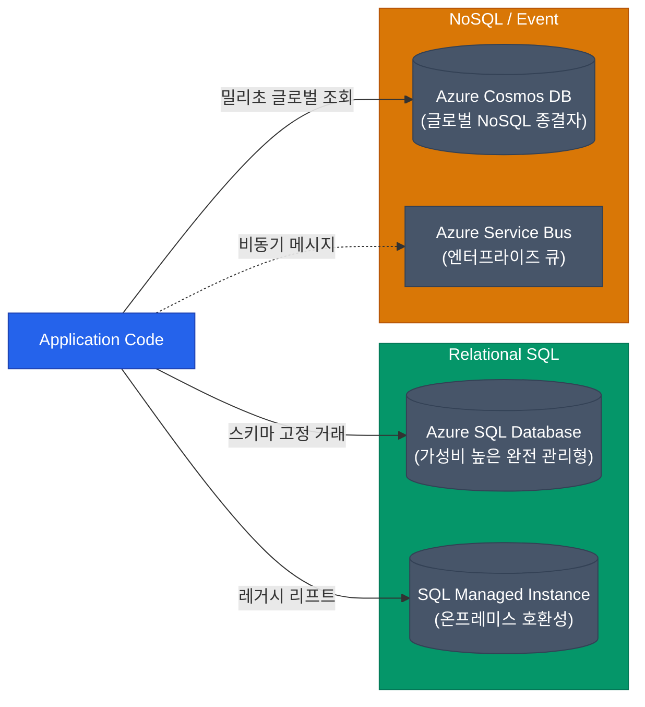

엔터프라이즈 환경에서 "무조건 모든 것을 Kubernetes(AKS)로 말아버려라"라는 전략이 정답은 아닙니다. 오히려 소규모 웹 서비스, 내부 어드민툴, 강력한 글로벌 NoSQL이 필요할 땐 이미 다 갖춰진 클라우드 고유의 관리형 리소스(PaaS)를 골라 배포하는 것이 압도적으로 효율적이에요.

Azure 3대장 컴퓨트와 대표 DB들의 쓰임새를 구분해 봅니다.

## 컴퓨트 서비스 비교: VM vs App Service vs Functions

서버를 띄울 일이 있을 때, 코드의 특성에 따라 다음과 같이 계단을 내려오며 고민해 보세요.

| 로직 성격 | 추천하는 컴퓨트 서비스 | 상세 특징 |
|---|---|---|
| **OS 커스텀 & 레거시 포팅** | **Virtual Machines (IaaS)** | 기존 온프레미스의 ".NET Framework 4.5 윈도우 서버" 등 낡은 환경 그대로 Shift 할 때 사용. 패치와 확장팩(Scale Set) 관리는 사용자의 몫. |
| **일반적인 웹 / API 서버** | **App Service (PaaS)** | 배포 파이프라인이나 Zip 파일 하나 던져주면 Azure가 런타임(Node, Java, 리눅스/윈도우)을 올리고 자동 확장을 담당함. (AWS Elastic Beanstalk과 유사). |
| **이벤트 기반 단발성 코드** | **Azure Functions** | HTTP 요청, 큐에 메시지가 쌓이는 이벤트에 반응해 몇 밀리초 동안만 실행되고 종료되는 진정한 서버리스 시스템. |

만약 소스 코드 수준이 아니라 어찌됐든 'Docker 컨테이너' 형태로만 말고 싶다면 **Azure Container Apps**라는 훌륭한 대안이 있습니다. 내부적으로 K8s 기반이지만 사용자에게는 복잡성을 완전히 숨긴 서버리스 컨테이너 서비스죠. EKS 대신 선택하는 AWS Fargate와 포지션이 매우 비슷합니다.

## 데이터베이스 서비스 매트릭스

과거에는 RDBMS 하나에 모조리 구겨 넣었다면, 현대의 클라우드는 **Polyglot Persistence**(데이터 성격에 맞는 각기 다른 저장소 활용)를 지향합니다.

### 1. Azure SQL Database (RDBMS)
가장 일반적인 선택입니다. SQL Server 엔진을 클라우드 시대에 맞게 재설계했습니다. Auto-scaling과 백업 관리를 Azure가 다 해줘요. 기존 구축형(On-premise) SQL Server 기능과 100% 문법 호환성이 필요하면 살짝 비싸고 거대한 **SQL Managed Instance** 버전을 택하면 됩니다.

### 2. Azure Cosmos DB (NoSQL)
Azure의 기술력이 돋보이는 가장 강력한 데이터베이스입니다. 지구상 어디서 쿼리를 날리든 데이터 복제 지연을 최소화하여 **한 자릿수 밀리초(ms) 단위의 응답 인프라**를 제공하는 무적의 글로벌 분산형 DB입니다. Document(MongoDB 호환), Key-Value, Graph 등 여러 API 형태를 지원합니다. (AWS DynamoDB의 포지션을 크게 압도하는 스펙)

### 3. Azure Service Bus (비동기 큐)
DB는 아니지만 엔터프라이즈 아키텍처에 빠질 수 없는 부품이에요. 두 서비스가 통신할 때 동기로 꽉 묶지 않고 큐(Queue/Topic)에 툭 던져놓고 나가는 방식입니다. 순서 보장(FIFO), 지연 발송 등 대규모 금융/물류 워크로드의 트랜잭션을 든든하게 보호해 주는 메시지 브로커입니다.

  
PaaS 서비스들의 가상 네트워크 통합

  초기 PaaS 서비스들은 공인 IP(Public IP)로 둥둥 떠 있어서 보안팀을 기겁하게 만들었습니다. 하지만 최근에는 <strong>Private Endpoint (Azure Private Link)</strong>를 이용해 App Service나 Cosmos DB 같은 PaaS 자원을 내 VNet(프라이빗 네트워크) 안으로 조용히 끌고 들어올 수 있습니다. 모든 트래픽이 인터넷 구간을 건너뛰게 되므로 보안상 반드시 거쳐야 하는 작업이에요.

## 정리

- IaaS(VM)의 늪에서 벗어나, 모던 웹앱 배포는 **App Service**, 컨테이너는 **Container Apps**, 짧은 배치·트리거 코드는 **Functions**에 맡기세요.
- 정형화된 트랜잭션과 레거시 포팅은 **Azure SQL DB**, 대규모 글로벌 확장과 스키마리스 캐시가 필요할 땐 막강한 **Cosmos DB**를 전진 배치하세요.
- 장애가 나도 주문이 날아가지 않게 서비스 사이에는 **Service Bus** 큐를 삽입하세요.
- 이 모든 통신은 보안 강화를 위해 **Private Link**로 프라이빗 망 내부에 종속시켜야 합니다.

Azure의 RBAC 계정 모델부터 AKS(쿠버네티스), 그리고 생산성을 올려주는 각종 PaaS 자원들까지 핵심 구조를 모두 다뤄 보았습니다.
