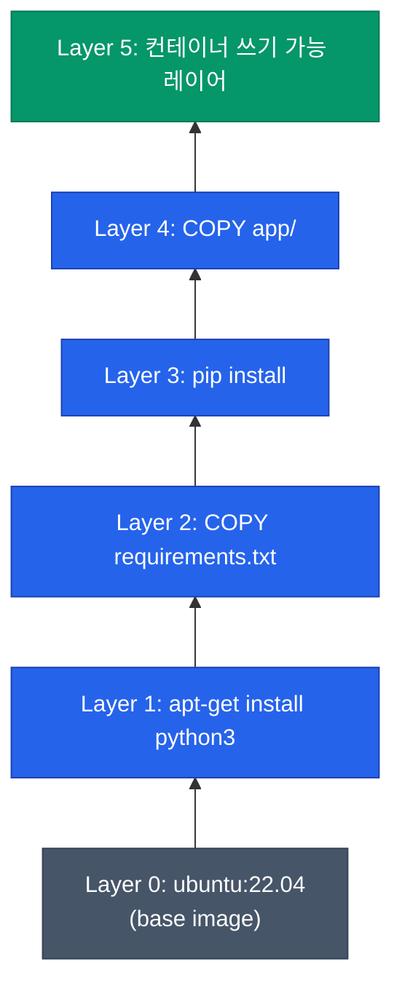
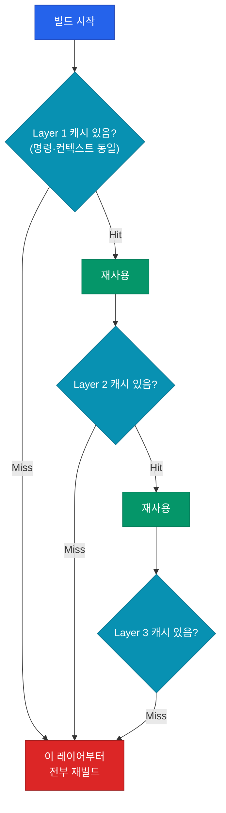
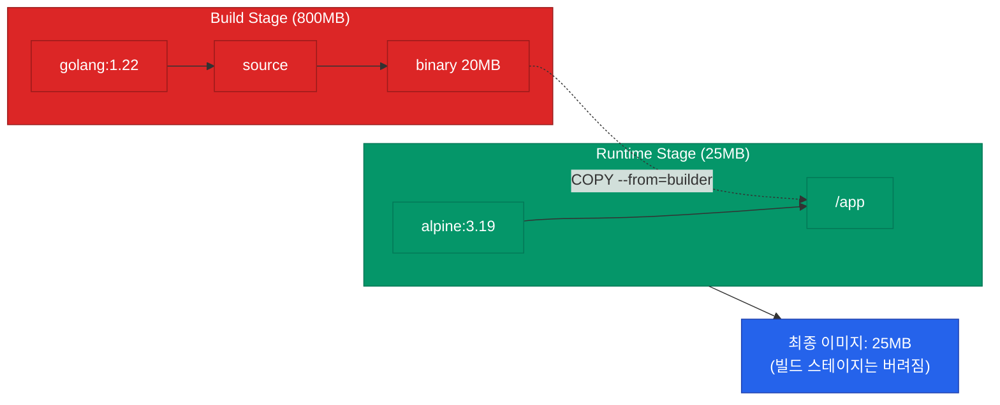

컨테이너를 다루다 보면 가장 먼저 부딪히는 질문이 "왜 내 이미지는 1GB가 넘어가지?"예요. 답은 Dockerfile이 어떻게 **레이어**로 변환되는지 이해하는 데서 시작해요. 이 글에서는 이미지가 만들어지는 원리부터 캐시 활용, 최종 이미지 크기를 줄이는 구조적 접근까지 다뤄요.

## 이미지 = 읽기 전용 레이어의 스택

Docker 이미지는 단일 파일이 아니에요. **레이어(layer)라 부르는 파일시스템 스냅샷들이 쌓여 있는 구조**예요. 각 레이어는 이전 레이어 위에 추가된 파일의 diff만 담고 있고, 컨테이너 실행 시 UnionFS(OverlayFS)로 하나의 파일시스템처럼 보여요.



| 특성 | 의미 |
|---|---|
| **불변성** | 한 번 생성된 레이어는 수정 불가 — 변경이 필요하면 새 레이어 추가 |
| **공유** | 같은 해시의 레이어는 여러 이미지가 공유 (디스크 절약) |
| **캐시 가능** | 변경되지 않은 레이어는 재빌드 시 재사용 |

## Dockerfile 명령과 레이어 매핑

Dockerfile의 모든 명령이 레이어가 되진 않아요. **실제 파일시스템을 변경하는 명령만** 레이어를 생성해요.

| 명령 | 레이어 생성? | 비고 |
|---|---|---|
| `FROM` | 베이스 레이어 참조 | 새 레이어 생성은 아님 |
| `RUN` | ✅ | 가장 큰 레이어가 여기서 나옴 |
| `COPY`·`ADD` | ✅ | 파일 크기만큼 레이어 증가 |
| `WORKDIR` | ❌ | 메타데이터만 변경 |
| `ENV`·`LABEL` | ❌ | 메타데이터만 변경 |
| `CMD`·`ENTRYPOINT` | ❌ | 실행 시점 설정 |
| `EXPOSE` | ❌ | 문서화 목적 |

`RUN`과 `COPY`가 핵심이에요. 이 두 명령이 이미지 크기와 빌드 시간을 대부분 결정해요.

## 빌드 캐시의 작동 원리

Docker는 각 명령의 실행 결과를 해시로 캐싱해요. **명령 문자열 + 컨텍스트 파일의 내용**이 같으면 캐시 히트예요.



**한 레이어가 캐시 미스되면 그 이후 레이어는 전부 재빌드**돼요. 그래서 명령 순서가 빌드 속도를 결정해요.

### 자주 바뀌는 것 = 뒤로

나쁜 예와 좋은 예를 비교해볼게요.

```dockerfile
# 안 좋은 예: 소스 코드가 맨 앞에 있어서 코드 한 줄 바꾸면 pip install 다시 돌아요
FROM python:3.12-slim
COPY . /app
WORKDIR /app
RUN pip install -r requirements.txt
CMD ["python", "main.py"]
```

```dockerfile
# 좋은 예: 의존성 먼저 설치, 소스는 마지막에
FROM python:3.12-slim
WORKDIR /app
COPY requirements.txt .
RUN pip install -r requirements.txt
COPY . .
CMD ["python", "main.py"]
```

의존성이 바뀌지 않는 한 `pip install` 레이어가 캐시되므로, 소스 코드 수정만으로는 재빌드가 순식간에 끝나요.

## 이미지 크기를 키우는 3대 주범

수백 MB짜리 이미지가 나오는 건 대부분 이 세 가지 때문이에요.

<div class="callout why">
  <div class="callout-title">레이어는 지워도 용량이 남아요</div>
  <code>RUN apt-get install</code> 다음 레이어에서 <code>RUN apt-get remove</code> 해도 이미지는 안 줄어요. 왜냐하면 <b>이전 레이어는 불변</b>이라 패키지가 설치된 상태의 스냅샷이 그대로 남고, 다음 레이어는 그 위에 "삭제 마커"만 추가하기 때문이에요. 최종 읽기 시점엔 없는 것처럼 보이지만 <b>이미지 파일 크기는 둘 다 포함</b>돼요.
</div>

| 주범 | 원인 | 해결 |
|---|---|---|
| **패키지 매니저 캐시** | `apt`·`yum`·`pip` 캐시가 레이어에 남음 | 같은 RUN 안에서 설치·정리 |
| **빌드 도구** | gcc·make·의존성 패키지 | Multi-stage build |
| **베이스 이미지 선택** | `ubuntu:22.04` (77MB) vs `alpine:3.19` (5MB) | 필요 최소한의 베이스 |

### RUN 하나로 묶기

```dockerfile
# 안 좋음: 3개 레이어, 캐시 남음
RUN apt-get update
RUN apt-get install -y curl
RUN apt-get clean && rm -rf /var/lib/apt/lists/*
```

```dockerfile
# 좋음: 1개 레이어, 캐시 없음
RUN apt-get update \
    && apt-get install -y --no-install-recommends curl \
    && apt-get clean \
    && rm -rf /var/lib/apt/lists/*
```

같은 레이어 안에서 설치와 정리를 끝내면 캐시가 레이어에 남지 않아요.

## Multi-stage Build — 빌드 도구를 이미지에서 제거

컴파일러나 빌드 도구는 **빌드 시점에만 필요**하고 실행 시점에는 불필요해요. Multi-stage build는 빌드 스테이지와 실행 스테이지를 분리해서 최종 이미지에는 결과물만 담아요.

```dockerfile
# 1단계: 빌드 (무거운 이미지)
FROM golang:1.22 AS builder
WORKDIR /src
COPY . .
RUN CGO_ENABLED=0 go build -o /out/app .

# 2단계: 실행 (가벼운 이미지)
FROM alpine:3.19
COPY --from=builder /out/app /app
ENTRYPOINT ["/app"]
```



Go 기준 빌드 이미지 800MB가 최종 25MB로 줄어들어요. Node.js·Python도 동일한 패턴을 적용할 수 있어요 (빌드 스테이지에서 `npm install` → 실행 스테이지는 필요한 `node_modules`와 컴파일된 결과만 복사).

## 베이스 이미지 선택 가이드

같은 언어라도 베이스 이미지 선택으로 수백 MB가 왔다 갔다 해요.

| 베이스 | 크기 | 장점 | 단점 |
|---|---|---|---|
| `*-full` (`python:3.12`) | 1GB+ | 모든 도구 포함, 디버깅 편함 | 크고 공격 표면 넓음 |
| `*-slim` (`python:3.12-slim`) | ~150MB | 기본 glibc 기반, 호환성 좋음 | 일부 도구 수동 설치 필요 |
| `*-alpine` | ~50MB | 매우 작음 | musl libc라 Python wheel 호환성 문제 가끔 |
| `distroless` | ~20MB | 쉘·패키지 매니저 없음, 공격 표면 최소 | 디버깅 어려움 |

프로덕션 권장 순서는 대체로 **distroless → slim → alpine → full**이에요. 단, Python·Ruby는 alpine에서 wheel 호환성 이슈가 종종 있어서 **slim을 기본**으로 두는 게 안전해요.

## 정리

Docker 이미지를 "그냥 만드는" 것과 "의도적으로 설계하는" 것은 결과 크기에서 10배 이상 차이나요.

- 이미지는 불변 레이어의 스택 — `RUN`과 `COPY`만 레이어를 만들어요
- 자주 바뀌는 건 **뒤로** — 캐시 히트율이 빌드 속도를 결정
- 한 레이어에서 설치·정리 완결 — 지워도 남는 캐시 방지
- Multi-stage build로 빌드 도구 제거
- 베이스는 **slim이 기본**, 작게 가고 싶으면 distroless 고려

다음 글에서는 컨테이너가 실제로 외부와 어떻게 소통하는지 — **네트워크와 볼륨 구조**를 다뤄요.
