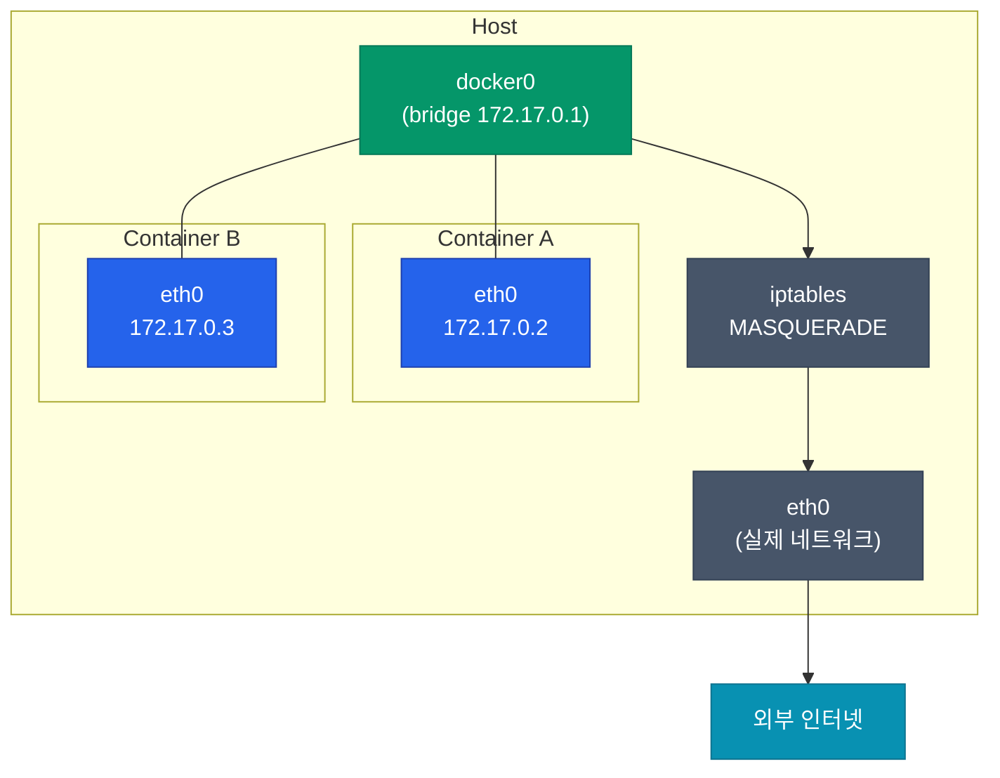
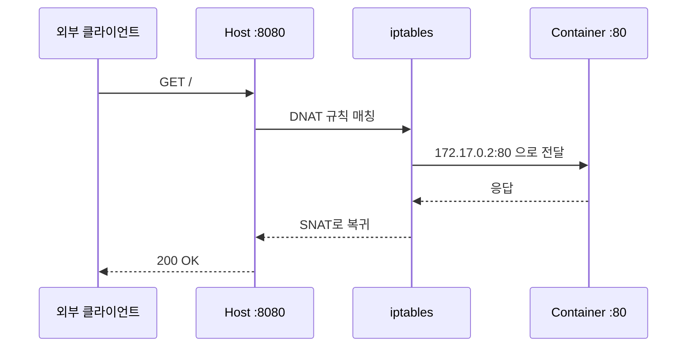
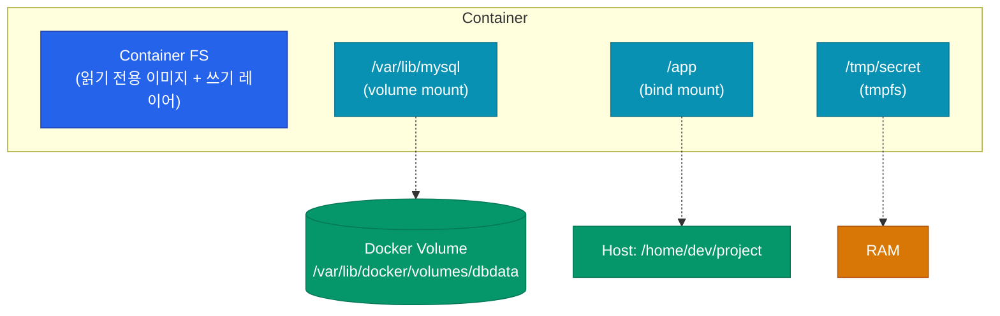

컨테이너를 한 개 띄우는 건 어렵지 않아요. 어려운 건 컨테이너끼리, 그리고 호스트와 외부 세계 사이의 **통신과 데이터 영속성**이에요. 이 글에서는 Docker의 네트워크 모드 네 가지와 볼륨 설계의 핵심을 정리해요.

## 네트워크 드라이버 — 4가지 모드

Docker는 컨테이너별로 네트워크를 어떻게 연결할지 **드라이버**로 선택해요.

| 드라이버 | 사용 범위 | 전형적 용도 |
|---|---|---|
| **bridge** | 단일 호스트 (기본값) | 개발 환경, 단순 컨테이너 구성 |
| **host** | 단일 호스트, 네트워크 격리 없음 | 고성능 네트워크 필요 시 |
| **none** | 네트워크 차단 | 보안 민감 배치 작업 |
| **overlay** | 멀티 호스트 | Swarm·클러스터 환경 |

### Bridge — 기본 동작 이해하기

가장 흔한 기본 모드예요. Docker가 `docker0`라는 가상 브릿지를 호스트에 만들고, 컨테이너는 거기에 virtual ethernet pair로 연결돼요.



외부로 나갈 때는 iptables NAT를 거쳐요. 외부에서 들어올 때는 `-p 8080:80` 같은 포트 매핑으로 **호스트 포트를 컨테이너 포트에 포워딩**해요.

### User-defined Bridge가 기본보다 낫다

기본 `bridge` 대신 **직접 만든 bridge 네트워크**를 쓰는 게 실무 권장이에요.

| 항목 | 기본 bridge | user-defined bridge |
|---|---|---|
| DNS 기반 컨테이너 이름 해석 | ❌ (IP만 가능) | ✅ `db`·`api` 같은 이름으로 호출 |
| 네트워크 격리 | 모든 컨테이너 한 네트워크 | 네트워크 단위로 격리 가능 |
| `--link` 필요 여부 | ✅ (deprecated) | ❌ |

```bash
docker network create app-net
docker run -d --network app-net --name db postgres
docker run -d --network app-net --name api my-api
# api 컨테이너는 db:5432로 바로 접속 가능
```

### Host 모드 — 성능 우선

`--network host`를 쓰면 컨테이너가 **호스트의 네트워크 스택을 그대로 공유**해요. NAT 오버헤드가 없어서 네트워크 처리량이 중요한 워크로드에 유리하지만, 포트가 호스트와 충돌할 수 있고 격리가 깨지는 대가가 있어요.

<div class="callout why">
  <div class="callout-title">Host 모드는 Linux에서만 진짜 host 모드예요</div>
  Docker Desktop (macOS·Windows)에서 <code>--network host</code> 를 써도 실제로는 VM 내부의 Linux host를 가리켜요. 즉 <b>호스트 OS의 네트워크에 직접 붙지 않아요</b>. 4.29 이후 실험 기능으로 macOS에서도 진짜 host 모드가 지원되긴 하지만, 크로스 플랫폼 개발 환경에서는 <b>bridge + port publish 조합이 여전히 가장 이식성이 높아요.</b>
</div>

## 포트 매핑의 실체

`docker run -p 8080:80`은 단순해 보이지만 내부적으로 iptables에 DNAT 규칙을 추가해요.



프로덕션에서는 보통 이 단일 호스트 포트 매핑 대신 **load balancer → host port → 컨테이너**의 3단 구조를 쓰거나, 아예 Kubernetes로 넘어가 Service가 이 역할을 대신하게 돼요.

## 볼륨 — 데이터가 컨테이너보다 오래 살아야 할 때

컨테이너의 파일시스템은 **컨테이너가 삭제되면 같이 사라져요**. DB·업로드 파일·로그처럼 영속성이 필요한 데이터는 볼륨으로 분리해야 해요.

### 3가지 스토리지 마운트 방식

| 방식 | 호스트 경로 | 관리 주체 | 언제 쓰나 |
|---|---|---|---|
| **Volume** | `/var/lib/docker/volumes/...` | Docker가 관리 | 프로덕션 기본, DB 등 |
| **Bind mount** | 호스트의 임의 경로 | 사용자가 관리 | 개발 중 소스코드 실시간 반영 |
| **tmpfs** | 메모리 (디스크 미사용) | 휘발성 | 비밀 키·임시 캐시 |



### Volume이 Bind Mount보다 나은 이유

- **OS 독립**: bind mount는 호스트 경로를 하드코딩하지만, volume은 Docker가 추상화
- **권한 관리**: volume은 컨테이너 UID에 맞게 초기화 가능
- **백업·이관 편함**: `docker volume` 명령으로 관리
- **드라이버 교체**: 로컬 → NFS·EBS·Ceph로 스토리지 백엔드 교체 가능

**"개발용은 bind, 프로덕션은 volume"**이 기본 원칙이에요.

## 볼륨 드라이버 — 로컬을 넘어서

기본 `local` 드라이버 외에 NFS·클라우드 블록 스토리지 드라이버를 붙일 수 있어요. Kubernetes를 쓰기 전 단일 호스트·소규모 환경에서 공유 스토리지가 필요할 때 유용해요.

| 드라이버 | 백엔드 | 용도 |
|---|---|---|
| `local` | 호스트 디스크 | 기본값, 단일 호스트 |
| `local` + `driver_opts` | NFS 마운트 | 여러 호스트 간 공유 |
| `rexray` 등 플러그인 | EBS·GCE PD·Ceph | 클라우드 블록 스토리지 |

## docker-compose에서의 실전 조합

개발 환경에서는 network·volume을 명시적으로 정의한 `docker-compose.yml`이 표준이에요.

```yaml
services:
  db:
    image: postgres:16
    volumes:
      - dbdata:/var/lib/postgresql/data
    networks: [backend]
    environment:
      POSTGRES_PASSWORD: secret

  api:
    build: .
    volumes:
      - ./src:/app/src  # bind mount: 코드 실시간 반영
    networks: [backend, frontend]
    depends_on: [db]

  nginx:
    image: nginx:alpine
    ports: ["80:80"]
    networks: [frontend]

volumes:
  dbdata:

networks:
  backend:
  frontend:
```

포인트 세 가지:

1. **네트워크 2개로 분리** — db는 frontend에 노출되지 않음
2. **볼륨은 named volume** — 컨테이너 재생성해도 데이터 유지
3. **개발 소스만 bind mount** — 실시간 반영, 나머지는 volume

## 정리

네트워크와 볼륨은 컨테이너를 "실험"에서 "운영"으로 끌어올리는 경계예요.

- **Bridge가 기본**, user-defined bridge로 DNS·격리 활용
- **Host 모드**는 네트워크 성능이 필요할 때만 (macOS/Windows에선 주의)
- **포트 매핑**은 iptables DNAT — 포트 충돌 관리가 핵심
- **Volume > Bind mount** for production, bind는 개발 소스코드 반영용
- **docker-compose**로 네트워크·볼륨을 선언적으로 표현

다음 글에서는 이미지 크기뿐 아니라 **보안 관점에서** 이미지를 어떻게 다듬을지 — 취약점 스캔, 최소 권한 실행, 서명된 이미지 사용까지 다뤄요.
