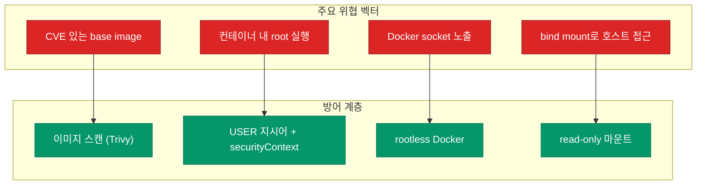
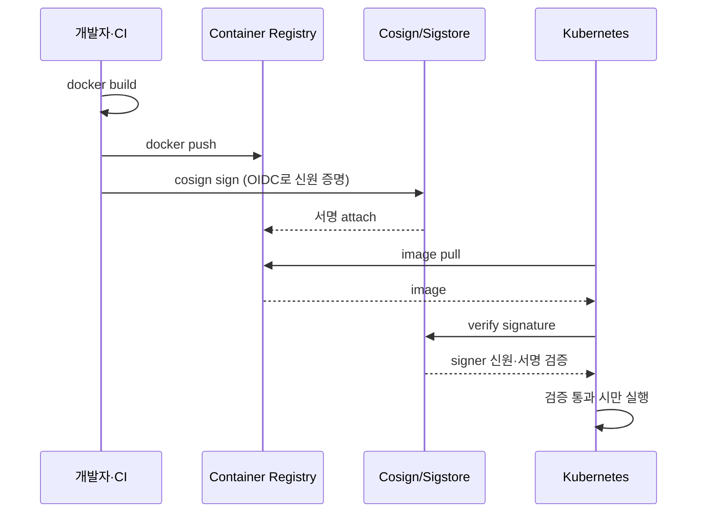

컨테이너는 "격리된 환경"이라 안전하다는 오해가 흔해요. 실제로는 **기본 설정으로 띄운 컨테이너의 대부분이 루트 권한으로 돌고**, 취약한 베이스 이미지를 그대로 쓰고, 서명 검증 없이 배포돼요. 이 글에서는 프로덕션 컨테이너를 공격 표면 관점에서 단단하게 만드는 핵심 실천을 다뤄요.

## 공격 표면 3가지

Docker 보안은 크게 세 층위로 나눠서 생각하면 정리가 쉬워요.

| 계층 | 위협 | 대응 |
|---|---|---|
| **이미지** | 취약한 라이브러리, 악성 베이스 이미지 | 스캔·서명·pinning |
| **런타임** | 루트 권한 탈출, 커널 호출 | 비-루트 실행, capability 제한, seccomp |
| **호스트** | Docker 데몬 권한, 볼륨 탈출 | rootless 모드, SELinux·AppArmor |



## 1. 비-루트 사용자로 실행

가장 기본이지만 가장 자주 빠뜨리는 단계예요. Dockerfile에서 `USER`를 지정하지 않으면 컨테이너는 **UID 0 (root)**로 실행돼요. 컨테이너를 탈출당했을 때 피해 범위가 확 달라져요.

```dockerfile
FROM node:20-alpine
RUN addgroup -S app && adduser -S app -G app
WORKDIR /app
COPY --chown=app:app . .
USER app
CMD ["node", "server.js"]
```

중요한 점 두 가지:

- `COPY --chown` 으로 **파일 소유권을 미리 정리** — 안 그러면 비-루트 사용자가 자기 파일을 못 건드려요
- `app` 유저는 로그인 셸이 없어야 함 (`-S` 옵션이 system user로 만듦)

<div class="callout why">
  <div class="callout-title">비-루트 실행만으로 대부분의 위협이 차단돼요</div>
  컨테이너 탈출 취약점 상당수는 <b>루트 권한을 전제</b>로 해요. 비-루트로 띄우면 <code>capability</code> 대부분이 기본적으로 비활성화되고, 컨테이너가 탈출되더라도 호스트에서 할 수 있는 게 일반 사용자 권한으로 제한돼요. 코드 한 줄의 효과가 다른 어떤 대응보다 크고 간단해요.
</div>

## 2. 이미지 취약점 스캔

공식 이미지라고 안전하지 않아요. `python:3.12-slim`처럼 잘 관리되는 이미지조차 수십 개의 CVE가 있는 경우가 흔해요. 스캔은 **빌드 시점과 배포 전에 두 번** 하는 게 좋아요.

### Trivy로 간단히 검증

```bash
trivy image --severity HIGH,CRITICAL my-app:latest
```

CI 파이프라인에 통합하는 게 이상적이에요.

```yaml
# GitHub Actions 예시
- name: Scan image
  uses: aquasecurity/trivy-action@master
  with:
    image-ref: my-app:${{ github.sha }}
    severity: HIGH,CRITICAL
    exit-code: 1  # 발견 시 CI 실패
```

| 도구 | 강점 |
|---|---|
| **Trivy** | OS 패키지 + 언어 의존성 + IaC 스캔, 빠르고 무료 |
| **Grype** | Anchore 기반, SBOM 연동 강함 |
| **Snyk** | 언어 의존성 심층 스캔, 유료 기능 풍부 |
| **Docker Scout** | Docker Hub 직접 연동 |

### 심각도 기준과 운영 원칙

스캔 결과를 전부 막으면 아무것도 배포 못 해요. 현실적인 기준선:

| 심각도 | 빌드 | 배포 |
|---|---|---|
| CRITICAL | ❌ 즉시 차단 | ❌ |
| HIGH | ⚠️ 경고 + 수정 기한 (7일) | 조건부 허용 |
| MEDIUM/LOW | 로깅 | 허용 |

**핵심은 "배포 차단"이 아니라 "가시성과 책임"**이에요. 누가 언제까지 고치기로 했는지가 추적되어야 해요.

## 3. 런타임 Capability와 read-only 파일시스템

컨테이너는 기본적으로 **14개의 Linux capability**를 가지고 실행돼요. 대부분의 앱은 이 중 한두 개도 필요 없어요.

```bash
docker run --cap-drop=ALL --cap-add=NET_BIND_SERVICE \
  --read-only --tmpfs /tmp \
  my-app
```

| 옵션 | 효과 |
|---|---|
| `--cap-drop=ALL` | 모든 capability 제거 |
| `--cap-add=NET_BIND_SERVICE` | 필요한 것만 선택적 추가 (80/443 포트 바인딩) |
| `--read-only` | 루트 파일시스템 읽기 전용 |
| `--tmpfs /tmp` | 쓰기 필요한 경로만 tmpfs로 허용 |
| `--security-opt=no-new-privileges` | setuid 바이너리로 권한 상승 차단 |

앱이 런타임에 파일을 쓸 일이 거의 없다면 `--read-only`는 매우 강력한 방어선이에요. 쉘 인젝션으로 악성 스크립트를 심으려 해도 디스크에 쓸 수 없어요.

## 4. Docker Socket 노출 금지

`/var/run/docker.sock`을 컨테이너에 마운트하는 건 **컨테이너에 호스트 루트 권한을 주는 것과 같아요**. Docker socket이 있으면 컨테이너 안에서 `docker run --privileged --pid=host` 같은 명령으로 호스트를 완전히 장악할 수 있어요.

```yaml
# ❌ 절대 하지 말 것
volumes:
  - /var/run/docker.sock:/var/run/docker.sock
```

대체 방안:

- **Kaniko, BuildKit rootless** — 컨테이너 내부 빌드가 필요할 때
- **sysbox·gvisor** — 격리된 중첩 컨테이너
- **외부 builder service** — CI 전담 빌드 클러스터

## 5. Rootless Docker

Docker 데몬 자체를 루트가 아닌 사용자로 실행하는 모드예요. 데몬이 탈취돼도 피해 범위가 해당 사용자로 제한돼요.

```bash
# 설치 (Docker Engine 20.10+)
dockerd-rootless-setuptool.sh install
```

| 항목 | 일반 Docker | Rootless |
|---|---|---|
| 데몬 실행 UID | root | 일반 사용자 |
| 1024 이하 포트 바인딩 | 가능 | 제한 (`CAP_NET_BIND_SERVICE` 필요) |
| 일부 네트워크 드라이버 | 전부 | 제한 있음 |
| 성능 | 기본 | 약간 저하 (slirp4netns NAT) |

개발 환경이나 멀티 테넌트 CI 러너에서 특히 가치가 커요.

## 6. 이미지 서명과 출처 검증

프로덕션에서 배포하는 이미지가 **정말 내가 빌드한 그 이미지**인지 보장하는 체계예요.



- **Cosign** (Sigstore) — OIDC 기반 keyless signing, GitHub Actions OIDC와 자연스럽게 연동
- **Notary v2** — OCI 표준 서명
- **Kubernetes admission controller** — `Kyverno`·`Connaisseur`로 서명 없는 이미지 거부

## 체크리스트 — 프로덕션 배포 전

| 항목 | 확인 |
|---|---|
| 이미지 tag가 `latest`가 아닌 **digest 또는 고정 버전** | |
| Dockerfile에 `USER` 지시어로 비-루트 설정 | |
| Trivy 스캔에서 CRITICAL 0건 | |
| `--read-only` + 필요한 `tmpfs`만 마운트 | |
| `--cap-drop=ALL` 후 필요한 capability만 추가 | |
| Docker socket 마운트 없음 | |
| Secret은 환경변수가 아니라 **secret manager** 사용 | |
| 이미지 서명·검증 체계 존재 | |

## 정리

보안은 "완벽"보다 "기본기"예요. 비-루트 실행·read-only·스캔 세 가지만 꾸준히 적용해도 사고 발생률이 크게 떨어져요.

- **비-루트 실행**: 가장 큰 효과, 가장 쉬운 대응
- **이미지 스캔**: CI에 통합, 기준선은 CRITICAL만 차단
- **read-only + capability 제한**: 런타임 공격 표면 최소화
- **Docker socket 절대 노출 금지**
- **Rootless·서명**: 성숙 단계에서 추가

다음 시리즈에서는 Docker로 만든 컨테이너를 **프로덕션에서 오케스트레이션하는 Kubernetes**의 구조와 운영을 깊이 있게 파고들어봐요.
