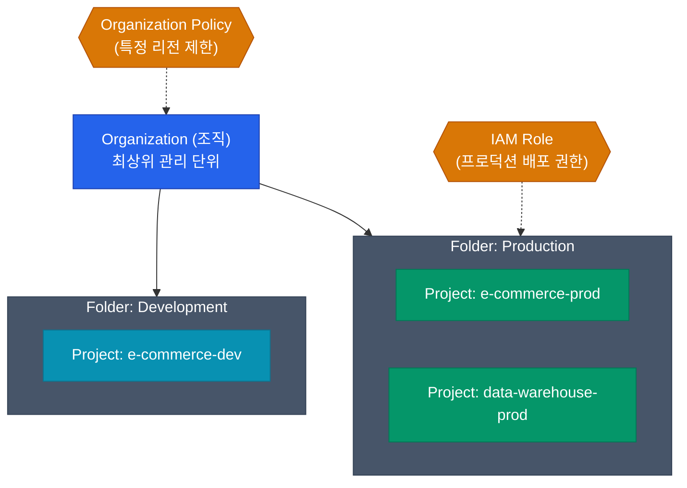

클라우드를 배울 때 보통 AWS를 먼저 접하기 때문에, GCP(Google Cloud Platform)를 처음 만나면 계정 구조와 권한 관리가 매우 이질적으로 느껴집니다. 그 차이는 구글이 가진 **강력한 계층형 리소스 모델**에서 시작돼요.

과거 "계정(Account)" 단위로 쪼개야만 했던 구별을 GCP는 어떻게 설계했는지 AWS와 대비해서 알아볼게요.

## Resource Hierarchy: 클라우드 자원의 뼈대

GCP의 인프라 구조는 우리가 흔히 쓰는 **파일 시스템의 디렉토리 구조**와 완벽히 닮았습니다. 리소스(VM, DB 등)는 반드시 가장 아래쪽의 `Project` 안에 속해야 하고, 권한과 정책은 위에서 아래로 상속(Inherit)돼요.

- **Organization**: 회사(Domain)를 나타내는 최상위 개념입니다.
- **Folder**: 부서나 환경(Prod/Dev)을 나타내는 논리적 폴더예요.
- **Project**: AWS의 'Account'와 비슷한 역할을 하는 최말단 그룹입니다. 청구, API 활성화, 자원 할당이 모두 Project 단위로 이루어집니다.

가장 위(Organization)에서 "아시아 리전에만 서버를 만들 수 있다"는 권한을 부여하면 그 아래 모든 폴더와 프로젝트에 자동으로 상속되어 매우 일관된 보안 적용이 가능합니다.

## GCP IAM Role 모델

GCP의 권한은 "누구(Member)에게 어떤 역할(Role)을 언제 어느 리소스(Resource)에 줄 것인가"로 정의됩니다. 여기서 **역할(Role)**은 세 가지로 구분할 수 있어요.

| Role 유형 | 설명 | AWS의 개념 비교 |
|---|---|---|
| **Basic (기본)** | Owner, Editor, Viewer. 너무 넓은 권한을 줘서 **사용하면 안 됨** | AWS의 `AdministratorAccess` 등과 유사하나 리소스 지향적 |
| **Predefined (사전 정의)** | GCP에서 공식적으로 묶어둔 촘촘한 권한 모음. (예: `roles/compute.instanceAdmin`) | AWS의 `Managed Policy` |
| **Custom (맞춤)** | 기업의 보안 요구사항에 맞춰 세밀한 API 권한들을 직접 고른 모음 | AWS의 `Customer Managed Policy` |

실무에서는 **최소 권한의 원칙**을 위해 무조건 Predefined Role을 사용하고, 정 안 맞을 때만 Custom Role을 만듭니다.

## Service Account: 기계들의 신분증

사람이 구글 콘솔에 로그인할 때 Google Workspace 계정을 쓰듯, VM이나 컨테이너(GKE Pod)가 구글 API를 호출하려면 신분증이 필요해요. 그게 바로 **Service Account (SA)** 입니다.

1. `gcp-storage-reader@my-project.iam.gserviceaccount.com` 라는 SA를 하나 만들어요.
2. 이 SA에 `roles/storage.objectViewer` 역할을 부여해요.
3. EC2와 유사한 구글의 Compute Engine(VM)을 띄울 때 해당 VM의 신분으로 SA를 연결합니다.
4. 이제 그 VM 위에서 도는 앱은 별도의 패스워드나 인증 키 없이 S3와 유사한 Cloud Storage의 파일을 읽을 수 있어요.

  
GCP IAM과 AWS IAM의 결정적 차이

  AWS는 Policy(정책)를 리소스(S3 버킷)나 아이덴티티(Role)에 모두 매달(Attach) 수 있습니다. 반면 GCP IAM은 철저하게 <strong>"리소스 계층에서 멤버를 바인딩"</strong>하는 개념입니다. "이 폴더(리소스)에 대해서 아무개 팀(멤버)에게 편집자(역할)를 부여하라"는 형태(IAM Policy Binding)로 동작해요.

## 정리

- 구글 클라우드는 조직의 구조를 **Organization > Folder > Project**의 트리 모델로 매핑합니다.
- 권한은 넓은 Basic 역할 대신, 용도에 딱 맞는 **Predefined Role**을 사용하세요.
- 애플리케이션의 인증과 권한 획득은 영구적인 키 파일 대신 **Service Account** 연결을 활용하는 것이 가장 안전합니다.

AWS보다 관리가 직관적인 Project와 권한 체계를 살펴봤어요. 다음에는 이 IAM 구조를 등에 업고 뛰어난 엔지니어링을 보여주는 구글의 자랑, **Kubernetes(GKE) 운영 구조**를 알아봅니다.
