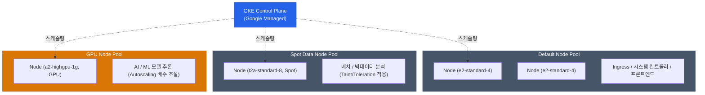

Kubernetes를 탄생시킨 구글의 플랫폼답게, **Google Kubernetes Engine(GKE)**은 퍼블릭 클라우드 관리형 K8s 생태계에서 가장 앞선 사용성과 자동화를 자랑해요. EKS나 AKS와 비교해 보더라도 클러스터 관리자의 부담이 훨씬 덜어져 있습니다.

GCP에서 GKE를 도입할 때 가장 먼저 결정해야 하는 운영 모드와 핵심 연동 기술을 살펴볼게요.

## 두 가지 운영 모드: Standard vs Autopilot

GKE는 인프라를 얼마나 사용자가 직접 제어할지에 따라 두 가지 모드를 제공해요.

| 비교 항목 | Standard 모드 | Autopilot 모드 |
|---|---|---|
| **과금 방식** | 실행 중인 **Node (VM)** 기준 과금 | 실행 중인 **Pod (CPU/Memory)** 기준 과금 |
| **Node(VM) 노출 여부** | OS 레벨 접속 가능, 관리자 권한 보장 | 완전 숨김 (No SSH, 빈 공간 자동 관리) |
| **스케일링 주체** | 사용자가 Node Pool Auto-scaler 직접 조율 | 구글이 컨테이너 크기에 맞춰 자동으로 서버 증설 |
| **운영 유연성** | 특수 하드웨어 장착 및 관리자 권한 도구(DaemonSet) 무제한 | 보안 규칙이 강제되어 권한 상승을 요하는 툴 제한 |

**Autopilot** 모드는 마치 AWS의 Fargate와 철학이 비슷하지만, 쿠버네티스 생태계 안에서 훨씬 매끄럽게 동작해요. "서버 용량"에 대한 고민 자체를 클러스터 밖으로 밀어내고, 오직 "이 Pod 띄우는 데 2코어 4GB 필요해"라고 선언만 하면 빈 여백은 GKE가 알아서 비용 최적화하여 채워줍니다.

하지만 복잡한 서비스 특성상 CNI 플러그인을 교체하거나 노드의 커널 튜닝을 해야 한다면 여전히 **Standard** 버전을 선택해야 해요.

## 노드풀(Node Pool) 아키텍처

Standard 모드를 사용한다면, 노드들의 묶음인 Node Pool을 용도에 맞게 구성해야 해요. 모든 Pod가 같은 컴퓨팅 자원에서 섞여 도는 건 좋지 않아요.

노드풀을 쪼갤 수 있는 대표적인 축은 다음과 같습니다.
- **Spot 인스턴스 전용 풀**: 중간에 꺼져도 상관없는 워커/배치 Pod를 띄워 컴퓨팅 비용을 70~80% 아낌
- **GPU 풀**: 머신러닝 모델 구동을 위한 고스펙 H/W 풀. 평소 인스턴스 개수를 0개로 Scale Down하여 무과금 유지

## Workload Identity (보안 연동의 핵심)

GKE에서 동작하는 Pod가 구글 클라우드의 다른 자원, 예를 들어 Cloud Storage의 이미지를 읽거나 Cloud SQL에 연결해야 할 때 권한은 어떻게 증명할까요?
과거에는 비공개 키가 담긴 JSON 파일을 K8s Secret으로 구워 넣어서 썼지만, 키 유출 위험이 커요.

이를 완벽에 가깝게 해결하는 방법이 **Workload Identity**입니다.

1. **Kubernetes Service Account (KSA)** 생성: `my-app-ksa`
2. **GCP IAM Service Account (GSA)** 생성: `my-app-gsa@my-project...`
3. 두 Account 간 바인딩: GSA에 권한을 주고, "이 GSA의 권한을 행사할 수 있는 주체는 KSA를 갖고 있는 녀석뿐이다"라고 연결합니다.
4. Pod는 단기 유효한 토큰 기반으로 AWS IAM Role처럼 무임소(keyless)로 권한을 사용해요.

  
자동 업그레이드의 이점과 그 대가

  K8s 버전 업그레이드는 플랫폼 엔지니어의 골칫거리입니다. GKE는 <strong>Release Channel</strong>을 통해 노드부터 컨트롤 플레인까지 클릭 몇 번(또는 완전 자동화)으로 무중단 롤링 업데이트를 제공해요. 단, 구글이 너무 빠르기 때문에 Deprecated API를 사용하는 레거시 배포판이 클러스터에 섞여 있으면, 강제 업데이트로 인해 서비스가 내려가는 대참사가 날 수 있습니다.

## 정리

- K8s의 서버 관리 부담에서 완전히 해방되고 싶다면 무조건 **Autopilot** 모드를 도입하세요.
- **Standard** 에서는 워크로드 특성에 따라 Spot, GPU 등 **다양한 종류의 Node Pool**을 분리 운영하세요.
- 앱 컨테이너의 GCP 자원 접근은 JSON 키 다운로드가 아닌, 무조건 **Workload Identity**를 구축해 해결하세요.

GKE는 GCP의 꽃이자 클라우드 네이티브 애플리케이션의 본진입니다. 다음으로는 이렇게 배포된 애플리케이션들이 어떻게 글로벌 유저를 맞아들이는지 **GCP의 네트워크, 글로벌 VPC와 Load Balancer** 체계를 살펴볼게요.
