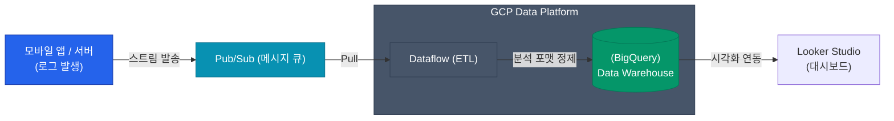

"이유는 모르겠지만 머신러닝이나 데이터 분석 조직은 GCP를 좋아하더라"라는 말을 종종 듣게 됩니다. 그 뒤에는 구글이 내놓은 압도적인 데이터 웨어하우스(DW), **BigQuery(빅쿼리)**가 자리 잡고 있습니다.

데이터 파이프라인의 종착지인 BigQuery와 그것을 둘러싼 실시간 처리 시스템, 그 찰떡궁합의 조합을 소개할게요.

## 명불허전 BigQuery: 노옵스(NoOps)의 정점

전통적인 DW(Hadoop이나 AWS Redshift 등)는 클러스터를 몇 대나 띄울지, 스토리지는 SSD로 얼마나 잡을지 인프라를 계획(Provisioning)해야 했습니다. 
하지만 BigQuery는 **완전한 서버리스(Serverless)**입니다. 노드를 늘리거나 패치를 할 필요가 전혀 없이, 페타바이트급 데이터에 당장 SQL 쿼리를 날릴 수 있어요.

### 컬럼 지향과 과금 모델

| 기술적 특징 | 의미 |
|---|---|
| **컬럼(Column) 기반 저장** | 데이터를 행 단위가 아닌 컬럼별로 모아 저장해서, 100개 컬럼 중 분석에 필요한 2개 컬럼만 초고속으로 스캔할 수 있어요. |
| **분산 처리 엔진 (Dremel)** | 한 번 쿼리를 날리면 구글 내부의 수천 대 서버가 작업을 쪼개어(MapReduce 변형) 몇 초 만에 집계한 후 결과를 돌려줘요. |
| **과금 (Pay-as-you-go)** | 읽은 데이터(스캔량) 만큼 돈을 내요. 1TB 스캔당 약 $6 정도 하기 때문에 생각 없이 날리는 `SELECT *`는 파산의 지름길이에요. |

  
파티셔닝(Partitioning)의 중요성

  BigQuery에서 스캔 비용을 줄이기 위해서는 <strong>날짜(Date) 기반 파티셔닝</strong>이 필수적입니다. 날짜별로 데이터가 물리적으로 분리 저장되므로 `WHERE date > '2026-04-01'` 조건을 걸면 이전 데이터는 아예 스캔하지 않아 과금과 성능 두 마리 토끼를 잡을 수 있습니다.

## 전형적인 실시간 데이터 파이프라인

게임 로그, 광고 클릭 스트림 같은 실시간 데이터를 어떻게 BigQuery까지 배달할까요? 구글 클라우드에서 가장 정석으로 여겨지는 Pub/Sub과 Dataflow의 호흡을 살펴볼게요.

1. **Pub/Sub (버퍼링)**: 쏟아지는 트래픽을 잠시 받아주는 무한대의 파이프(Queue)예요. AWS의 Kinesis나 SQS 스탠다드의 자리를 대신하며 완전 관리형인 게 특징이에요.
2. **Dataflow (데이터 가공)**: 아파치 빔(Apache Beam) 엔진으로 도는 ETL 시스템이에요. 개인정보(PII)를 마스킹하거나 형태를 예쁘게 매핑(Transform)해서 BigQuery로 넘깁니다. 서버리스 파이프라인의 핵심이죠.

## Looker Studio: 대시보드의 완성

수십억 건의 데이터가 BigQuery에 쌓였다면, 경영진이나 기획자들이 훌륭한 인사이트를 얻어갈 차례입니다. 이를 위해 Tableau 같은 유료 제품을 써도 좋지만, GCP에 바로 붙어있는 **Looker Studio**(옛 구글 데이터 스튜디오)가 아주 훌륭한 시각화 도구가 됩니다.

BigQuery를 데이터 소스로 몇 번 클릭만 해주면, 비개발자도 드래그 앤 드롭으로 트렌드 차트를 뽑을 수 있어요.

## 정리

- 구글 클라우드를 도입하는 가장 강력한 유인책이 바로 **서버리스 데이터 웨어하우스, BigQuery**입니다.
- 빠른 처리와 비용 절감을 위해선 무조건 쿼리 상단에 **파티셔닝** 조건과 특정 컬럼 참조 구문을 사용하세요.
- **Pub/Sub → Dataflow → BigQuery → Looker Studio**로 이어지는 아키텍처는 실시간 분석 파이프라인의 교과서적인 패턴입니다.

지금까지 4편에 걸쳐 GCP의 핵심 인프라를 살펴보았습니다. 조직 구조에 편안하게 대응하는 IAM 모델, 쿠버네티스의 성지 GKE, 강력한 글로벌 네트워크 백본과 BigQuery까지, GCP만이 제공하는 엣지를 잘 활용하시면 모던 아키텍처 전환에 큰 도움이 될 거라 믿습니다.
