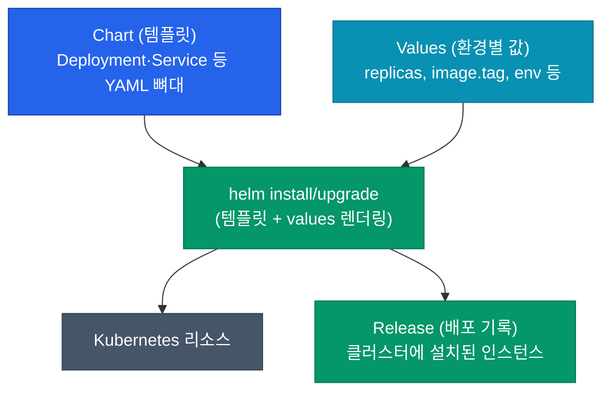
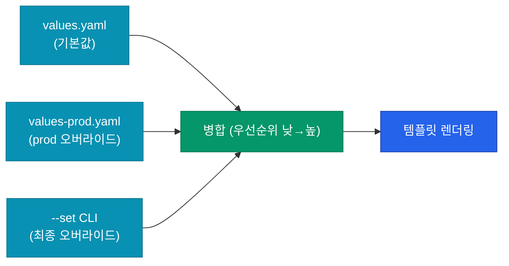



Kubernetes 매니페스트를 여러 환경(dev·stg·prod)에 배포하면서 값만 살짝씩 다르게 관리하려면, YAML 파일을 복사해서 환경마다 손으로 수정하는 방식은 금방 한계에 부딪혀요. Helm은 이 문제를 **템플릿 엔진 + 패키징**으로 풀어요. 차트 하나로 "같은 앱, 다른 환경"을 선언적으로 관리하는 도구예요.

## 왜 Helm인가

매니페스트 중복이 쌓이면 이런 문제가 생겨요.

| 문제 | 원인 |
|---|---|
| 환경별 값이 비동기화 | dev에는 반영됐는데 prod에 빠진 설정 |
| Deployment·Service·ConfigMap 같은 리소스를 통째로 복붙 | 한 서비스 배포에 5~10개 YAML 파일 |
| 공통 패턴 재사용 불가 | 서비스마다 ServiceMonitor·PDB·HPA 매번 다시 작성 |
| 버전 롤백 수작업 | 어제 상태로 되돌리려면 git checkout + apply 수동 |

Helm은 이 네 가지를 **차트·values·release** 3단 구조로 해결해요.

## 핵심 3요소



| 개념 | 역할 |
|---|---|
| **Chart** | 재사용 가능한 매니페스트 템플릿 묶음 |
| **Values** | 템플릿에 주입하는 환경별 변수 |
| **Release** | 특정 values로 설치된 실제 인스턴스 (이름 + 네임스페이스) |

동일한 Chart를 `my-api-dev`, `my-api-prod`라는 두 Release로 설치하면, 같은 템플릿 기반이지만 각자 다른 values로 렌더링된 **독립적 배포**가 돼요.

## Chart 구조

```
my-chart/
├── Chart.yaml          # 차트 메타데이터 (이름·버전·의존성)
├── values.yaml         # 기본 values
├── templates/
│   ├── deployment.yaml
│   ├── service.yaml
│   ├── _helpers.tpl    # 재사용 함수 (naming, label 등)
│   └── NOTES.txt       # 설치 후 표시될 안내문
├── charts/             # 의존 차트 (subchart)
└── .helmignore
```

### Chart.yaml

차트의 신분증이에요.

```yaml
apiVersion: v2
name: my-api
version: 1.2.0          # 차트 자체 버전 (SemVer)
appVersion: "2.5.1"     # 담고 있는 앱 버전 (정보용)
dependencies:
  - name: postgresql
    version: 14.2.0
    repository: https://charts.bitnami.com/bitnami
```

`version`과 `appVersion`의 구분이 중요해요. **차트 구조가 바뀌면 version 증가**, **앱 이미지만 바뀌면 appVersion 증가**.

## 템플릿 — Go template 기반

Helm은 Go의 `text/template`에 `sprig` 함수를 추가한 템플릿 엔진을 써요. values가 `.Values.`, 릴리스 메타가 `.Release.`로 들어와요.

```yaml
# templates/deployment.yaml
apiVersion: apps/v1
kind: Deployment
metadata:
  name: {{ include "my-api.fullname" . }}
  labels:
    {{- include "my-api.labels" . | nindent 4 }}
spec:
  replicas: {{ .Values.replicaCount }}
  selector:
    matchLabels:
      {{- include "my-api.selectorLabels" . | nindent 6 }}
  template:
    metadata:
      labels:
        {{- include "my-api.selectorLabels" . | nindent 8 }}
    spec:
      containers:
      - name: app
        image: "{{ .Values.image.repository }}:{{ .Values.image.tag | default .Chart.AppVersion }}"
        resources:
          {{- toYaml .Values.resources | nindent 10 }}
```

| 구문 | 의미 |
|---|---|
| `{{ .Values.x }}` | values.yaml에서 x 주입 |
| `{{ include "name" . }}` | `_helpers.tpl`의 named template 호출 |
| `{{- ... }}` / `{{ ... -}}` | 좌우 공백·개행 제거 |
| `\| nindent N` | 값 앞에 N칸 들여쓰기 추가 |
| `\| default X` | 값 없으면 X 사용 |

### `_helpers.tpl` — 재사용 블록

매번 반복되는 라벨·이름 생성 로직은 여기에 모아둬요.

```
{{- define "my-api.fullname" -}}
{{- printf "%s-%s" .Release.Name .Chart.Name | trunc 63 | trimSuffix "-" -}}
{{- end -}}

{{- define "my-api.labels" -}}
app.kubernetes.io/name: {{ .Chart.Name }}
app.kubernetes.io/instance: {{ .Release.Name }}
app.kubernetes.io/version: {{ .Chart.AppVersion | quote }}
app.kubernetes.io/managed-by: {{ .Release.Service }}
{{- end -}}
```

**표준 라벨 세트**(`app.kubernetes.io/*`)를 붙이면 ArgoCD·Prometheus·kubectl 같은 도구가 차트 간 일관되게 인식해요.

## Values 오버라이드 체계

같은 차트를 여러 환경에 배포할 때, 기본 `values.yaml`을 두고 환경별 파일로 덮어써요.



```bash
helm upgrade --install my-api ./my-chart \
  -f values.yaml \
  -f values-prod.yaml \
  --set image.tag=v2.5.1
```

| 우선순위 (낮→높) | 소스 |
|---|---|
| 1 | Chart의 기본 `values.yaml` |
| 2 | `-f file.yaml` (순서대로) |
| 3 | `--set key=value` CLI |

CLI `--set`이 가장 강력해요. CI에서 image tag를 주입할 때 주로 써요.

## Release 관리

Helm이 일반 `kubectl apply`와 다른 점은 **Release 이력을 보관**한다는 거예요.

```bash
helm list -n production            # 설치된 release 목록
helm history my-api -n production  # 버전 이력
helm rollback my-api 3 -n production  # 3번째 리비전으로 롤백
```

이력은 Kubernetes Secret으로 저장돼요 (`sh.helm.release.v1.*`). 즉 **클러스터 자체가 release 상태의 SSOT**예요.

<div class="callout why">
  <div class="callout-title">Helm은 "무엇을 변경했는가"가 아니라 "최종 상태"를 기록해요</div>
  Helm은 각 upgrade마다 <b>렌더링된 전체 매니페스트</b>를 Secret에 저장해요. 덕분에 롤백은 "이전 매니페스트를 그대로 재적용"하는 간단한 연산이 돼요. 대신 용량은 리비전마다 누적되므로, <code>--history-max 10</code> 으로 제한을 두지 않으면 Secret이 수백 개로 쌓이는 경우가 있어요.
</div>

## 기본 명령어 요약

| 명령 | 역할 |
|---|---|
| `helm create NAME` | 차트 스캐폴딩 생성 |
| `helm template . -f values.yaml` | 렌더링 결과만 출력 (설치 X) |
| `helm install NAME . -f values.yaml` | 새 release 설치 |
| `helm upgrade --install NAME .` | 있으면 업그레이드, 없으면 설치 (idempotent) |
| `helm diff upgrade NAME .` | 변경분 미리보기 (plugin 필요) |
| `helm uninstall NAME` | release 제거 |
| `helm lint .` | 차트 문법·구조 검증 |

**`upgrade --install` 조합**이 CI/CD에서 기본 형태예요. 첫 배포든 업데이트든 같은 명령으로 처리돼요.

## Umbrella Chart — 차트의 조합

여러 서비스를 하나의 릴리스로 묶고 싶을 때 쓰는 패턴이에요.

```
my-platform/
├── Chart.yaml          # dependencies에 여러 차트
├── values.yaml
└── charts/
    ├── api-chart/
    ├── worker-chart/
    └── postgres/       # bitnami/postgresql 의존 포함
```

`Chart.yaml`의 `dependencies`에 등록하고 `helm dependency update`로 묶으면, **단일 차트처럼 동작**하면서 내부적으로는 여러 subchart가 각자 렌더링돼요.

## 정리

- **Chart = 템플릿**, **Values = 환경별 값**, **Release = 설치된 인스턴스**
- 동일 Chart + 다른 Values = 환경별 선언 재사용
- **표준 라벨**(`app.kubernetes.io/*`)을 `_helpers.tpl`로 일관화
- `values.yaml → -f → --set` 우선순위로 값 오버라이드
- `upgrade --install` 이 CI 표준 패턴

다음 글에서는 실제로 **차트를 설계할 때 빠지기 쉬운 함정과 재사용 가능한 패턴**을 다뤄요.


