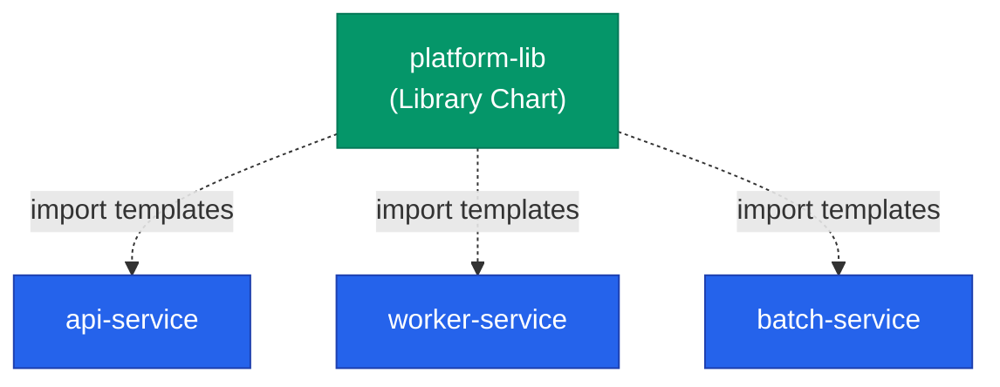
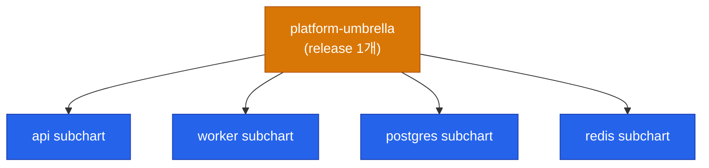



회사의 서비스가 열 개쯤 되면 각 서비스마다 Deployment·Service·HPA·PDB·ServiceMonitor가 거의 똑같은 형태로 반복돼요. 서비스마다 따로 차트를 만들면 공통 정책 하나 바꿀 때 열 군데 수정해야 하죠. 이 글에서는 **중복을 제거하는 차트 설계 패턴**을 정리해요.

## 3가지 재사용 전략

| 전략 | 쓰임 | 장단점 |
|---|---|---|
| **Umbrella + subchart** | 여러 서비스를 하나의 릴리스로 | 묶음 배포 편함, 개별 롤백 어려움 |
| **Library chart** | 재사용 가능한 템플릿 블록 | DRY 극대화, 학습 곡선 있음 |
| **Common values 공유** | 서비스별 차트 + 공통 values | 유연함, 규율 필요 |

## Library Chart — 템플릿 함수 라이브러리

가장 강력한 재사용 메커니즘이에요. **렌더링되지 않는 차트**로, 다른 차트가 `import`하는 **함수 모음집** 역할을 해요.



### Library Chart 정의

```yaml
# platform-lib/Chart.yaml
apiVersion: v2
name: platform-lib
type: library      # 🔑 핵심
version: 1.0.0
```

```
# platform-lib/templates/_deployment.tpl
{{- define "platform-lib.deployment" -}}
apiVersion: apps/v1
kind: Deployment
metadata:
  name: {{ .Values.name }}
  labels:
    {{- include "platform-lib.labels" . | nindent 4 }}
spec:
  replicas: {{ .Values.replicas | default 3 }}
  selector:
    matchLabels:
      app: {{ .Values.name }}
  template:
    metadata:
      labels:
        app: {{ .Values.name }}
    spec:
      containers:
      - name: app
        image: "{{ .Values.image.repository }}:{{ .Values.image.tag }}"
        resources:
          {{- toYaml .Values.resources | nindent 10 }}
        {{- with .Values.probes }}
        readinessProbe:
          {{- toYaml .readiness | nindent 10 }}
        livenessProbe:
          {{- toYaml .liveness | nindent 10 }}
        {{- end }}
{{- end -}}
```

### 사용하는 차트

```yaml
# api-service/Chart.yaml
apiVersion: v2
name: api-service
type: application
version: 0.1.0
dependencies:
  - name: platform-lib
    version: 1.0.0
    repository: "oci://ghcr.io/org/charts"
```

```
# api-service/templates/deployment.yaml
{{- include "platform-lib.deployment" . }}
```

이제 서비스 차트에는 **단 한 줄**만 있어요. Deployment 구조가 변경되면 library chart만 업데이트하고 각 서비스는 의존 버전만 올리면 돼요.

<div class="callout why">
  <div class="callout-title">Library Chart는 템플릿을 만들지 않아요</div>
  <code>type: library</code> 선언이 핵심이에요. <code>application</code> 차트는 <code>templates/</code> 안의 파일을 렌더링 대상으로 쓰지만, library 차트는 <b>렌더링 대상에서 제외</b>되고 <code>_*.tpl</code> 의 <code>define</code> 블록만 다른 차트가 import할 수 있는 함수로 노출돼요.
</div>

## Values 스키마 — 타입 안전성

values.yaml은 문자열과 숫자를 자유롭게 섞어 쓸 수 있어서 오타로 인한 장애가 흔해요. **`values.schema.json`** 으로 구조를 강제할 수 있어요.

```json
{
  "$schema": "https://json-schema.org/draft-07/schema",
  "type": "object",
  "required": ["image", "replicaCount"],
  "properties": {
    "replicaCount": {
      "type": "integer",
      "minimum": 1,
      "maximum": 50
    },
    "image": {
      "type": "object",
      "required": ["repository", "tag"],
      "properties": {
        "repository": { "type": "string" },
        "tag": { "type": "string" }
      }
    },
    "resources": {
      "type": "object",
      "properties": {
        "limits": { "$ref": "#/definitions/resource" },
        "requests": { "$ref": "#/definitions/resource" }
      }
    }
  }
}
```

`helm install`·`helm lint` 시 스키마 위반이 발견되면 **즉시 실패**해요. CI에서 자동으로 검증되는 안전장치가 돼요.

## 환경별 values 구조

환경이 늘어나면 values 파일도 정리가 필요해요. 두 가지 대표 패턴이에요.

### 패턴 A — 환경별 전체 파일

```
charts/api-service/
├── values.yaml            # 공통 기본
├── values-dev.yaml
├── values-stg.yaml
└── values-prod.yaml
```

**장점**: 환경별 값이 한눈에 보임
**단점**: 공통값 변경 시 여러 파일 동기화

### 패턴 B — 계층화된 values

```
values/
├── base/
│   └── values.yaml
├── env/
│   ├── dev.yaml
│   ├── stg.yaml
│   └── prod.yaml
└── region/
    ├── ap-northeast-2.yaml
    └── us-east-1.yaml
```

```bash
helm upgrade api ./chart \
  -f values/base/values.yaml \
  -f values/env/prod.yaml \
  -f values/region/ap-northeast-2.yaml
```

**장점**: 차원별 재사용 (env × region)
**단점**: 병합 순서·충돌 규칙 파악 필요

규모가 커지면 B 패턴이 유리하지만, 서비스 5개 이하에서는 A가 단순해서 낫죠.

## 자주 빠지는 함정

### 1. `values.yaml`에 Secret 박기

```yaml
# ❌ 절대 안 됨
database:
  password: s3cr3t-production
```

Secret은 **Sealed Secrets·External Secrets·Vault**로 외부화해야 해요. values.yaml은 Git에 올라가니까요.

### 2. `range` 루프에서 `.Values` 컨텍스트 잃기

```
{{- range .Values.services }}
  name: {{ .name }}
  image: {{ .image }}
  namespace: {{ $.Values.namespace }}  # $ 로 루트 접근 필수
{{- end }}
```

`range` 안에서는 `.`이 현재 루프 아이템을 가리켜요. 루트 `.Values` 에 접근하려면 **`$`를 루프 밖에서 선언**해두거나 `$.Values`로 써요.

### 3. 빈 문자열 vs 누락

```yaml
replicaCount:
```

YAML에서 이는 `null`이에요. `{{ .Values.replicaCount | default 3 }}`는 `null`을 감지하지만, 명시적 빈 문자열 `""`은 **default 연산자가 적용되지 않아요**. 조건 분기할 때 `empty` 함수를 쓰는 게 안전해요.

### 4. 숫자가 문자열로 렌더링

```yaml
timeout: {{ .Values.timeout }}s
```

`timeout: 30`을 주면 `30s`가 되는데, `timeout: "30"`을 주면 `"30"s`가 되어 파싱 실패해요. **숫자형은 `| int`로 강제 변환**하세요.

## Umbrella Chart — 언제 쓸 만한가

여러 차트를 하나로 묶는 umbrella 패턴은 유혹적이지만 함정이 있어요.



| 상황 | 적합성 |
|---|---|
| 초기 프로토타입·POC | ✅ 한 번에 띄우기 편함 |
| dev 환경 | ✅ 개발자 로컬 환경 구축 |
| 개별 서비스 롤백이 잦음 | ❌ 전체가 하나의 release라 불편 |
| 팀별 독립 배포 주기 | ❌ 한 팀의 배포가 다른 팀 영향 |
| 수십 개 서비스 대규모 플랫폼 | ❌ 차트가 비대해짐 |

**실무 권장**: 서비스별 차트 + ArgoCD ApplicationSet 조합이 umbrella보다 운영이 깔끔해요.

## 테스트 — 차트도 CI로 검증

```yaml
# .github/workflows/chart-ci.yml
- name: Lint
  run: helm lint ./charts/api-service

- name: Template render
  run: helm template api ./charts/api-service -f values-prod.yaml > rendered.yaml

- name: Validate with kubeconform
  run: kubeconform -strict -summary rendered.yaml

- name: Chart testing (helm/chart-testing)
  run: ct install --config ct.yaml
```

| 도구 | 검증 항목 |
|---|---|
| `helm lint` | 차트 구조·syntax |
| `helm template` + `kubeconform` | 렌더링된 매니페스트가 Kubernetes 스키마 준수 |
| `chart-testing (ct)` | 실제 kind 클러스터에 설치·upgrade 테스트 |

## 정리

- **Library chart**로 여러 서비스의 공통 템플릿을 한 곳에 모아요
- **`values.schema.json`**으로 values 타입 오류를 CI에서 걸러요
- 환경이 5개 미만이면 파일별 values, 이상이면 계층화
- **Secret은 values.yaml에 넣지 말기** — SealedSecret·ExternalSecret 사용
- Umbrella는 매력적이지만 서비스 분리 주기가 다르면 독이 돼요
- 차트는 **애플리케이션 코드처럼 CI로 검증**

다음 글에서는 차트를 **어떻게 배포하고 공유할지** — 레포지토리·OCI registry·릴리즈 자동화를 다뤄요.


