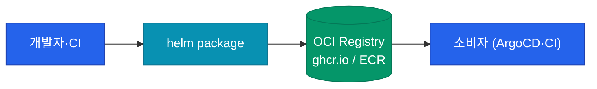
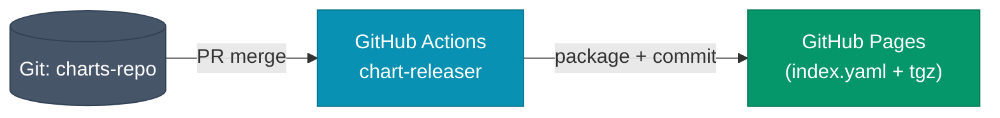
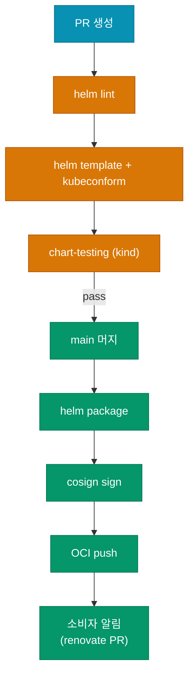

차트를 잘 설계했어도 **어떻게 다른 팀·다른 클러스터에 공유할지**가 해결되지 않으면 쓸모가 제한돼요. 이 글에서는 Helm 차트를 패키징해서 저장소에 올리고, CI로 자동 릴리즈하고, 소비자 쪽에서 버전을 핀닝해서 안정적으로 받아쓰는 파이프라인 전체 흐름을 정리해요.

## 차트 저장소 — 3가지 방식

| 저장소 | 백엔드 | 장점 | 단점 |
|---|---|---|---|
| **HTTP 기반** | 정적 파일 서버 | 단순함, 무료 (GitHub Pages) | index.yaml 수동 관리 |
| **ChartMuseum** | 자체 서버 | 차트 업로드 API 제공 | 운영 부담 |
| **OCI Registry** | Docker registry (ECR·GHCR·Harbor) | 컨테이너 이미지와 동일 인프라 | Helm 3.8+ 필요 |

**최근 표준은 OCI**예요. 이미지 레지스트리와 동일한 인프라·권한·서명을 그대로 쓸 수 있어서 운영 일원화가 돼요.



## OCI 레지스트리로 업로드

```bash
# 1. 차트 패키징
helm package ./charts/my-api
# my-api-1.2.0.tgz 생성

# 2. 레지스트리 로그인
helm registry login ghcr.io -u USERNAME -p TOKEN

# 3. 푸시
helm push my-api-1.2.0.tgz oci://ghcr.io/my-org/charts
```

소비자 쪽 사용:

```bash
helm install my-api oci://ghcr.io/my-org/charts/my-api --version 1.2.0
```

**OCI URL에 차트 이름은 안 들어가요.** `oci://host/namespace`까지만 쓰고, 차트 이름은 command 인자로 줘요.

### 이미지 레지스트리와 권한 일원화

OCI 방식의 가장 큰 장점이에요. GitHub Container Registry를 쓰면 **같은 org token으로 이미지·차트를 모두 관리**할 수 있고, ArgoCD도 **같은 pullSecret으로 차트와 이미지를 함께** 가져와요.

## HTTP 기반 저장소 (GitHub Pages)

간단한 팀은 GitHub Pages로 시작하는 경우도 많아요.



### chart-releaser 액션

`helm/chart-releaser-action`이 차트 디렉토리를 감지해서 자동으로 패키징·릴리즈·index.yaml 업데이트까지 해줘요.

```yaml
# .github/workflows/release.yml
on:
  push:
    branches: [main]

jobs:
  release:
    runs-on: ubuntu-latest
    steps:
      - uses: actions/checkout@v4
        with:
          fetch-depth: 0
      - name: Configure Git
        run: |
          git config user.name "$GITHUB_ACTOR"
          git config user.email "$GITHUB_ACTOR@users.noreply.github.com"
      - uses: azure/setup-helm@v4
      - name: Run chart-releaser
        uses: helm/chart-releaser-action@v1
        env:
          CR_TOKEN: ${{ secrets.GITHUB_TOKEN }}
```

소비자 등록:

```bash
helm repo add my-org https://my-org.github.io/charts-repo
helm repo update
helm install my-api my-org/my-api --version 1.2.0
```

## 차트 버전 관리 원칙

차트 버전은 **SemVer**를 따르되, "앱 버전"과 "차트 버전"을 확실히 분리해야 해요.

| 변경 유형 | 차트 version | 차트 appVersion |
|---|---|---|
| 앱 이미지 태그만 업데이트 (bug fix) | patch (1.2.0 → 1.2.1) | v2.5.1 → v2.5.2 |
| 앱 기능 추가 (new feature) | minor (1.2.0 → 1.3.0) | v2.5.1 → v2.6.0 |
| values 구조 변경 (breaking) | major (1.2.0 → 2.0.0) | 동일 유지 가능 |

**values 구조가 바뀌면 반드시 major**여야 해요. 소비자는 minor까지만 자동 upgrade하는 게 관례인데, breaking을 minor에 숨기면 자동 배포가 깨져요.

## CI 파이프라인 전체 그림



### 차트 서명 (cosign)

이미지와 동일하게 차트도 서명해서 **출처 검증**이 가능해요.

```bash
cosign sign oci://ghcr.io/my-org/charts/my-api:1.2.0

# 소비자 쪽 검증
cosign verify oci://ghcr.io/my-org/charts/my-api:1.2.0 \
  --certificate-identity-regexp='https://github.com/my-org/.+' \
  --certificate-oidc-issuer='https://token.actions.githubusercontent.com'
```

ArgoCD에서도 차트 서명 검증을 통과한 것만 배포되도록 admission을 걸 수 있어요.

## 소비자 쪽 — 버전 핀닝과 자동 업데이트

### ArgoCD Application

```yaml
spec:
  source:
    repoURL: ghcr.io/my-org/charts
    chart: my-api
    targetRevision: 1.2.*   # patch만 자동 따라감
    helm:
      valueFiles:
      - values-prod.yaml
```

`targetRevision`에 SemVer range를 쓰면 patch는 자동, minor·major는 수동으로 끊을 수 있어요.

### Renovate로 PR 자동화

`renovate.json`에 Helm chart 업데이트 규칙을 넣으면, 새 차트 버전이 올라올 때 자동으로 PR이 생성돼요.

```json
{
  "extends": ["config:base"],
  "helm-values": {
    "fileMatch": ["^charts/.+/values.*\\.yaml$"]
  },
  "packageRules": [
    {
      "matchManagers": ["helmv3"],
      "automerge": true,
      "matchUpdateTypes": ["patch"]
    }
  ]
}
```

**Patch 자동 merge + minor 이상 수동 리뷰**가 안전한 기본 설정이에요.

## 차트 배포 전략 체크리스트

| 항목 | 권장 |
|---|---|
| 저장소 형태 | OCI (ghcr·ECR·Harbor) |
| 버전 정책 | SemVer 엄격 준수, breaking = major |
| 서명 | cosign keyless |
| 릴리즈 자동화 | GitHub Actions + chart-releaser (HTTP) / push (OCI) |
| CI 검증 | lint + template + kubeconform + chart-testing |
| 소비자 업데이트 | Renovate (patch auto, minor 수동) |
| 차트 히스토리 보관 | 이전 10개 버전 이상 유지 (롤백 여력) |

## Umbrella 릴리즈 vs 서비스별 릴리즈

"여러 서비스 함께 배포"를 할 때 릴리즈 단위 선택도 중요해요.

| 전략 | 장점 | 단점 |
|---|---|---|
| Umbrella chart 1개 릴리즈 | 일관된 버전, 한 번에 배포 | 한 서비스 변경도 전체 버전 증가 |
| 서비스별 차트 독립 릴리즈 | 각 팀 독립 주기 | "플랫폼 전체 상태"가 버전으로 표현 안 됨 |
| 서비스별 + GitOps에서 묶음 | 양쪽 장점 | ArgoCD ApplicationSet 등 추가 인프라 |

**대기업 규모에서는 세 번째가 표준**이에요. 차트는 서비스별로 독립 릴리즈하되, ArgoCD ApplicationSet으로 "어느 환경에 어느 버전이 떠있는지"를 Git에서 관리해요.

## 시리즈 마무리

3편에 걸쳐 Helm의 개념, 재사용 설계, 배포 파이프라인을 훑었어요.

- 01: Chart·Values·Release 3요소와 템플릿 기본
- 02: Library chart·values schema·함정 피하기
- 03: OCI 기반 배포·서명·CI 자동화

핵심 메시지: **"매니페스트를 복사하지 말고 차트로 만들어라. 차트는 코드처럼 CI로 검증해라."** 차트가 없는 Kubernetes 운영은 결국 복붙 지옥으로 끝나요.

다음 시리즈에서는 Pod 간 통신을 더 정교하게 제어하는 **Service Mesh**(Istio·Linkerd)를 다뤄요.
