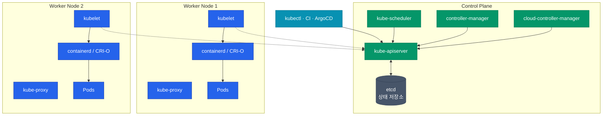
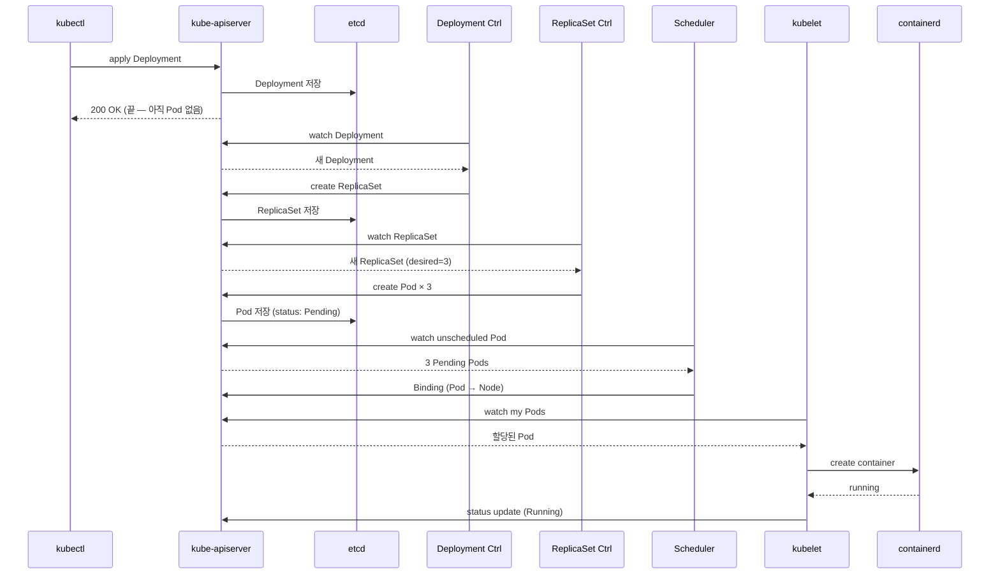

Docker로 컨테이너 한두 개 돌리는 건 쉬워요. 그런데 수백 개 컨테이너를 수십 대 서버에 흩뿌리고, 서버 하나가 죽어도 알아서 복구하고, 롤링 업데이트가 부드럽게 돌아가야 한다면 이야기가 달라져요. Kubernetes는 이 문제를 **선언적으로** 풀어요. "이 상태여야 한다"를 말하면 컨트롤러들이 알아서 맞춰놓아요.

## 두 개의 평면 — Control Plane과 Data Plane

Kubernetes 클러스터는 크게 두 종류의 노드로 나뉘어요.

| 평면 | 역할 | 담당 |
|---|---|---|
| **Control Plane** | 클러스터의 "뇌" — 상태 저장과 결정 | API·etcd·scheduler·controller-manager |
| **Data Plane** | 실제 컨테이너를 실행 | kubelet·kube-proxy·container runtime |

Control Plane이 아무리 많이 죽어도 기존에 돌던 Pod들은 계속 실행돼요. 다만 **스케일링·장애 복구·새 배포**는 멈추죠. 그래서 프로덕션에서는 Control Plane을 **3개 이상 노드로 HA 구성**해요.

## Control Plane 컴포넌트

### kube-apiserver

**유일한 진입점**이에요. 모든 요청(kubectl, 컨트롤러, kubelet)이 여기를 거치고, 인증·인가·admission 검증을 통과한 요청만 etcd에 반영돼요. stateless라서 **수평 확장**이 자유로워요.

### etcd

클러스터의 **모든 상태**가 저장되는 분산 key-value 스토어예요. "Pod 몇 개 있고, 각 Deployment는 뭐고, Secret은 뭔지" 전부 여기 있어요. **Raft 합의 프로토콜** 기반이라 홀수 노드(3·5·7)로 구성하고, **백업 없이 etcd를 잃으면 클러스터 전체를 잃어요**.

### kube-scheduler

새로 생성된 Pod를 **어느 노드에 배치할지** 결정해요. 단순히 빈 자리를 찾는 게 아니라 다음 기준을 종합 평가해요.

| 단계 | 하는 일 |
|---|---|
| **Filtering** | 리소스 부족, taint 불일치, nodeSelector 불만족 노드 제외 |
| **Scoring** | 남은 후보 노드에 점수 부여 (affinity, balance 등) |
| **Binding** | 최고 점수 노드에 Pod 할당 |

`nodeSelector`·`affinity`·`taint/toleration`·`topology spread constraints`로 이 결정에 개입할 수 있어요.

### controller-manager

Kubernetes의 **"선언 vs 실제" 차이를 줄이는 수십 개 컨트롤러**가 이 프로세스 안에서 돌아요.

| 컨트롤러 | 역할 |
|---|---|
| Deployment controller | ReplicaSet 생성·롤링 업데이트 |
| ReplicaSet controller | Pod 개수 유지 |
| Node controller | 노드 상태 감지 (NotReady 등) |
| Endpoint controller | Service와 Pod 연결 |
| Job/CronJob controller | 배치 작업 실행 관리 |

각 컨트롤러는 "desired state를 읽고, actual state와 비교하고, 차이를 줄이는 행동을 취한다"는 **Reconcile 루프**를 무한히 돌려요.

## Data Plane 컴포넌트

### kubelet

각 워커 노드에 돌면서 **"이 노드에서 돌아야 하는 Pod들"**을 관리해요. API server를 polling해서 자기 노드에 할당된 Pod가 있으면 container runtime에 실행을 지시하고, 상태를 다시 API server에 보고해요.

### kube-proxy

Service 추상화를 **iptables·IPVS 규칙으로 구현**하는 데몬이에요. Service IP로 들어온 요청을 뒤쪽 Pod IP들 중 하나로 분산시켜요. 4편에서 더 자세히 다뤄요.

### Container Runtime (CRI)

실제로 컨테이너를 띄우고 죽이는 주체예요. 초기에는 Docker였지만 현재 표준은 **containerd**·**CRI-O**예요. kubelet은 CRI라는 표준 인터페이스로 런타임과 통신하기 때문에 구현체를 바꿔도 위쪽 계층은 영향받지 않아요.

## 선언적 동작의 실체 — Pod 하나가 뜰 때

`kubectl apply -f deployment.yaml`을 실행하면 내부에서 어떤 연쇄 반응이 일어나는지 따라가봐요.

이 전 과정이 **watch/reconcile 루프의 연쇄**로 일어나요. 중앙 통제자가 있는 게 아니라 각 컨트롤러가 자기 관심사만 보고 움직이는 분산 협력 모델이에요.

## 기본 오브젝트 체계

Kubernetes API 리소스는 계층적으로 조직돼요. 전체 그림만 잡고 2편에서 자세히 다뤄요.

| 카테고리 | 대표 리소스 | 역할 |
|---|---|---|
| **워크로드** | Pod, Deployment, StatefulSet, DaemonSet, Job | 컨테이너 실행 단위 |
| **네트워크** | Service, Ingress, NetworkPolicy | 트래픽 라우팅·보안 |
| **스토리지** | PersistentVolume, PVC, StorageClass | 데이터 영속성 |
| **설정** | ConfigMap, Secret | 환경 설정·비밀 |
| **정책** | ResourceQuota, LimitRange, PodSecurityPolicy | 제약·거버넌스 |
| **확장** | CRD, CustomResource | 사용자 정의 리소스 |

  
Pod가 "가장 작은" 단위가 아닌 이유

  Pod는 **한 개 이상의 컨테이너** 묶음이에요. 같은 Pod 안 컨테이너들은 네트워크 네임스페이스와 볼륨을 공유해요. <b>왜 컨테이너가 아니라 Pod를 기본 단위로 만들었을까요?</b> 현실에서 "로그 수집 사이드카", "리버스 프록시" 같이 같은 네트워크를 공유해야 하는 보조 컨테이너가 흔하기 때문이에요. 이걸 컨테이너별로 관리하면 스케줄링·네트워크 설정이 복잡해져요.

## 왜 이런 구조인가

한 줄로 요약하면 **"선언 + 분산 reconcile"**이에요.

- 사용자는 **"이래야 한다"**만 말해요 (desired state)
- 각 컨트롤러가 **자기 담당 영역의 현재 상태**를 감지해요 (actual state)
- 차이가 있으면 **줄이는 행동**을 취해요 (reconcile)
- 모든 상태는 **etcd 하나에 저장** (single source of truth)

이 구조 덕분에 네트워크 장애·노드 장애·데몬 재시작이 있어도 **결과적으로는 desired state로 수렴**해요. 실패에 강한 시스템의 교과서적인 설계예요.

## 정리

- Kubernetes = **Control Plane (뇌) + Data Plane (몸)**
- 모든 요청은 **kube-apiserver**를 거치고 상태는 **etcd**에 저장
- **Scheduler**는 배치를 결정, **controller-manager**는 reconcile 루프를 돌림
- 노드에서는 **kubelet**이 Pod 관리, **kube-proxy**가 Service 트래픽 처리
- **CRI 런타임** (containerd)이 실제 컨테이너 실행

다음 글에서는 이 플랫폼 위에서 실제 워크로드를 표현하는 **Pod·Deployment·StatefulSet·Job** 같은 오브젝트를 언제 어떻게 쓸지 구분해요.
