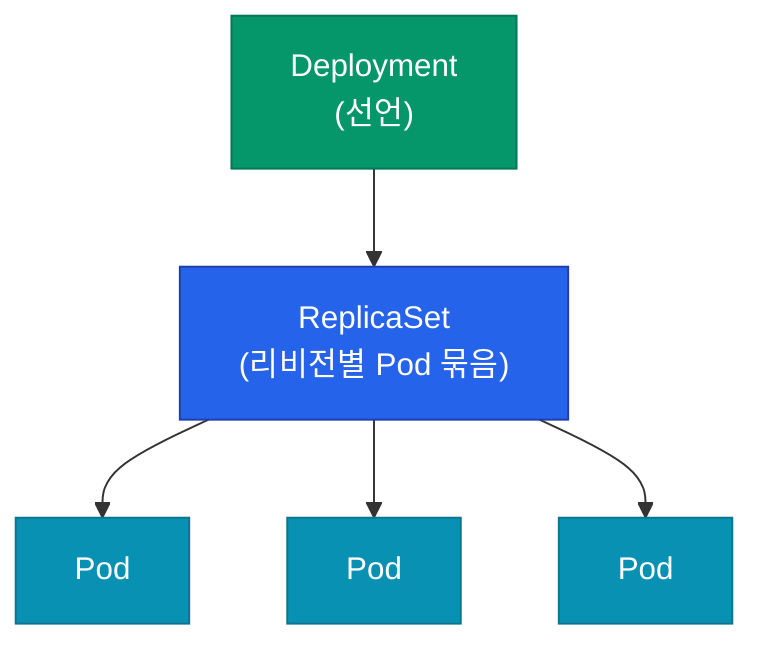
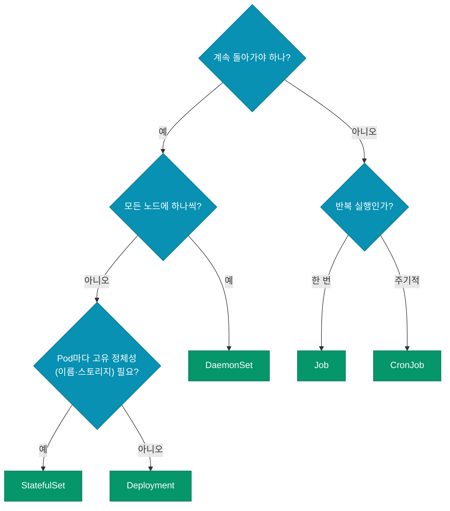

Kubernetes에 "애플리케이션을 올린다"고 할 때 그 주체는 Pod 자체가 아니에요. Pod는 **컨테이너 실행의 최소 단위**일 뿐, 실제로 다루는 건 **워크로드 오브젝트**예요. Deployment·StatefulSet·DaemonSet·Job — 이름만 보면 헷갈리지만, 각각 **다른 생명주기와 보장**을 가져요. 이 글에서 구분을 확실히 잡아요.

## 왜 Pod를 직접 쓰지 않을까

Pod는 수명이 짧고 **자기 복제 능력이 없어요**. Pod 하나가 죽으면 그냥 죽어요. 새로 안 만들어져요. 그래서 실무에서는 Pod를 직접 다루지 않고, **Pod를 관리하는 상위 오브젝트**를 통해 선언해요.



## 5가지 워크로드 오브젝트 한눈 비교

| 오브젝트 | Pod 교체 허용? | 순서 보장? | 네트워크 ID 고정? | 쓰임 |
|---|---|---|---|---|
| **Deployment** | ✅ 자유롭게 | ❌ | ❌ | Stateless 웹·API |
| **StatefulSet** | ⚠️ 신중히 | ✅ 순차 | ✅ Pod-0, Pod-1... | DB, Kafka, 상태 있는 앱 |
| **DaemonSet** | 노드당 1개 | — | ❌ | 로그·모니터링 에이전트 |
| **Job** | 완료까지 1회성 | ❌ | ❌ | 배치 처리, 마이그레이션 |
| **CronJob** | 정해진 시각마다 Job 생성 | — | — | 예약 작업 |

## Deployment — 가장 많이 쓰는 기본

Stateless 워크로드의 표준이에요. **Pod가 서로 대체 가능**하다는 전제로 설계됐어요.

### 롤링 업데이트의 동작

```yaml
spec:
  replicas: 5
  strategy:
    type: RollingUpdate
    rollingUpdate:
      maxSurge: 1        # 기존 replicas보다 최대 몇 개 더 띄울 수 있나
      maxUnavailable: 0  # 업데이트 중 최소 몇 개는 사용 가능해야 하나
```



```mermaid
flowchart LR
    subgraph before ["v1 (초기)"]
        V1A["v1"]
        V1B["v1"]
        V1C["v1"]
        V1D["v1"]
        V1E["v1"]
    end

    subgraph during ["롤링 중 (maxSurge=1)"]
        V1F["v1"]
        V1G["v1"]
        V1H["v1"]
        V2A["v2"]
        V2B["v2 (새로 추가)"]
    end

    subgraph after ["v2 (완료)"]
        V2C["v2"]
        V2D["v2"]
        V2E["v2"]
        V2F["v2"]
        V2G["v2"]
    end

    before --> during --> after

    classDef v1 fill:#0891b2,stroke:#0e7490,color:#ffffff
    classDef v2 fill:#059669,stroke:#047857,color:#ffffff

    class V1A,V1B,V1C,V1D,V1E,V1F,V1G,V1H v1
    class V2A,V2B,V2C,V2D,V2E,V2F,V2G v2
```

`maxUnavailable=0`으로 두면 사용자 입장에선 **다운타임 제로**예요. 대신 잠깐 원래보다 Pod가 하나 더 떠 있는 시간을 감당해야 해요.

### Blue/Green, Canary는 어떻게?

Deployment 자체는 롤링 업데이트만 지원해요. Blue/Green이나 Canary는 **두 개의 Deployment + Service 라벨 셀렉터** 조작으로 구현하거나, Argo Rollouts·Flagger 같은 전용 컨트롤러를 써요.

## StatefulSet — 상태를 가진 Pod

DB나 Kafka처럼 **각 인스턴스가 자기 정체성을 가져야** 하는 워크로드에 써요. 세 가지 보장이 핵심이에요.

| 보장 | 의미 |
|---|---|
| **안정적 이름** | `mysql-0`·`mysql-1`로 Pod 이름이 고정 |
| **안정적 스토리지** | 각 Pod에 **개별 PVC**가 자동 생성 (volumeClaimTemplates) |
| **순차 기동/종료** | Pod-0 → Pod-1 → Pod-2 순서로 뜨고, 반대 순서로 죽음 |

### 왜 Deployment로는 안 되나

Deployment는 Pod 이름에 랜덤 해시가 붙어서 (`web-abc12`·`web-def34`) 재생성될 때마다 바뀌어요. DB 복제 그룹에서는 "Pod-0이 primary"처럼 이름에 의존하는 로직이 필요한데, Deployment는 이 약속을 지켜주지 못해요.

```yaml
apiVersion: apps/v1
kind: StatefulSet
metadata:
  name: mysql
spec:
  serviceName: mysql      # Headless Service 이름 — DNS에 쓰임
  replicas: 3
  volumeClaimTemplates:
  - metadata:
      name: data
    spec:
      accessModes: [ReadWriteOnce]
      resources:
        requests:
          storage: 100Gi
  template:
    spec:
      containers:
      - name: mysql
        image: mysql:8
```

`mysql-0.mysql.default.svc.cluster.local` 같은 고유 DNS 이름이 자동 생성돼요. 이걸로 클러스터링을 구성해요.

<div class="callout why">
  <div class="callout-title">StatefulSet이 DB를 "관리"하진 않아요</div>
  StatefulSet은 Pod에 <b>정체성과 스토리지를 주는 것까지만</b> 해요. 실제 복제·failover·백업은 <b>DB가 스스로 처리</b>해야 하고, 그게 어려우니까 <b>Operator</b>(예: Percona XtraDB Operator, Kafka Strimzi)가 StatefulSet 위에 얹혀서 DB 운영 로직을 담당해요. "StatefulSet만 쓰면 DB 운영이 쉬워진다"는 오해가 가장 흔해요.
</div>

## DaemonSet — 모든 노드에 1개씩

**각 노드에 반드시 하나 있어야 하는** 시스템 에이전트용이에요. 노드가 추가되면 자동으로 Pod가 배치되고, 노드가 제거되면 같이 사라져요.

대표 용도:

- 로그 수집기 (Fluent Bit, Promtail)
- 모니터링 에이전트 (node-exporter)
- 네트워크 플러그인 (Calico, Cilium)
- 스토리지 플러그인 (CSI driver)

```yaml
spec:
  tolerations:
  - operator: Exists  # 모든 taint 허용 (control plane 노드까지)
```

toleration 설정을 안 하면 control plane 노드나 GPU 전용 노드에는 배치되지 않아요. 로그 수집기 같은 범용 에이전트는 **모든 노드에 찍혀야** 하므로 저 설정이 중요해요.

## Job과 CronJob — 완료되는 작업

웹 서버는 "계속 돌아가는" 워크로드지만, DB 마이그레이션이나 배치 처리는 **끝이 있는 작업**이에요. Deployment로 돌리면 끝나고도 계속 재시작해서 문제가 생겨요.

```yaml
apiVersion: batch/v1
kind: Job
metadata:
  name: db-migration
spec:
  backoffLimit: 3        # 실패 시 재시도 횟수
  activeDeadlineSeconds: 600
  completions: 1
  parallelism: 1
  template:
    spec:
      restartPolicy: Never
      containers:
      - name: migrate
        image: my-app:latest
        command: ["alembic", "upgrade", "head"]
```

### CronJob — 예약 Job

`cron` 스케줄 문법으로 Job을 주기적으로 생성해요.

```yaml
apiVersion: batch/v1
kind: CronJob
spec:
  schedule: "0 2 * * *"          # 매일 새벽 2시
  successfulJobsHistoryLimit: 3
  failedJobsHistoryLimit: 5
  concurrencyPolicy: Forbid      # 이전 Job 실행 중이면 새 건 건너뜀
```

`concurrencyPolicy`는 실무에서 중요한 결정이에요.

| 정책 | 동작 |
|---|---|
| `Allow` (기본) | 중복 실행 허용 — 장시간 작업이 겹치면 문제 |
| `Forbid` | 이전 Job이 돌고 있으면 새 Job 건너뜀 |
| `Replace` | 이전 Job을 죽이고 새로 시작 |

## 실전 선택 가이드

새 워크로드를 만들 때 의사결정 흐름이에요.



## Probe — Pod의 상태를 정확히 알려주기

워크로드 종류와 상관없이 반드시 설정해야 하는 게 **probe**예요. 없으면 Kubernetes는 **컨테이너가 살아있는지만** 알지, 실제로 요청을 받을 수 있는지는 몰라요.

| Probe | 용도 | 실패 시 |
|---|---|---|
| **livenessProbe** | 컨테이너가 먹통인지 확인 | 컨테이너 재시작 |
| **readinessProbe** | 트래픽 받을 준비됐는지 | Service endpoint에서 제외 |
| **startupProbe** | 느린 기동 앱 보호 | 실패 전 liveness 시작 지연 |

```yaml
readinessProbe:
  httpGet:
    path: /healthz
    port: 8080
  periodSeconds: 5
  failureThreshold: 3

livenessProbe:
  httpGet:
    path: /healthz
    port: 8080
  periodSeconds: 10
  failureThreshold: 3
```

`readinessProbe`가 없으면 **배포 순간 502 에러가 몇 초씩** 나요. Pod는 떴지만 앱 초기화가 안 끝났는데 Service가 트래픽을 밀어넣기 때문이에요.

## 정리

| 상황 | 선택 |
|---|---|
| 일반 웹·API | Deployment |
| DB·Kafka·Zookeeper | StatefulSet (+ Operator) |
| 노드별 에이전트 | DaemonSet |
| 마이그레이션·리포트 생성 | Job |
| 야간 백업·정기 작업 | CronJob |

모든 워크로드에 **readinessProbe·livenessProbe는 필수**예요. 안 설정하면 장애 시 서비스가 먹통이어도 Kubernetes는 "Running" 상태만 계속 보고해요.

다음 글에서는 이 Pod들이 서로, 그리고 외부와 어떻게 소통하는지 — **Service·Ingress·NetworkPolicy** 기반의 네트워킹을 다뤄요.
