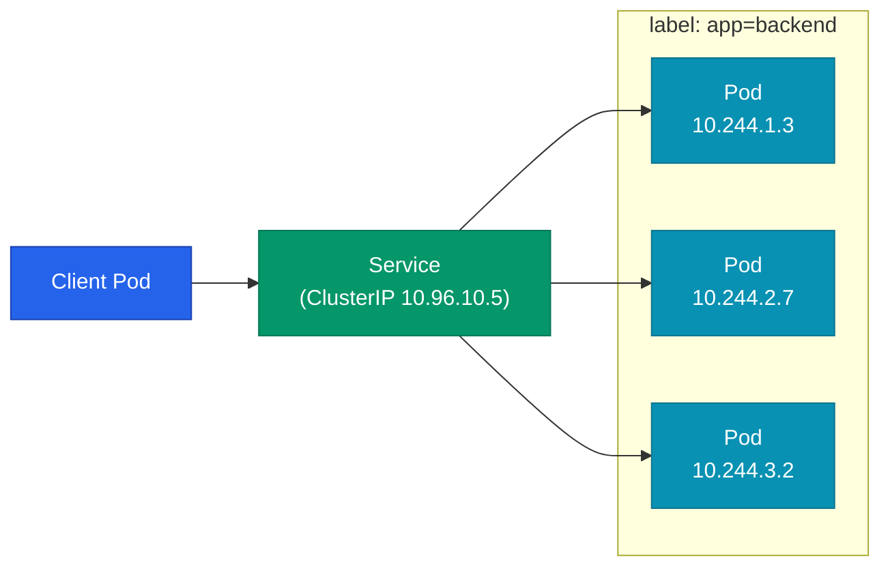
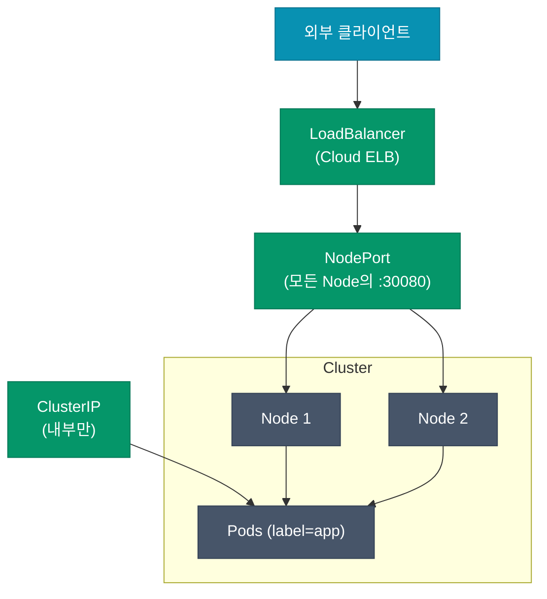
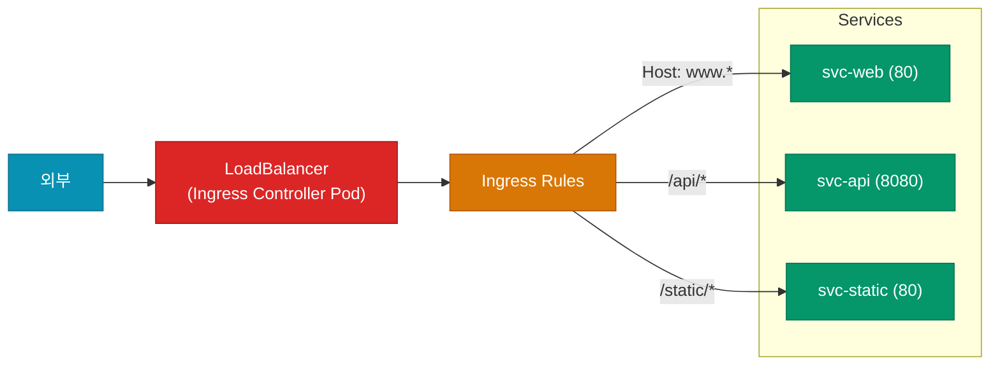
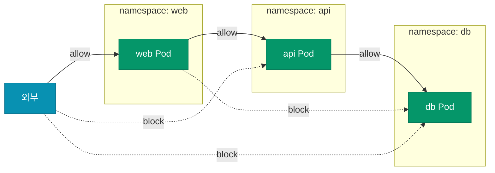

Pod는 뜨고 죽기를 반복해요. IP도 계속 바뀌어요. 그런 Pod들에게 어떻게 **안정적인 주소**를 부여하고, 외부 트래픽을 **어떻게 라우팅**하고, 어떤 Pod가 어떤 Pod에게 **말을 걸 수 있게** 할까요. 이게 Kubernetes 네트워킹의 세 축이에요.

## 4가지 네트워크 문제

Kubernetes는 명시적으로 다음 네 가지 통신을 해결해요.

| 통신 방향 | 해결 수단 |
|---|---|
| 컨테이너 ↔ 컨테이너 (같은 Pod) | localhost (네트워크 네임스페이스 공유) |
| Pod ↔ Pod (클러스터 내) | CNI 플러그인 (Calico·Cilium·Flannel) |
| Pod ↔ Service | kube-proxy + Service 추상화 |
| 외부 → 클러스터 내 | Service `LoadBalancer` + Ingress |

이 글에서는 뒤 두 가지에 집중해요.

## Service — Pod의 IP를 고정시키는 추상

Pod는 언제든 사라질 수 있어서 **Pod IP를 직접 호출하면 안 돼요**. Service는 "Pod 집합의 안정적인 가상 IP"예요.



Service는 **label selector**로 대상 Pod들을 모아요. Pod가 재생성되면서 IP가 바뀌어도 라벨이 같으면 자동으로 Service 뒤로 편입돼요.

### Service 타입 4가지

| 타입 | 노출 범위 | 용도 |
|---|---|---|
| **ClusterIP** | 클러스터 내부 | Pod 간 통신 (기본값) |
| **NodePort** | 모든 노드의 특정 포트 | 로컬·디버깅, Ingress 없이 외부 노출 |
| **LoadBalancer** | 클라우드 LB로 외부 노출 | 프로덕션 외부 노출 |
| **ExternalName** | DNS CNAME | 외부 서비스를 내부 이름으로 |



### kube-proxy가 하는 일

Service는 "가상"이에요. 실제로는 kube-proxy가 각 노드에 **iptables 규칙**(또는 IPVS 규칙)을 심어서 구현해요.

```
Pod가 10.96.10.5:80으로 요청
  ↓
iptables가 매칭: "이 목적지는 3개 Pod IP 중 랜덤 하나로 DNAT"
  ↓
실제 Pod IP로 패킷 전달
```

기본 알고리즘은 **랜덤 분배**예요. 세션 기반 분배가 필요하면 `sessionAffinity: ClientIP`로 설정하지만, 더 정교한 분배(가중치·지역)는 Service Mesh 영역이에요.

## Headless Service — DNS 기반 개별 Pod 접근

ClusterIP를 안 할당하고 **DNS만 제공**하는 특수 Service예요. StatefulSet의 각 Pod를 이름으로 지정 접근할 때 필요해요.

```yaml
spec:
  clusterIP: None  # Headless
  selector:
    app: mysql
```

이렇게 설정하면 `mysql-0.mysql.default.svc.cluster.local` 같은 Pod별 DNS가 자동 생성돼요. DB 복제 그룹에서 필수예요.

## Ingress — HTTP 레벨 라우팅

LoadBalancer Service는 L4(TCP)예요. HTTP 경로·호스트 기반 라우팅이 필요하면 **Ingress**를 써요.



Ingress 자체는 규칙 선언일 뿐이고, 실제로 요청을 라우팅하는 건 **Ingress Controller** (nginx-ingress, Traefik, HAProxy, AWS ALB Controller)예요.

```yaml
apiVersion: networking.k8s.io/v1
kind: Ingress
metadata:
  name: app-ingress
  annotations:
    cert-manager.io/cluster-issuer: letsencrypt
spec:
  ingressClassName: nginx
  tls:
  - hosts: [www.example.com]
    secretName: example-tls
  rules:
  - host: www.example.com
    http:
      paths:
      - path: /api
        pathType: Prefix
        backend:
          service:
            name: svc-api
            port:
              number: 8080
      - path: /
        pathType: Prefix
        backend:
          service:
            name: svc-web
            port:
              number: 80
```

### Gateway API — 차세대 Ingress

Ingress는 annotation으로 컨트롤러별 설정을 우회해서 이식성이 나쁜 약점이 있어요. 이걸 정식 API로 대체하는 게 **Gateway API**예요 (2024년 v1 GA). 새 프로젝트라면 Gateway API를 우선 고려할 만해요.

## NetworkPolicy — Pod 간 방화벽

기본 클러스터에서는 **모든 Pod가 모든 Pod와 통신 가능**해요. 이게 보안 관점에서 가장 큰 구멍이에요. `NetworkPolicy`로 **whitelist 기반**의 통신 규칙을 걸 수 있어요.



```yaml
apiVersion: networking.k8s.io/v1
kind: NetworkPolicy
metadata:
  name: db-allow-api
  namespace: db
spec:
  podSelector:
    matchLabels:
      app: db
  policyTypes: [Ingress]
  ingress:
  - from:
    - namespaceSelector:
        matchLabels:
          name: api
      podSelector:
        matchLabels:
          app: api
    ports:
    - protocol: TCP
      port: 5432
```

이 정책 하나로 **api 네임스페이스의 api Pod만** DB에 5432로 접근할 수 있고, 나머지는 전부 차단돼요.

<div class="callout why">
  <div class="callout-title">NetworkPolicy는 CNI 플러그인이 지원해야 작동해요</div>
  <code>NetworkPolicy</code> 리소스를 만들어도 기본 CNI(예: 일부 Flannel 구성)에서는 <b>아무 일도 안 일어나요</b>. Calico·Cilium·Weave 등 <b>지원하는 CNI를 써야</b> 실제 iptables 또는 eBPF 규칙으로 강제돼요. 매니페스트를 만들고 안심하기 전에 반드시 확인해야 하는 부분이에요.
</div>

## DNS — 클러스터 내 이름 해석

CoreDNS가 클러스터 전체 DNS를 담당해요. 서비스 이름 규칙은 이래요.

| 패턴 | 의미 |
|---|---|
| `my-svc` | 같은 네임스페이스의 Service |
| `my-svc.other-ns` | 다른 네임스페이스 명시 |
| `my-svc.other-ns.svc.cluster.local` | FQDN (완전한 이름) |
| `pod-0.my-svc.default.svc.cluster.local` | Headless Service의 개별 Pod |

환경 변수로도 Service 정보가 주입되지만, **DNS가 표준**이고 환경 변수는 잘 안 써요.

## 실전 패턴 — "3층 구조" 보안

프로덕션에서 자주 쓰는 네임스페이스 분리 + NetworkPolicy 조합이에요.

| 네임스페이스 | 라벨 | 허용 통신 |
|---|---|---|
| `frontend` | `tier=frontend` | Ingress → frontend, frontend → backend |
| `backend` | `tier=backend` | frontend → backend, backend → database |
| `database` | `tier=database` | backend → database만 |

각 네임스페이스에 **"기본 차단 + 필요한 것만 허용"** NetworkPolicy를 깔아두면 횡적 이동 공격(lateral movement)의 영향 범위가 극적으로 줄어요.

## 정리

- **Service**는 Pod 추상화 — ClusterIP가 기본, 외부 노출은 LoadBalancer + Ingress 조합
- **Ingress**는 HTTP 레이어 라우팅, 실제 동작은 Ingress Controller에 의존
- **NetworkPolicy**는 화이트리스트 방화벽 — CNI가 지원해야 작동
- **DNS**로 Service·Pod를 이름 기반 접근
- 프로덕션은 **네임스페이스 분리 + NetworkPolicy**로 계층 분리

다음 글에서는 이렇게 배치한 워크로드를 **어떻게 안정적으로 운영할지** — HPA·PDB·리소스 제한·노드 장애 대응을 다뤄요.
