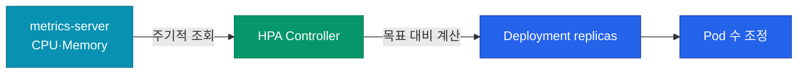
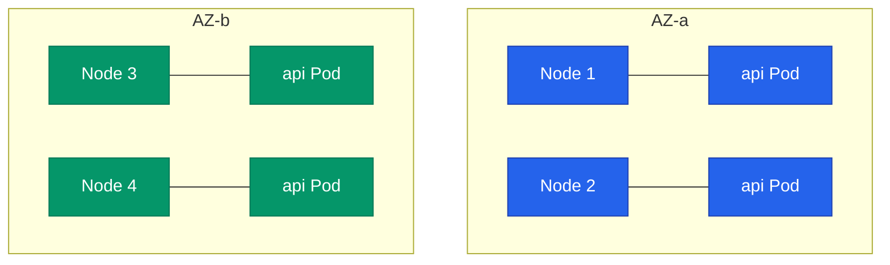

개발 환경에서 잘 돌던 매니페스트가 프로덕션에서 멈추는 이유는 대부분 같아요. **리소스 선언 없음, 오토스케일링 없음, 장애 격리 규칙 없음**. 이 글에서는 Pod 하나를 "프로덕션 급"으로 끌어올리는 핵심 정책을 정리해요.

## 리소스 Requests·Limits — 모든 운영의 출발점

가장 많이 빠뜨리고, 가장 큰 장애 원인이에요. 설정 안 하면 스케줄러도 커널도 Pod를 "무제한"으로 취급해요.

| 설정 | 의미 | 빠뜨리면 |
|---|---|---|
| `requests` | 스케줄러가 노드 배치할 때 예약하는 최소량 | Pod끼리 한 노드에 몰려서 노드 OOM |
| `limits` | 컨테이너가 쓸 수 있는 최대량 | 한 Pod가 폭주해서 노드 전체 먹통 |

```yaml
resources:
  requests:
    cpu: 100m
    memory: 256Mi
  limits:
    cpu: 500m
    memory: 512Mi
```

### CPU와 Memory는 다르게 동작해요

| 자원 | limit 초과 시 |
|---|---|
| **CPU** | **쓰로틀링** — 느려지지만 죽지 않음 |
| **Memory** | **OOMKilled** — 컨테이너 즉시 종료 |

이 차이 때문에:
- **Memory**: requests = limits로 맞추는 게 안전 (Guaranteed QoS)
- **CPU**: requests는 평균 사용량, limits는 버스트 허용치로 여유롭게

<div class="callout why">
  <div class="callout-title">QoS Class가 퇴거(eviction) 순서를 결정해요</div>
  노드 메모리가 부족해지면 kubelet이 Pod를 강제 퇴거시켜요. 이때 <b>QoS Class</b> 순서로 쫓겨나요.
  <br><br>
  <code>BestEffort</code> (requests·limits 없음) → <code>Burstable</code> (일부만) → <code>Guaranteed</code> (둘 다 같게)
  <br><br>
  프로덕션 핵심 서비스는 <b>Guaranteed</b>로 맞추면 노드 이상 시에도 가장 늦게 퇴거돼요.
</div>

## HPA — 트래픽 따라 자동 스케일링

Horizontal Pod Autoscaler는 CPU·Memory·custom metric을 감시하면서 replicas를 자동 조절해요.

```yaml
apiVersion: autoscaling/v2
kind: HorizontalPodAutoscaler
metadata:
  name: api-hpa
spec:
  scaleTargetRef:
    apiVersion: apps/v1
    kind: Deployment
    name: api
  minReplicas: 3
  maxReplicas: 20
  metrics:
  - type: Resource
    resource:
      name: cpu
      target:
        type: Utilization
        averageUtilization: 70
  behavior:
    scaleDown:
      stabilizationWindowSeconds: 300  # 급격한 축소 방지
```



### HPA의 흔한 실수

1. **requests 설정 없음** → HPA가 CPU 사용률을 계산 못 함 (`Unknown` 상태)
2. **minReplicas를 1로** → 트래픽 급증 시 스케일업 전에 다운
3. **stabilizationWindow 기본값** → 짧은 트래픽 변동에 요요처럼 흔들림

### KEDA — 이벤트 기반 오토스케일러

Kafka 메시지 적체량, SQS 큐 길이, Prometheus metric 같은 **비-리소스 신호**로 스케일하고 싶으면 KEDA를 써요. HPA가 지원하지 않는 수십 개 소스에 바로 붙일 수 있고, **replicas를 0으로 줄이는 것도 가능**(cold start 허용 시).

## PodDisruptionBudget — 장애 격리

노드 업그레이드·cordoning 같은 **자발적 중단**(voluntary disruption) 시, 동시에 얼마나 많은 Pod가 사라져도 되는지 선언해요.

```yaml
apiVersion: policy/v1
kind: PodDisruptionBudget
metadata:
  name: api-pdb
spec:
  minAvailable: 2       # 항상 최소 2개는 살아있어야 함
  selector:
    matchLabels:
      app: api
```

PDB가 없으면 `kubectl drain`이 한 노드의 Pod를 전부 한꺼번에 죽일 수 있어요. PDB가 있으면 "최소 2개 유지"를 지키기 위해 **다른 Pod가 먼저 떠야 drain이 진행**돼요.

| 옵션 | 의미 |
|---|---|
| `minAvailable: N` | 항상 N개 이상 살아있어야 |
| `minAvailable: 50%` | 50% 이상 살아있어야 |
| `maxUnavailable: N` | 동시에 N개까지만 죽일 수 있음 |

**replicas 1짜리 워크로드에 PDB를 거는 건 의미 없어요.** PDB는 ≥2 replicas 전제에서 작동해요.

## Affinity·Anti-affinity — Pod 배치 통제

같은 Deployment의 Pod들이 한 노드에 몰려 있으면, 그 노드가 죽을 때 서비스 전체가 멈춰요. **Anti-affinity**로 분산 배치를 강제해요.

```yaml
affinity:
  podAntiAffinity:
    requiredDuringSchedulingIgnoredDuringExecution:
    - labelSelector:
        matchExpressions:
        - key: app
          operator: In
          values: [api]
      topologyKey: kubernetes.io/hostname  # 노드 단위 분산
```

`topologyKey`를 `topology.kubernetes.io/zone`으로 바꾸면 **AZ(가용 영역) 단위 분산**이 돼요. 클라우드 AZ 하나가 날아가도 다른 AZ의 Pod가 살아남아요.



### topologySpreadConstraints — 더 깔끔한 대안

Anti-affinity는 문법이 어지러워서, 최근에는 `topologySpreadConstraints`를 많이 써요.

```yaml
topologySpreadConstraints:
- maxSkew: 1
  topologyKey: topology.kubernetes.io/zone
  whenUnsatisfiable: DoNotSchedule
  labelSelector:
    matchLabels:
      app: api
```

"모든 zone의 Pod 개수가 최대 1개 차이까지만" — 읽기 쉽고 의도가 명확해요.

## Graceful Shutdown — Pod가 죽을 때 끊기지 않게

Pod가 종료될 때 Kubernetes는 **동시에 두 가지**를 해요.

1. Service endpoint에서 Pod 제거 (트래픽 차단)
2. 컨테이너에 `SIGTERM` 전송

문제는 **이 두 작업이 동시**라는 거예요. 1번이 반영되기 전에 2번이 실행되면 **이미 전송된 요청이 잘려요**.

해결: `preStop` hook으로 잠깐 sleep.

```yaml
lifecycle:
  preStop:
    exec:
      command: ["sleep", "15"]
terminationGracePeriodSeconds: 60
```

15초 sleep 동안 Service endpoint 전파가 완료되고, 그 후 앱이 SIGTERM을 받아 남은 요청을 마무리해요. **15~30초가 일반적인 값**이에요.

## Node 장애 대응

노드 하나가 죽으면 그 위의 Pod는 `NotReady` 상태가 되고, 5분(`pod-eviction-timeout` 기본값) 후에 다른 노드로 재스케줄돼요. 이 5분이 꽤 길어서 장애 시간이 늘어나요.

| 대응 | 효과 |
|---|---|
| **PodDisruptionBudget** | drain 시 점진적 이동 보장 |
| **Anti-affinity (AZ)** | 한 AZ 장애가 전체에 영향 안 감 |
| **readinessProbe** | 실패 노드의 Pod를 빠르게 트래픽에서 제외 |
| **Cluster Autoscaler** | 노드 부족 시 자동 추가 |

## PodPriority — 누가 먼저 살아야 하나

노드 리소스가 부족하면 priority가 낮은 Pod가 먼저 퇴거돼요. 결제·인증 같은 **핵심 서비스에 높은 priority**를 부여하면 장애 시 살아남을 확률이 높아져요.

```yaml
apiVersion: scheduling.k8s.io/v1
kind: PriorityClass
metadata:
  name: critical
value: 1000000
globalDefault: false
description: "결제·인증 등 핵심 서비스"
```

## 체크리스트 — 프로덕션 배포 전

| 항목 | 이유 |
|---|---|
| `resources.requests/limits` 설정 | 노드 안정성 |
| `readinessProbe`·`livenessProbe` 설정 | 무중단 배포 |
| `preStop` + `terminationGracePeriodSeconds` | graceful shutdown |
| replicas ≥ 2 + PDB | 단일 Pod 장애 허용 |
| Pod anti-affinity (최소 host 레벨) | 노드 장애 허용 |
| HPA 연결 | 트래픽 변동 대응 |
| PriorityClass (핵심 서비스) | 리소스 부족 시 우선순위 |

## 시리즈 마무리

4편으로 Kubernetes의 구조·워크로드·네트워킹·운영을 훑었어요. 핵심 메시지는:

**"컨테이너를 실행하는 게 아니라, 원하는 상태를 선언하는 거예요."**

- 01: Control Plane + Data Plane, 선언적 reconcile
- 02: 워크로드별 보장 (Deployment·StatefulSet·DaemonSet·Job)
- 03: Service·Ingress·NetworkPolicy 3층 네트워킹
- 04: 리소스·HPA·PDB·affinity 운영 안전장치

다음 시리즈에서는 이 수많은 매니페스트를 **어떻게 재사용 가능한 패키지로 묶을지** — Helm과 차트 설계를 다뤄요.
