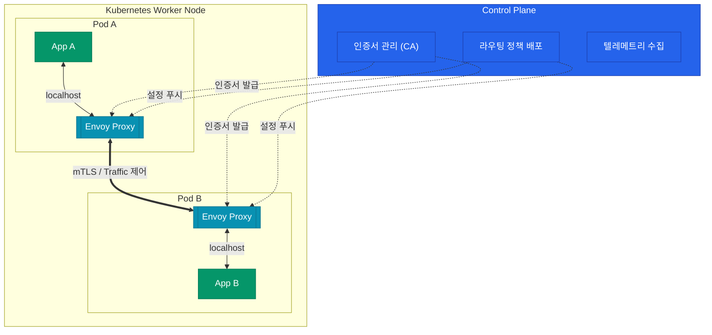

마이크로서비스 아키텍처로 넘어가면 애플리케이션 코드가 처리해야 할 새로운 문제들이 생겨나요. 서비스 A가 서비스 B를 호출할 때 재시도는 몇 번 할지, 타임아웃은 어떻게 잡을지, 통신 구간은 안전한지 고민해야 해요. 초기에는 이를 라이브러리(Spring Cloud, Netflix OSS 등)로 해결했지만, 다국어 환경에서는 관리가 불가능에 가까워요. Service Mesh는 이 **"네트워크의 복잡성"을 애플리케이션 외부로 분리**하는 아키텍처 패턴이에요.

## 왜 라이브러리 대신 사이드카인가?

애플리케이션 내부에 네트워크 제어 로직을 두면 언어별로 라이브러리를 유지보수해야 해요. Java팀, Go팀, Node.js팀이 각자 재시도 로직을 구현하면 정책이 파편화돼요.

Service Mesh는 이 로직을 별도의 프로세스, 즉 **사이드카(Sidecar) 프록시**로 빼내요.

| 특성 | 라이브러리 기반 (Spring Cloud 등) | Service Mesh (Istio, Linkerd) |
|---|---|---|
| **언어 의존성** | 강함 (Java, Go 등 특정 언어 종속) | **없음** (폴리글랏 환경 완벽 지원) |
| **코드 변경** | 필수 (어노테이션 추가 등) | **불필요** (애플리케이션은 localhost 통신만 함) |
| **업그레이드** | 애플리케이션 재배포 필요 | 프록시 컨테이너만 재시작 |
| **성능 오버헤드** | 라이브러리 레벨의 미미한 오버헤드 | 프록시를 거치는 추가 홉(Hop) 발생 |

애플리케이션은 복잡한 라우팅을 알 필요 없이 무조건 `localhost`로 요청을 던지고, 모든 트래픽 제어는 옆에 붙어 있는 사이드카가 가로채서 처리해요.

## Control Plane과 Data Plane 구조

Service Mesh 시스템은 크게 두 가지 영역으로 나뉘어요.

- **Control Plane**: 관리자가 정책(YAML)을 정의하면 이를 각 사이드카들이 이해할 수 있는 설정으로 변환해서 **푸시(Push)**해요. 인증서를 발급하고 텔레메트리를 수집하는 뇌 역할이에요.
- **Data Plane**: 실제 트래픽이 지나는 길이에요. 각 Pod마다 주입된 수많은 사이드카 프록시들이 모여 그물망(Mesh)을 형성해요.

  
핵심 인사이트

  초기 애플리케이션 개발자들에게 사이드카 패턴은 직관적이지 않을 수 있어요. 하지만 "비즈니스 로직"과 "인프라(네트워크) 로직"의 결합도를 끊어낸다는 점에서, 인프라 플랫폼 엔지니어링의 핵심 기반 기술로 자리 잡았어요.

## Istio와 Linkerd 비교

Kubernetes 환경에서 가장 대중적인 두 가지 Service Mesh 솔루션을 비교해 볼게요.

| 비교 항목 | Istio | Linkerd |
|---|---|---|
| **Data Plane 프록시** | **Envoy** (C++) | **Linkerd-proxy** (Rust) |
| **복잡도와 진입 장벽** | 높음 (학습 곡선 가파름) | 낮음 (극강의 단순함 지향) |
| **기능과 확장성** | 매우 풍부 (Gateway, Wasm 확장 지원) | 필수 기능에 집중 (가벼움) |
| **리소스 오버헤드** | 상대적으로 무거움 | 매우 가벼움 (Rust 특성) |

- **Istio**는 사실상 업계 표준에 가까워요. 복잡한 환경 분리, 상세한 트래픽 제어, Wasm을 통한 커스텀 필터 등 "안 되는 게 없는" 다기능 스위스 아미 나이프예요.
- **Linkerd**는 "간단한 설치로 5분 만에 얻는 mTLS와 메트릭"을 모토로 해요. 오버헤드를 극단적으로 줄였지만 고급 라우팅 기능은 덜 풍부할 수 있어요.

## Envoy 사이드카의 마법

Istio의 심장인 **Envoy 프록시**가 어떻게 트래픽을 가로채는지 짧게 짚고 넘어갈게요.
Pod가 뜰 때 `istio-init`이라는 초기화 컨테이너(initContainer)가 먼저 실행돼요. 이 녀석이 `iptables` 규칙을 조작해서, **App 컨테이너가 밖으로 보내거나 밖에서 들어오는 모든 트래픽이 강제로 Envoy를 거치도록** 만들어요.

그래서 App 코드를 한 줄도 수정하지 않고도 트래픽 가로채기가 가능한 거예요.

## 정리

- Service Mesh는 **비즈니스 로직에서 네트워크 제어 로직을 분리**해요.
- 핵심은 애플리케이션의 언어와 무관하게 동작하는 **사이드카 프록시(Data Plane)**예요.
- **Control Plane**은 이 프록시들의 중앙 통제 센터 역할을 해요.
- 다이나믹한 기능이 필요하면 **Istio**, 가볍고 빠른 도입이 목표면 **Linkerd**를 선택해요.

다음 글에서는 Service Mesh의 꽃인 **트래픽 관리(Traffic Management)**를 다뤄요. VirtualService와 DestinationRule로 카나리 배포와 서킷 브레이커를 어떻게 구현하는지 살펴볼게요.
