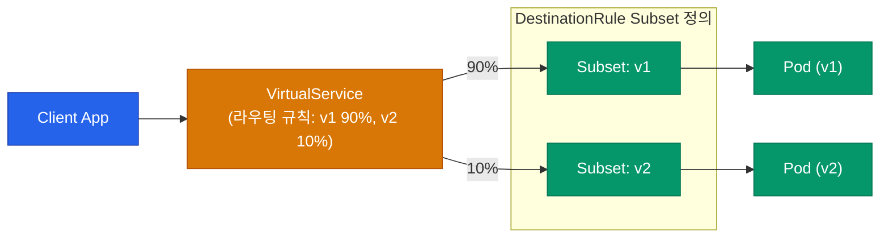

Service Mesh를 도입하는 가장 큰 이유 중 하나는 **정교한 트래픽 제어**예요. 기본 Kubernetes의 Service 리소스는 트래픽을 Pod 개수 비율로만 분산(Round Robin)시킬 수 있어요. 하지만 실무에서는 "새 버전(v2)에 트래픽의 딱 5%만 흘려보내줘" 또는 "특정 헤더를 가진 테스터들만 v2로 보내줘" 같은 요구사항이 필요해요.

Istio는 이를 `VirtualService`와 `DestinationRule`이라는 커스텀 오브젝트(CRD)로 해결해요.

## 핵심 오브젝트: VirtualService와 DestinationRule

이 두 리소스는 항상 짝을 이뤄 동작해요.

- **VirtualService**: "요청이 들어왔을 때 **어디로** 보낼 것인가?" (라우팅 규칙)
- **DestinationRule**: "도착지에 도달한 후, 또는 통신 과정에서 **어떤 정책**을 적용할 것인가?" (로드밸런싱 방식, 서킷 브레이커, mTLS 정책)



## Canary 배포 패턴 (가중치 라우팅)

새로운 버전을 안전하게 배포하기 위해 트래픽의 일부만 새 버전으로 라우팅하는 카나리(Canary) 배포 설정이에요.

먼저 `DestinationRule`로 버전을 구분하는 Subset을 정의해요.

```yaml
# destination-rule.yaml
apiVersion: networking.istio.io/v1alpha3
kind: DestinationRule
metadata:
  name: reviews-dr
spec:
  host: reviews
  subsets:
  - name: v1
    labels:
      version: v1
  - name: v2
    labels:
      version: v2
```

그 다음 `VirtualService`를 통해 트래픽 가중치(Weight)를 부여해요.

```yaml
# virtual-service.yaml
apiVersion: networking.istio.io/v1alpha3
kind: VirtualService
metadata:
  name: reviews-vs
spec:
  hosts:
  - reviews
  http:
  - route:
    - destination:
        host: reviews
        subset: v1
      weight: 90
    - destination:
        host: reviews
        subset: v2
      weight: 10
```

이렇게 하면 Kubernetes Service 계층의 한계를 뛰어넘어, Pod 대상이 아닌 **트래픽 비율 자체를 정확하게 제어**할 수 있어요.

## 네트워크 회복성 패턴

네트워크는 언제든 실패할 수 있어요. 이를 보완하기 위한 Retry, Timeout, Circuit Breaker를 애플리케이션 코드 바깥에서 투명하게 처리해요.

### Retry와 Timeout

일시적인 네트워크 단절은 몇 번 다시 요청해보면 성공하는 경우가 많아요. App 코드 수정 없이 VirtualService에 몇 줄만 추가하면 돼요.

```yaml
# Timeout과 Retry가 추가된 VirtualService 발췌
  http:
  - timeout: 2s
    retries:
      attempts: 3
      perTryTimeout: 2s
      retryOn: gateway-error,connect-failure,refused-stream
```

### Circuit Breaker (회로 차단기)

요청 대상 시스템이 장애 상태일 때 계속해서 요청을 보내면, 장애가 전체 시스템으로 전파(Cascading Failure)될 수 있어요. 이럴 때 빠르게 연결을 차단하여 시스템을 보호하는 패턴이에요. 이는 `DestinationRule`에 정의해요.

```yaml
# 서킷 브레이커가 선언된 DestinationRule 발췌
spec:
  trafficPolicy:
    outlierDetection:
      consecutive5xxErrors: 5    # 5번 연속 5xx 에러 발생 시
      interval: 10s              # 10초 주기 검사
      baseEjectionTime: 30s      # 30초 동안 로드밸런싱 풀에서 제외 (차단)
```

<div class="callout why">
  <div class="callout-title">Fault Injection (장애 주입)</div>
  우리가 만든 재시도나 서킷 브레이커 로직이 실제로 잘 동작하는지 어떻게 테스트할까요? Istio의 <code>Fault Injection</code> 기능을 사용하면, 특정 트래픽에 고의로 <strong>500 에러를 반환</strong>하거나 <strong>지연(Delay)을 발생</strong>시킬 수 있어요. 프로덕션 환경의 카오스 엔지니어링(Chaos Engineering)을 위해 꼭 필요한 기능이에요.
</div>

## 정리

- **VirtualService**는 트래픽이 어떻게 라우팅될지 결정해요 (Canary 비율, 특정 헤더 매칭 등).
- **DestinationRule**은 도착 노드들에 대한 로드밸런싱 방법, 버전 분류(Subset), 서킷 브레이커 등을 정의해요.
- **Retry, Timeout, Circuit Breaker** 설정을 통해 통신 장애 전파를 인프라 레벨에서 막을 수 있어요.
- 애플리케이션 코드는 어떠한 라우팅 로직도 가지지 않으며, 모든 책임은 Envoy 사이드카가 위임받아요.

다음 글에서는 사이드카가 자동으로 처리해 주는 또 다른 거대한 이점, **mTLS 보안**과 **관측성(Observability) 통합**에 대해 알아볼게요.
