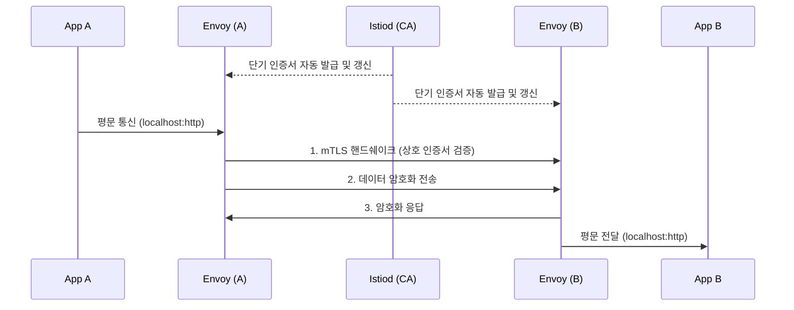

마이크로서비스에서 네트워크 보안을 챙기려면 각 서비스 간 통신을 암호화해야 해요. 이전에는 개발자들이 각 서버마다 인증서를 심고 갱신하며 TLS 설정을 관리해야 했어요. 게다가 서비스 간의 복잡한 호출 흐름을 모니터링하려면 코드 곳곳에 추적(Trace) 라이브러리를 심어야 했죠.

Service Mesh는 사이드카 프록시를 통해 이 두 가지 난제를 **코드를 건드리지 않고 자동화**해요.

## 자동 mTLS (Mutual TLS) 동작 원리

일반적인 TLS 통신(ex. 브라우저 ↔ 서버)은 클라이언트가 서버의 신원만 확인해요. 하지만 **mTLS(상호 TLS)**는 **클라이언트와 서버가 서로의 인증서를 검증**하는 양방향 신원 확인 시스템이에요.

Istio는 이 복잡한 과정을 `Envoy` 사이드카와 Control Plane의 `Istiod`를 통해 완전히 숨겨버려요.



1. **인증서 발급**: `Istiod`는 내장된 CA(Certificate Authority) 역할을 하며, 각 Pod의 식별자(SPIFFE ID)를 기반으로 사이드카에 단기 인증서를 자동 발급·갱신해요.
2. **트래픽 가로채기**: App A는 App B로 무조건 평문(HTTP)으로 호출해요.
3. **자동 암호화**: App A의 프록시가 트래픽을 가로채 App B의 프록시와 mTLS 채널을 형성하고 암호화해요. App B의 프록시는 복호화 후 App B에게 평문으로 넘겨줘요.

이 구조 덕분에 소스 코드에는 단 한 줄의 TLS 관련 설정이나 인증서 경로 유입이 없어도, 네트워크 구간은 완벽하게 암호화돼요.

## 보안 정책 제어

mTLS가 적용되었다면, 이제 "누가 누구를 호출할 수 있는지"를 제어할 차례예요.

### PeerAuthentication

특정 네임스페이스나 워크로드에 트래픽이 들어올 때, 반드시 mTLS를 사용하도록 강제하는 정책이에요.

```yaml
apiVersion: security.istio.io/v1beta1
kind: PeerAuthentication
metadata:
  name: default-strict
  namespace: prod-env
spec:
  mtls:
    mode: STRICT  # mTLS가 아닌 평문 트래픽은 모두 거절
```

보통 도입 초기에는 `PERMISSIVE`(평문과 mTLS 모두 허용)로 두어 통신 단절을 막고, 검증이 끝나면 `STRICT`로 전환해요.

### AuthorizationPolicy

"Frontend 서비스는 Backend 서비스의 `GET` 메서드만 호출할 수 있다" 같은 세밀한 인가 규칙(RBAC)을 설정해요. 이는 Kubernetes NetworkPolicy(L3/L4 제어)보다 훨씬 고도화된 L7 레벨의 접근 제어예요.

## 관측성(Observability) 통합

수많은 서비스들이 그물처럼 얽히면 "대체 어디서 병목이 발생했는가?" 찾기가 극도로 어려워져요. 사이드카는 애플리케이션의 모든 Inbound/Outbound 트래픽을 관통하기 때문에 그 해답을 쥐고 있어요.

| 관측성 요소 | 사이드카의 자동화 역할 | 도구 연동 |
|---|---|---|
| **Metrics** (메트릭) | 요청 수, 응답 코드, 지연 시간(Latency) 등을 자동으로 수집해요. | Prometheus, Grafana |
| **Distributed Tracing** (분산 추적) | 요청의 전체 호출 경로(Span)와 소요 시간을 추적해요. 단, App에서 B3 헤더는 직접 전파해줘야 해요. | Jaeger, Zipkin |
| **Access Logs** (접근 로그) | L7 레벨의 상세한 HTTP 요청/응답 로그를 표준 포맷으로 남겨요. | ELK, Loki |

Envoy 프록시는 트래픽이 지나갈 때마다 풍부한 메트릭(예: `istio_requests_total`)을 기본적으로 생성해 Prometheus가 수집해 갈 수 있도록 엔드포인트를 열어줘요.

<div class="callout why">
  <div class="callout-title">성능 오버헤드 주의사항</div>
  Service Mesh는 분명 마법같지만 공짜는 아니에요. 각 Pod마다 프록시 컨테이너가 붙으므로 전체 클러스터의 <strong>메모리 사용량이 상승</strong>하며, 트래픽이 수많은 프록시 홉을 거치며 <strong>네트워크 레이턴시(지연)</strong>가 소폭 증가해요. 따라서 실시간성이 극도로 중요한 게임 서버 등에는 신중하게 도입해야 해요.
</div>

## 정리

- 사이드카 구조의 진정한 완성은 **자동화된 구간 암호화(mTLS)와 텔레메트리 자동 수집**이에요.
- **PeerAuthentication**과 **AuthorizationPolicy** 리소스를 통해 '인증'과 '인가'를 선언적으로 관리해요.
- Envoy는 풍부한 **메트릭, 추적, 로그** 데이터를 생성하여 관측성 도구와 완벽하게 통합돼요.

Service Mesh 시리즈를 통해 "어떻게 네트워크 제어와 보안 책임을 인프라 단계로 완전히 내리는가"를 살펴보았어요. 이 원칙을 이해하면 거대한 클러스터 환경의 복잡성을 투명하게 통제할 수 있습니다.
