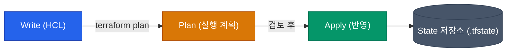

인프라를 AWS/GCP 콘솔에서 수작업으로 클릭하며 만드는 시대는 끝났어요. Infrastructure as Code(IaC)는 인프라 생성을 문서나 기억이 아닌, **"제어 가능한 코드"**로 남기자는 철학이에요. 그중에서도 HashiCorp의 Terraform은 특정 클라우드에 종속되지 않는 사실상의 업계 표준이 되었어요.

## Terraform vs 다른 IaC 도구들

IaC 도구는 크게 세 가지 진영으로 나눌 수 있어요.

| 도구 | 특징 | 언어 | 적합한 환경 |
|---|---|---|---|
| **Terraform** | 가장 범용적, 거대한 생태계, 선언적 | HCL (HashiCorp Configuration Language) | 다중 클라우드, 일반적인 인프라 표준화 |
| **CloudFormation** | AWS 전용, 콘솔과 깊은 통합 | JSON / YAML | 오직 AWS만 심도 있게 사용할 때 |
| **Pulumi / CDK** | 프로그래밍 언어로 제어 | TypeScript, Python 등 | 개발자 중심 조직, 복잡한 인프라 로직 필요 |

Terraform은 "선언적"인 특성과 "직관적인 HCL 문법" 덕분에 인프라 엔지니어가 가장 선호하는 균형 잡힌 도구예요.

## HCL 문법의 4가지 핵심 요소

Terraform 코드를 읽으려면 4가지 기본 블록만 이해하면 돼요.

```yaml
# 1. Provider: 어떤 클라우드나 서비스와 통신할지 정의
provider "aws" {
  region = "ap-northeast-2"
}

# 2. Variable (Input): 외부에서 주입받을 변수
variable "instance_type" {
  type    = string
  default = "t3.micro"
}

# 3. Resource: 실제로 생성할 인프라 객체
resource "aws_instance" "web" {
  ami           = "ami-12345678"
  instance_type = var.instance_type
  
  tags = {
    Name = "MyWebServer"
  }
}

# 4. Data / Output
# Data: 이미 존재하는 리소스의 정보를 가져옴
data "aws_vpc" "default" {
  default = true
}

# Output: 생성 후 결과물을 반환
output "instance_ip" {
  value = aws_instance.web.public_ip
}
```

- **Provider**: AWS, GCP, GitHub 등 통신 대상의 API 구조를 추상화해 주는 플러그인이에요.
- **Resource**: 우리가 이 코드를 작성하는 이유예요. EC2 인스턴스, S3 버킷, IAM 역할 등을 만들어요.
- **Data Source**: 손대지 않을 외부 인프라(예: 이미 만들어진 VPC) 정보를 안전하게 조회하기 위해 써요.

## 선언적 사고와 워크플로우

스크립트로 서버를 만들 때는 "네트워크를 만들고 → 포트를 열고 → 서버를 띄워라"라는 순서(명령형)를 적어줘요. 하지만 Terraform은 **"서버 1대, 네트워크 1개가 있는 상태를 만들어줘"**라고 선언해요.



1. **Write**: HCL로 **원하는 최종 상태(Desired State)**를 작성해요.
2. **Plan**: 제일 중요한 단계예요. 우리가 작성한 코드가 현재 인프라 상태와 비교했을 때, **무엇이 생성되고( `+` ), 무엇이 파괴되며( `-` ), 무엇이 변경되는지( `~` )**를 미리 보여줘요.
3. **Apply**: 플랜 결과를 확인하고 실제로 인프라스트럭처에 반영해요.

<div class="callout why">
  <div class="callout-title">안전장치로서의 Plan</div>
  선언적 인프라의 가장 큰 장점은 Dry-run이 가능하다는 거예요. AWS 콘솔에서 잘못 클릭하면 즉시 장애로 이어지지만, Terraform은 <code>plan</code> 명령어로 "DB가 삭제될 위기"라는 것을 적용 전에 확실히 경고해 줘요.
</div>

## 본질은 의존성 그래프 모듈

우리가 작성한 HCL 코드의 순서는 중요하지 않아요. 내부적으로 리소스 간의 참조(`aws_instance.web.id` 등)를 바탕으로 **의존성 그래프(Dependency Graph)**를 파악한 뒤, 의존성이 없는 리소스들을 **병렬로 동시 생성**하여 속도를 끌어올려요.

## 정리

- **HCL**은 간결하면서도 선언적인 인프라 표현에 특화되어 있어요.
- **Provider, Resource, Variable, Data**의 조합으로 클라우드를 제어해요.
- `Write -> Plan -> Apply`의 예측 가능한 워크플로우를 제공해요.

코드 한 덩어리로 서버 하나 띄우는 건 쉽습니다. 그러나 실무에서는 수많은 환경과 컴포넌트를 코드로 관리해야 하죠. 다음 글에서는 재사용성을 극대화하여 중복 코드를 제거하는 **Terraform 모듈(Module)** 구조를 살펴볼게요.
