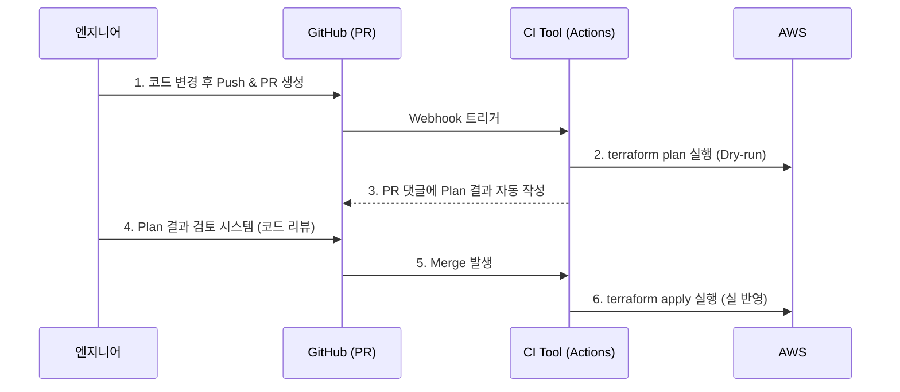

Infrastructure as Code의 진정한 가치는 인프라가 **소프트웨어 개발 생명주기(SDLC)**에 완전히 편입될 때 나옵니다. 개발자 PC에서 누군가 은밀하게 `terraform apply`를 치고 있다면, 그건 선언적인 쉘 스크립트일 뿐이에요. Git History 기반의 인프라 변경, 자동화된 검증, 그리고 안전한 반영을 위해서는 Terraform CI 파이프라인이 필수적입니다.

## PR 기반 작업 흐름 (GitOps 스타일)

가장 이상적인 목표는 **"개인은 Apply 권한이 없고, 오직 CI 시스템만이 인프라를 변경한다"**는 철학입니다.



이 흐름의 핵심은 **PR(Pull Request) 내 구문 리뷰와 Plan 결과의 결합**입니다. 동료들은 코드가 어떻게 바뀌었는지 뿐만 아니라, 이 변경이 AWS를 어떻게 바꿀지(`+`, `-`, `~`)를 깃허브 댓글 파이프라인에서 한눈에 보고 합의를 거칩니다.

오픈소스인 **Atlantis**를 호스팅하거나 **Terraform Cloud**를 활용하면 이 워크플로우를 "Plan 댓글 자동 작성 기능"과 함께 아름답게 구성할 수 있습니다.

## 인프라 코드 검증 단계 (Shift-Left)

단순히 `terraform plan`이 성공 여부만을 따지기는 부족합니다. 애플리케이션 코드처럼 인프라 코드도 다양한 스캐너를 통과해야 합니다.

| 도구 | 수행 목적 | 작동 예시 |
|---|---|---|
| `terraform fmt` / `validate` | 포맷 통일 및 구문 문법 오류 검증 | 줄 맞춤, 누락된 괄호 검출 |
| **tflint** | 클라우드 서비스의 제약조건과 베스트 프랙티스 검증 | "이 인스턴스 타입은 이 리전에서 안 팔아요", "사용하지 않는 변수 제거하세요" |
| **tfsec** (또는 checkov) | 보안 정책 기반 정적 스캔 (SAST) | "S3 버킷이 Public으로 열려있음!", "암호화 미설정됨" |

`terraform plan`은 클라우드 API를 호출해야 결과를 뱉어내기 때문에 비교적 느립니다. 따라서 PR을 만들자마자 CI 첫 단계에서 위 3가지 정적 분석 도구들을 통과하게 만들면 생산성과 보안을 획기적으로 올릴 수 있습니다.

## 인프라 실제 테스트 (Terratest)

정적 분석과 Plan 확인만으로 확신이 서지 않는 "복잡한 모듈의 검증"이 필요하다면, 프로그래밍 언어로 통합 테스트를 작성할 수 있어요. 대표적인 도구가 Go 언어 기반의 **Terratest**입니다.

```go
// terratest 예제
func TestTerraformAwsS3Bucket(t *testing.T) {
    terraformOptions := &terraform.Options{
        TerraformDir: "../modules/s3-secure-bucket",
    }
    
    // 테스트 종료 시 자동으로 파괴 보장 (테스트 찌꺼기 방지)
    defer terraform.Destroy(t, terraformOptions)
    
    // terraform init & apply 실행
    terraform.InitAndApply(t, terraformOptions)
    
    // 결과 검증: 실제로 버킷에 Tag가 맞게 들어갔는가?
    bucketID := terraform.Output(t, terraformOptions, "bucket_name")
    assert.True(t, aws.AssertS3BucketExists(t, "ap-northeast-2", bucketID))
}
```

실제 AWS 환경(테스트 계정)에 코드를 배포해 보고 무결성을 확인한 후 자동으로 파괴(`destroy`)하는 극강의 회귀(Regression) 테스트 환경을 구축하게 됩니다.

<div class="callout why">
  <div class="callout-title">Drift Detection (형상 오차 탐지)</div>
  우리가 만든 CI가 아무리 탄탄해도 누군가는 긴급 장애 처리를 핑계로 콘솔 로그인해서 설정을 바꿀(ClickOps) 수 있어요. 이를 막기 위해 크론(Cron) 스케줄러로 주기적으로 `terraform plan`을 빈 상태로 돌립니다. 만약 "변경 사항이 있습니다"라는 결과가 나오면, 누군가 코드를 거치지 않고 인프라를 바꿨다는 뜻이니 슬랙 알람을 울려 즉시 조치해야 해요.
</div>

## 정리

- `terraform apply`는 **개발자 PC가 아니라 CI/CD 시스템**이 담당해야 해요.
- PR 댓글에 **Plan 결과를 자동 출력**하고 동료와 검토하는 문화를 정착시키세요.
- **tflint**와 **tfsec** 등의 정적 분석 도구를 파이프라인 앞단에 추가하여 보안을 Shift-Left 하세요.
- 주기적인 Plan 확인(Drift Detection)으로 인프라와 코드의 형상 붕괴를 잡아내세요.

인프라스트럭처의 코드화 원칙부터 재사용을 위한 모듈, 협업을 위한 State 메커니즘, 그리고 CI 파이프라인까지 이어지는 긴 여정을 살펴봤어요. 훌륭한 Terraform 역량은 운영 불확실성을 가장 빠르게 제거하는 인프라 엔지니어의 핵심 무기입니다.
