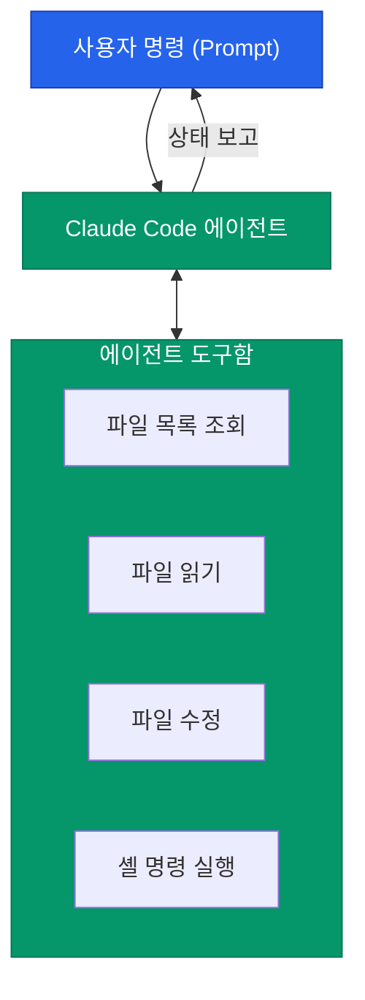

개발자의 터미널에 직접 상주하며 코드를 분석하고 수정하는 시대가 열렸습니다. Anthropic에서 출시한 **Claude Code**는 단순한 채팅 UI를 넘어, 파일 시스템과 도구들을 직접 제어하는 에이전트 기반 CLI 도구입니다. 본 시리즈의 첫 번째 글로 Claude Code를 시작하기 위한 준비 과정을 살펴보겠습니다

## 설치 전 요구 사항

Claude Code는 Node.js 환경에서 동작하므로, 시작 전 다음 구성 요소가 설치되어 있어야 합니다

- **Node.js**: v18 이상 (최신 LTS 권장)
- **Git**: 코드베이스 분석 및 버전 관리를 위해 필수적입니다
- **Anthropic API Key**: 에이전트가 Claude 모델과 통신하기 위해 필요합니다

## Claude Code 설치하기

터미널에서 `npm`을 이용해 전역(global)으로 설치합니다. 설치 후에는 `claude` 명령어를 통해 어디서든 실행할 수 있습니다

```bash
# Claude Code 설치
npm install -g @anthropic-ai/claude-code

# 설치 확인 및 버전 체크
claude --version
```

## 초기 인증 및 설정

설치가 완료되었다면, 에이전트가 사용할 계정 인증을 진행해야 합니다

1. **인증 시작**: 터미널에 `claude`를 입력하여 실행합니다
2. **로그인**: 출력되는 링크를 브라우저에서 열고 Anthropic 계정으로 로그인합니다
3. **인증 코드 입력**: 브라우저에 표시된 코드를 터미널에 입력하여 연동을 완료합니다
4. **기본 설정**: 사용 환경(셸 종류, 에디터 등)에 맞게 초기 구성이 자동으로 이루어집니다

## Claude Code 실행 흐름

사용자가 명령을 내리면 Claude Code는 다음과 같은 단계를 거쳐 작업을 수행합니다



## 주요 설정 옵션 (Config)

`claude config` 명령을 통해 에이전트의 행동 방식을 세밀하게 조정할 수 있습니다

| 설정 항목 | 설명 | 기본값 |
|---|---|---|
| **theme** | 터미널 UI의 색상 테마 설정 | auto |
| **editor** | 에디터 연동 시 사용할 편집기 지정 | (system default) |
| **auto-commit** | 코드 수정 후 자동 커밋 여부 | false |
| **verbose** | 상세 로그 출력 여부 | false |

<div class="callout why">
  <div class="callout-title">보안 주의사항: .claudeignore</div>
  Claude Code는 기본적으로 프로젝트 전체를 분석합니다. 보안상 외부로 노출되면 안 되는 파일이나 민감한 정보는 <code>.claudeignore</code> 파일을 만들어 에이전트의 접근을 명시적으로 차단해야 합니다
</div>

## 정리

- Claude Code는 터미널 기반의 강력한 AI 에이전트 도구입니다
- Node.js 환경에서 간단한 npm 설치와 Anthropic 계정 연동으로 시작할 수 있습니다
- 단순한 코드 작성을 넘어 파일 제어와 셸 명령 실행 권한을 가집니다

다음 글에서는 Claude Code를 더 효율적으로 다루기 위한 **CLI 기본 명령어와 인터랙티브 모드 활용법**에 대해 자세히 다뤄보겠습니다
