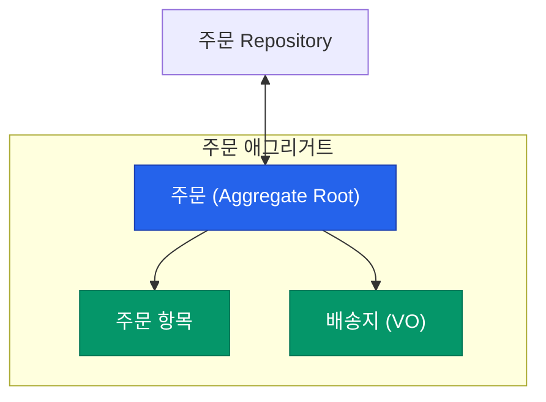

복잡한 비즈니스 로직을 가진 소프트웨어를 개발할 때, 가장 큰 위험은 비즈니스 규칙이 코드 곳곳에 흩어져 스파게티처럼 꼬이는 것입니다. **도메인 주도 설계**(Domain-Driven Design, DDD)의 **전술적 패턴**들은 핵심 로직을 특정 객체 안에 응집시키고, 외부의 오염으로부터 보호하는 구체적인 가이드라인을 제공합니다.

## 데이터가 아닌 식별자 중심: Entity

**엔티티**(Entity)는 속성이 변하더라도 **연속성**과 **식별자**를 유지하는 객체입니다.

- **특징**: "사용자"의 이름이나 주소가 바뀌어도 그는 여전히 "그 사용자"입니다. 데이터베이스의 ID(PK)와 연결되는 경우가 많습니다.
- **주의**: 모든 클래스를 엔티티로 만들면 시스템이 무거워지고 추적하기 어려워집니다.

## 값 자체가 중요함: Value Object (VO)

**값 객체**(Value Object)는 식별자 없이 그 자체가 가진 **값**으로만 정의되는 객체입니다.

- **특징**: "주소(서울시 강남구...)"나 "금액(10,000원)"은 그 구성 요소가 같으면 동일한 것으로 취급합니다.
- **불변성(Immutability)**: VO는 한 번 생성되면 값을 바꿀 수 없어야 합니다. 변경이 필요하면 새로운 VO 객체를 생성합니다. 이는 부수 효과(Side Effect)를 없애는 강력한 수단이 됩니다.

## 보호의 경계: Aggregate (애그리거트)

관련된 객체들을 하나의 군집으로 묶어 데이터 변경의 단위로 삼는 개념입니다.

- **Aggregate Root**: 외부에서 애그리거트 내부로 접근할 수 있는 유일한 통로입니다. 
- **일관성 보장**: "주문 항목의 총합은 주문서의 총액과 같아야 한다"와 같은 규칙은 애그리거트 루트가 책임지고 관리합니다.

## 영속성 추상화: Repository

애그리거트 전체를 저장하고 조회하는 인터페이스입니다. DB 기술이 무엇이든 간에, 비즈니스 로직 입장에서는 "객체를 컬렉션에 넣고 빼는" 것처럼 느껴져야 합니다.

  
핵심 인사이트: 모든 것이 엔티티는 아닙니다

  입문자들이 흔히 하는 실수는 모든 테이블을 엔티티로 만들고 일일이 <code>getter/setter</code>를 여는 것입니다. <b>가능한 많은 객체를 Value Object로 만드세요.</b> 식별자가 필요 없는 객체들을 VO로 격리할수록 도메인 모델은 안전해지고 테스트하기 쉬워집니다.

## 정리

- **Entity**는 식별자로 구분하며, **Value Object**는 값으로 구분합니다.
- **Aggregate**는 비즈니스 규칙이 깨지지 않도록 보호하는 데이터 경계입니다.
- 외부 시스템은 오직 **Aggregate Root**를 통해서만 내부와 소통해야 합니다.
- **Repository**를 통해 도메인 모델과 DB 기술을 분리하세요.

다음 글에서는 이러한 전술 패턴들이 실제 아키텍처로 구현되는 방식인 **클린·헥사고날 아키텍처**를 다뤄요.
