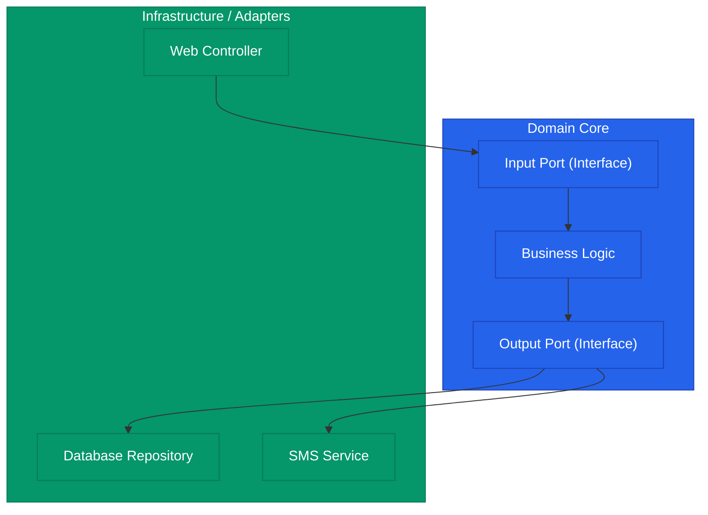

기술은 빠르게 변하지만 비즈니스 규칙은 상대적으로 천천히 변합니다. 데이터베이스를 MySQL에서 MongoDB로 바꾸거나, 웹 프레임워크를 Spring에서 NestJS로 바꾼다고 해서 "주문하면 재고가 깎여야 한다"는 비즈니스 로직이 바뀌지는 않죠. **헥사고날 아키텍처**(Hexagonal Architecture)는 이처럼 변하는 기술(인프라)로부터 변하지 않는 핵심 로직(도메인)을 분리하기 위한 설계 방식입니다

## 핵심 원칙: 의존성 역전 (DIP)

전통적인 방식에서는 비즈니스 로직이 DB나 외부 API 라이브러리에 직접 의존했습니다. 헥사고날 아키텍처는 이를 뒤집어, **모든 외부 요소가 도메인 로직에 의존**하게 만듭니다

## 포트(Port)와 어댑터(Adapter)

- **Port**: 도메인 코어가 외부에 열어놓은 '콘센트'입니다. 인터페이스로 정의됩니다
    - *Input Port*: 비즈니스 로직을 실행하기 위한 입구 (예: 주문하기 서비스)
    - *Output Port*: 비즈니스 로직이 외부 시스템을 필요로 할 때 쓰는 통로 (예: 주문 저장소)
- **Adapter**: 포트에 꽂히는 '플러그'입니다. 실제 구현체입니다
    - *Input Adapter*: HTTP 요청을 받아 포트를 호출하는 컨트롤러
    - *Output Adapter*: 포트 인터페이스를 구현하여 실제 DB에 저장하는 코드

## 유즈케이스(Use Case) 중심 설계

이 아키텍처에서 시스템의 동작은 **유즈케이스** 단위로 쪼개집니다 

- **장점**: 개발자가 코드를 열었을 때, 기술적인 구현보다 "이 시스템이 어떤 기능을 제공하는가"를 먼저 파악할 수 있습니다
- **테스트 용이성**: DB나 외부 시스템 없이도 도메인 로직만 독립적으로 테스트(Stub/Mock 활용)하기 매우 좋습니다

  
핵심 인사이트: 실용적인 접근법

  헥사고날 아키텍처를 엄격하게 지키려면 각 계층마다 데이터 객체를 변환(Mapping)해야 하는 번거로움이 따릅니다. 도메인이 단순한 경우라면 오버 엔지니어링이 될 수 있습니다. <b>비즈니스 로직의 복잡도가 일정 수준을 넘어서는 시점</b>에 도입을 고려하는 유연함이 필요합니다

## 정리

- **헥사고날 아키텍처**는 도메인 중심의 설계를 실현하는 가장 구체적인 구조입니다
- **의존성의 방향**을 안쪽(도메인)으로 모아 인프라 기술의 변경에 유연하게 대응합니다
- **포트와 어댑터**를 통해 명확한 인터페이스 기반의 협업 환경을 만듭니다
- 기술적인 세부 사항은 언제든 갈아 끼울 수 있는 부품으로 취급하세요

Design Patterns 시리즈를 통해 GoF부터 DDD, 아키텍처 패턴까지 살펴보았습니다. 패턴은 정답이 아닌 대화의 도구입니다. 상황에 맞는 적절한 패턴 선택으로 더 나은 소프트웨어를 설계해 보세요
