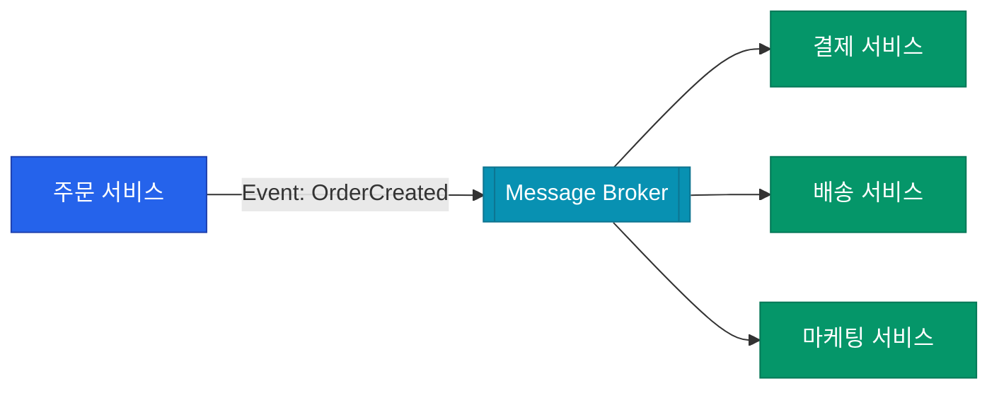

전통적인 시스템은 요청을 보내고 응답을 기다리는 **Request-Response** 방식이 주를 이뤘습니다. 하지만 서비스 규모가 커지면 서비스 간의 강한 결합(Coupling)이 병목이 됩니다. **이벤트 주도 아키텍처**(Event-Driven Architecture, EDA)는 상태의 변화를 '이벤트'로 발행하고, 이를 필요로 하는 곳에서 비동기적으로 처리하여 유연한 시스템을 만드는 방식입니다

## 메시지의 종류: Event vs Command

EDA를 설계할 때 가장 먼저 정의해야 할 것은 메시지의 성격입니다

| 종류 | 의미 | 시점 | 특징 |
|---|---|---|---|
| **Command** | 특정 동작을 수행하라는 명령 | 미래 | 하나의 수신자(Receiver)가 명확함, 실패 시 처리 필요 |
| **Event** | 이미 발생한 상태의 변화 | 과거 | 수신자가 누구인지 발신자는 모름 (Pub/Sub), 불변(Immutable) |

"결제해라(Command)"와 "결제되었다(Event)"의 차이는 시스템의 확장성을 결정짓는 중요한 지점입니다

## 워크플로우 구성: Choreography vs Orchestration

여러 서비스에 걸친 비즈니스 흐름을 관리하는 두 가지 전략입니다

### 1. 코레오그래피 (Choreography)
각 서비스가 이벤트를 구독하고 자신의 할 일을 마친 뒤 다시 이벤트를 발행합니다. 무용수들이 음악에 맞춰 각자의 춤을 추듯 자율적으로 움직입니다

- **장점**: 서비스 간 결합도가 가장 낮고 확장이 매우 쉽습니다
- **단점**: 전체 비즈니스 로직이 어디에 있는지 한눈에 파악하기 어렵습니다

### 2. 오케스트레이션 (Orchestration)
중앙의 지휘자(Orchestrator)가 각 서비스에게 명령을 내리고 결과를 취합합니다

- **장점**: 복잡한 비즈니스 프로세스를 중앙에서 제어하고 상태를 추적하기 쉽습니다
- **단점**: 지휘자 서비스에 로직이 몰려 무거워질 수 있습니다

## EDA의 핵심 가치: 시간적 디커플링

  
핵심 인사이트: 나중에 처리해도 괜찮습니다

  비동기 이벤트 방식의 가장 큰 장점은 <b>시간적 디커플링</b>입니다. 주문 서비스는 결제 서버가 점검 중이라도 일단 이벤트를 던져두고 다음 주문을 받을 수 있습니다. 결제 서버는 복구된 후에 밀린 이벤트를 순차적으로 처리하면 됩니다. 이는 시스템 전체의 가용성을 비약적으로 높여줍니다

## 정리

- **EDA**는 상태 변화를 비동기적으로 전파하여 서비스 간 결합을 끊습니다
- **Event**는 과거의 사실을 기록하며, 확장에 매우 유리합니다
- 시스템의 복잡도에 따라 **코레오그래피**와 **오케스트레이션** 중 적절한 방식을 선택하세요
- 데이터의 즉각적인 반영보다 **최종 일관성**(Eventual Consistency)을 수용하는 설계가 필요합니다

다음 글에서는 이벤트를 아카이빙하고 상태를 재구성하는 **Event Sourcing과 CQRS** 패턴에 대해 알아봐요
