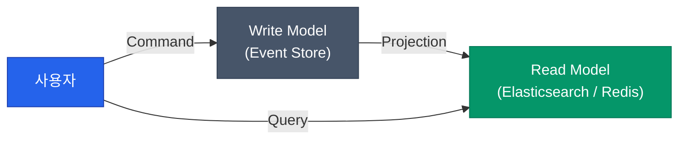

데이터베이스의 현재 값만 저장하면, "과거에 어떤 과정을 거쳐 이 상태가 되었는가"에 대한 정보는 사라집니다. **이벤트 소싱**(Event Sourcing)은 상태의 최종 결과가 아닌, 발생한 모든 이벤트를 순서대로 저장하는 방식입니다. 여기에 읽기와 쓰기의 책임을 분리하는 **CQRS** 패턴을 더해 거대하고 유연한 시스템을 구축하는 방법을 정리해요

## 이벤트 소싱 (Event Sourcing)

전통적인 방식이 `UPDATE`를 통해 현재 상태를 덮어쓴다면, 이벤트 소싱은 오직 `INSERT`만 발생합니다

- **방식**: `주문 생성됨`, `주소 변경됨`, `결제 완료됨`과 같은 이벤트를 저장소(Event Store)에 차곡차곡 쌓습니다
- **상태 재구성**: 현재의 상태가 필요할 때, 저장된 이벤트를 처음부터 끝까지 다시 실행(Replay)하여 결과물을 만듭니다
- **장점**: 완벽한 감사 추적(Audit Trail)이 가능하며, 과거 특정 시점의 상태로 언제든 되돌릴 수 있습니다

## CQRS (읽기와 쓰기의 분리)

**CQRS**(Command Query Responsibility Segregation)는 시스템의 모델을 두 가지로 나눕니다

1. **Command (쓰기)**: 데이터의 변경을 처리하며, 비즈니스 규칙 검증에 집중합니다
2. **Query (읽기)**: 화면에 보여줄 데이터를 조회하며, 성능에 최적화된 모델을 가집니다

## 프로젝션 (Projection)

이벤트 저장소에서 데이터를 조회하는 것은 매우 비효율적입니다. 그래서 백그라운드 프로세스가 이벤트를 읽어 검색 엔진이나 캐시 서버에 **읽기 전용 뷰**(Materialized View)를 미리 만들어두는데, 이를 **프로젝션**이라고 합니다

- **장점**: 조회 성능이 비약적으로 향상됩니다. 각 화면이나 클라이언트에 최적화된 다양한 형태의 DB를 가질 수 있습니다

  
핵심 인사이트: 만능 열쇠는 아닙니다

  이벤트 소싱과 CQRS는 시스템의 복잡도를 극도로 높입니다. 데이터가 쓰기 모델에서 읽기 모델로 넘어가는 동안 발생하는 <b>지연 시간</b>을 감당해야 하며, 이벤트 스키마가 변경될 때 과거 데이터를 어떻게 처리할지(Versioning)에 대한 정교한 전략이 필요합니다

## 정리

- **이벤트 소싱**은 데이터의 '결과'가 아닌 '과정'을 저장합니다
- **CQRS**를 통해 쓰기와 읽기 부하를 독립적으로 확장할 수 있습니다
- **리플레이(Replay)** 기능을 활용하여 언제든 새로운 형태의 통계나 분석 뷰를 만들어낼 수 있습니다
- 단순한 비즈니스에는 과한 설계일 수 있으므로, 도메인의 복잡도를 먼저 확인하세요

다음 글에서는 이벤트 주도 아키텍처의 심장인 **Kafka의 운영 관점**에 대해 알아봐요
