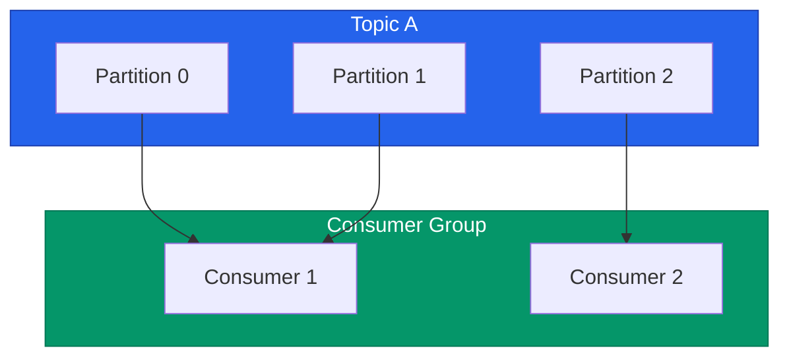

현대적인 이벤트 주도 아키텍처에서 **Apache Kafka**는 사실상 표준(De-facto standard)입니다. 하지만 Kafka는 단순한 메시지 큐가 아닌 분산 스트리밍 플랫폼이기 때문에, 그 내부 동작 원리를 모르면 장애 대응이 매우 어렵습니다. 프로덕션 환경에서 Kafka를 안정적으로 운영하기 위한 핵심 개념들을 정리해요

## 파티션과 병렬 처리

Kafka의 성능은 **파티션**(Partition)에서 나옵니다. 하나의 토픽을 여러 파티션으로 쪼개어 브로커들에 분산 저장함으로써 처리량을 높입니다

- **순서 보장**: Kafka는 **파티션 내부**에서만 메시지 순서를 보장합니다. 토픽 전체의 순서가 중요하다면 파티션을 하나만 써야 하지만, 이는 성능을 포기하는 일이 됩니다
- **파티션 개수 결정**: 파티션은 한 번 늘리면 줄일 수 없습니다. 예상되는 최대 소비자(Consumer) 수에 맞춰 신중하게 결정해야 합니다

## 컨슈머 그룹과 리밸런싱

Kafka의 소비자들은 **컨슈머 그룹**(Consumer Group)으로 묶여 작업을 나눠 가집니다

- **Rebalancing**: 그룹 내에 소비자가 추가되거나 제거될 때, 파티션 소유권을 다시 배분하는 과정입니다. 이때 일시적으로 소비가 멈추므로 리밸런싱이 너무 자주 일어나지 않도록 관리해야 합니다

## 신뢰성 있는 전송 (Delivery Semantics)

비즈니스 요구사항에 따라 메시지 전송 수준을 선택합니다

| 수준 | 설명 | 특징 |
|---|---|---|
| **At-most-once** | 최대 한 번 전송 | 메시지 유실 가능성 있음, 가장 빠름 |
| **At-least-once** | 최소 한 번 전송 | 유실은 없지만 중복 발생 가능 (가장 흔한 설정) |
| **Exactly-once** | 정확히 한 번 전송 | 중복과 유실 모두 없음, 성능 오버헤드 있음 |

## 스키마 레지스트리 (Schema Registry)

이벤트가 많아지면 "이 메시지에 어떤 필드가 들어있지?"를 관리하기 힘들어집니다. **Schema Registry**를 사용하여 메시지 형식을 강제하고 버전 호환성을 관리해야 시스템 전체의 안정성을 지킬 수 있습니다

  
핵심 인사이트: Lag 모니터링이 생명입니다

  Kafka 운영에서 가장 중요한 지표는 <b>Consumer Lag</b>입니다. 프로듀서가 생산하는 속도보다 컨슈머가 소비하는 속도가 느려지면 Lag이 쌓이고, 이는 실시간성 장애로 이어집니다. Burrow 같은 도구를 사용하여 Lag 추이를 실시간으로 감시하세요

## 정리

- **파티션** 설계를 통해 시스템의 처리량을 결정합니다
- **컨슈머 그룹**을 통해 부하를 분산하고 고가용성을 확보합니다
- 서비스의 성격에 맞는 **전송 보장 방식**을 선택하세요
- 데이터의 규약을 관리하는 **스키마 관리**는 시스템이 커질수록 필수입니다

Event-Driven 시리즈를 통해 기본 개념부터 이벤트 소싱, 그리고 Kafka 운영까지 살펴보았습니다. 이벤트 중심의 사고방식은 시스템 간의 벽을 허물고 더 유연한 아키텍처를 가능하게 합니다
