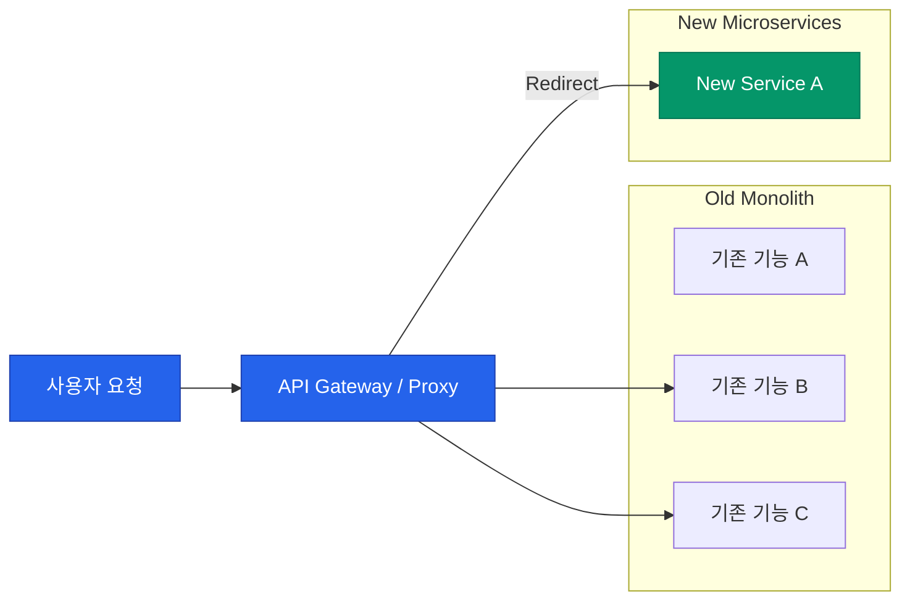

모놀리식 아키텍처에서 마이크로서비스(MSA)로 전환할 때 가장 먼저 맞닥뜨리는 거대한 벽은 "어떻게 서비스를 쪼갤 것인가"입니다. 너무 크게 쪼개면 MSA의 장점이 없고, 너무 잘게 쪼개면 관리 비용만 늘어나는 **분산 모놀리스**(Distributed Monolith)의 늪에 빠지게 됩니다. 서비스를 건강하게 분해하기 위한 핵심 원칙을 정리해요.

## 비즈니스 경계: Bounded Context

기술적인 계층(DB, UI 등)이 아니라 비즈니스 도메인을 중심으로 경계를 나눠야 합니다. 도메인 주도 설계(DDD)의 **Bounded Context** 개념이 가장 강력한 가이드라인이 됩니다.

| 기준 | 설명 | 특징 |
|---|---|---|
| **도메인 중심** | 비즈니스 기능(주문, 결제, 배정)별로 분리 | 언어적 맥락(Ubiquitous Language)의 일치 |
| **변경 주기** | 자주 바뀌는 기능과 정적인 기능 분리 | 배포 독립성 확보 |
| **데이터 소유권** | 서비스는 자신의 DB를 직접 관리 | API를 통해서만 데이터 접근 가능 |

## 전환 전략: 스트랭글러 피그 (Strangler Fig)

기존 모놀리식을 한 번에 다 부수고 새로 만드는 것은 매우 위험합니다. 거대한 나무를 타고 올라가며 결국 나무를 대체하는 식물처럼, 기능을 하나씩 떼어내어 새 서비스로 옮기는 방식을 권장합니다.

## MSA의 함정: 분산 모놀리스

서비스를 분리했음에도 불구하고, 하나를 고칠 때마다 다른 서비스들도 함께 배포해야 한다면 그것은 **분산 모놀리스**입니다. 

- **증상**: 서비스 간 강한 결합(Tight Coupling), 과도한 동기 호출, 공용 DB 사용.
- **해결**: 비동기 메시징(Event-driven)을 도입하고, 데이터의 정합성보다 서비스의 자율성을 우선시해야 합니다.

  
핵심 인사이트: 데이터 분리가 가장 어렵습니다

  코드를 쪼개는 것은 쉽지만, <b>데이터베이스를 쪼개는 것</b>은 고통스럽습니다. 데이터 정합성을 위해 트랜잭션을 묶어야 한다면, 아직 그 두 기능은 하나의 서비스로 남아있어야 한다는 신호일 수 있습니다.

## 정리

- **비즈니스 도메인**의 경계를 먼저 파악하세요.
- **배포 독립성**을 가질 수 있는 크기가 적정 사이즈입니다.
- **스트랭글러 패턴**을 사용하여 점진적으로 전환하세요.
- 기술적 유행보다 우리 조직이 MSA의 운영 비용을 감당할 수 있는지 먼저 자문해야 합니다.

다음 글에서는 쪼개진 서비스들이 서로 소통하는 방식인 **동기·비동기 통신 전략**에 대해 알아봐요.
