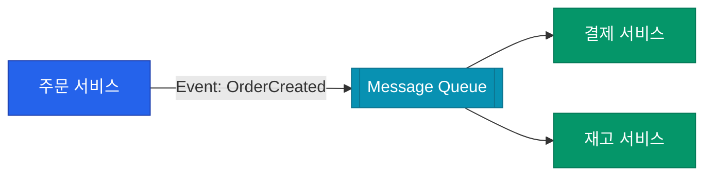

마이크로서비스 아키텍처에서 서비스들은 끊임없이 대화해야 합니다. 이때 대화의 방식을 어떻게 선택하느냐에 따라 시스템의 **응답성**(Latency)과 **결합도**(Coupling)가 결정됩니다. 즉시 응답을 기다리는 동기 방식과, 메시지를 던지고 잊어버리는 비동기 방식의 특징을 정리해요

## 동기 통신 (Synchronous)

요청을 보낸 서비스가 응답이 올 때까지 기다리는 방식입니다

| 프로토콜 | 특징 | 비고 |
|---|---|---|
| **REST (HTTP)** | 가장 보편적, 단순함, 어디서나 사용 가능 | 텍스트 기반(JSON)으로 오버헤드 있음 |
| **gRPC** | 이진(Binary) 포맷, 높은 성능, 타입 안전 | HTTP/2 기반, 양방향 스트리밍 지원 |

- **장점**: 직관적이고 구현이 쉽습니다. 오류 처리가 명확합니다
- **단점**: 호출하는 서비스가 죽으면 연쇄적으로 장애가 발생할 수 있으며(Cascading Failure), 전체 응답 시간이 길어집니다

## 비동기 통신 (Asynchronous)

메시지 큐(Kafka, RabbitMQ)나 이벤트 버스를 통해 데이터를 전달하고 제어권을 즉시 반환받는 방식입니다

- **장점**: 서비스 간의 결합도가 낮아집니다. 시스템 부하가 몰려도 큐에서 완충 역할을 해주어 안정적입니다
- **단점**: 결과가 즉시 반영되지 않아(최종 일관성), 프로그래밍 복잡도가 올라가고 디버깅이 어렵습니다

## 진입점 관리: API Gateway와 BFF

클라이언트가 수십 개의 마이크로서비스를 각각 호출하는 것은 비효율적입니다

- **API Gateway**: 인증, 라우팅, 속도 제한(Rate Limiting) 등 공통 기능을 처리하는 단일 진입점입니다
- **BFF (Backend for Frontend)**: 특정 클라이언트(iOS, Web, Android)에 최적화된 API를 제공하는 계층입니다

  
핵심 인사이트: 동기 호출은 전파됩니다

  A -> B -> C 순서로 동기 호출이 일어날 때, C가 1초 늦어지면 A는 총 2초 이상을 기다려야 할 수도 있습니다. <b>핵심 비즈니스 흐름</b>이 아니라면 가능한 비동기 이벤트로 분리하여 각 서비스의 독립성을 지켜주세요

## 정리

- **동기 호출**은 결과가 즉시 필요한 실시간 처리에 사용합니다
- **비동기 이벤트**는 서비스 간 결합을 끊고 확장성을 높일 때 사용합니다
- 복잡한 내부 서비스 구조는 **API Gateway** 뒤로 숨겨 클라이언트를 보호하세요
- 각 방식의 장단점을 섞어 쓰는 **혼합형 아키텍처**가 실무에서는 가장 흔합니다

다음 글에서는 여러 서비스에 걸친 데이터 일관성을 맞추는 **분산 트랜잭션과 Saga 패턴**에 대해 알아봐요
