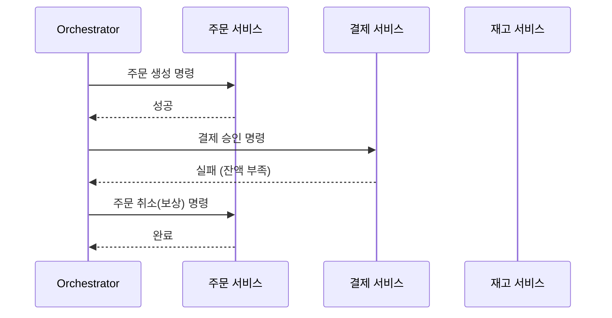

마이크로서비스 환경에서는 서비스마다 독립된 DB를 가지기 때문에, 기존 RDBMS의 단일 트랜잭션(ACID)을 사용할 수 없습니다. "주문은 성공했는데 결제가 실패한 상황"을 어떻게 수습할까요? 여러 서비스에 걸친 데이터 정합성을 맞추기 위한 **분산 트랜잭션** 해결책인 **Saga 패턴**을 정리해요

## 2PC의 한계

과거에는 **2단계 커밋**(Two-Phase Commit, 2PC)을 통해 여러 DB를 하나로 묶으려 했습니다. 하지만 모든 참여 서비스가 응답할 때까지 락(Lock)을 잡고 대기해야 하므로, 성능이 매우 떨어지고 한 서비스만 장애가 나도 전체가 멈추는 가용성 문제가 치명적이었습니다

## Saga 패턴: 보상 트랜잭션의 연쇄

Saga 패턴은 각 서비스의 로컬 트랜잭션을 순차적으로 실행하고, 중간에 실패하면 이전에 성공한 작업들을 취소하는 **보상 트랜잭션**(Compensating Transaction)을 실행하여 일관성을 맞춥니다

### 1. 코레오그래피 (Choreography)
중앙 통제자 없이, 각 서비스가 이벤트를 주고받으며 자율적으로 다음 단계를 실행합니다

- **장점**: 단순하고 서비스 간 결합도가 낮습니다
- **단점**: 흐름이 복잡해지면 전체 과정을 추적하기 어렵습니다

### 2. 오케스트레이션 (Orchestration)
중앙의 **Saga 오케스트레이터**가 전체 흐름을 지휘하며 각 서비스에게 무엇을 할지 명령합니다

- **장점**: 복잡한 비즈니스 로직을 중앙에서 관리하고 상태를 파악하기 쉽습니다
- **단점**: 오케스트레이터 자체가 복잡해질 수 있습니다

## 핵심: 보상 트랜잭션 (Compensating)

"취소"는 단순히 데이터를 지우는 것이 아닙니다. 이미 결제 완료된 상태라면 "결제 취소"라는 반대 행위를 수행해야 합니다

| 실행 단계 | 로컬 트랜잭션 | 보상 트랜잭션 |
|---|---|---|
| 주문 | 주문 생성 (Pending) | 주문 취소 / 삭제 |
| 결제 | 카드 결제 승인 | 카드 결제 취소 (환불) |
| 재고 | 재고 차감 | 재고 원복 |

  
핵심 인사이트: Transactional Outbox 패턴

  이벤트를 보낼 때 "DB 업데이트"와 "메시지 발송"이 하나의 원자적 작업으로 묶여야 합니다. DB의 별도 <b>Outbox 테이블</b>에 메시지를 기록하고, 별도 프로세스가 이를 읽어 큐로 보내는 패턴을 함께 사용하여 메시지 유실을 방지하세요

## 정리

- 분산 환경에서는 **강한 일관성**보다 **결과적 일관성**을 수용해야 합니다
- **Saga 패턴**은 로컬 트랜잭션과 보상 트랜잭션의 조합으로 일관성을 유지합니다
- 단순한 흐름은 **코레오그래피**, 복잡한 흐름은 **오케스트레이션**이 유리합니다
- 실패 상황을 비즈니스 로직의 일부로 설계하는 사고의 전환이 필요합니다

다음 글에서는 장애가 다른 서비스로 전파되는 것을 막는 **Resilience(회복성) 패턴**에 대해 알아봐요
