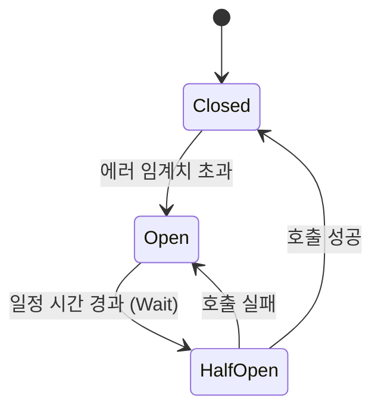

마이크로서비스 아키텍처에서 가장 무서운 것은 **연쇄 장애**(Cascading Failure)입니다. 서비스 B가 느려지면 이를 기다리던 서비스 A의 스레드도 모두 점유되고, 결국 시스템 전체가 마비됩니다. 우리 서비스를 '좀비' 상태로 만들지 않고, 장애를 격리하여 회복성을 높이는 4가지 핵심 패턴을 정리해요.

## 1. 서킷 브레이커 (Circuit Breaker)

과부하가 걸린 서비스로의 호출을 즉시 차단하여 시스템을 보호하는 패턴입니다. 전기 회로 차단기와 같은 원리로 동작합니다.

- **Closed**: 정상 상태. 모든 요청을 통과시킵니다.
- **Open**: 장애 상태. 요청을 보내지 않고 즉시 에러를 반환(Fallback)합니다.
- **Half-Open**: 복구 확인 상태. 소수의 요청만 보내보고 성공하면 다시 Closed로 전환합니다.

## 2. 격리 (Bulkhead)

배의 격벽(Bulkhead)이 침수 시 다른 칸을 보호하는 것처럼, 특정 기능의 장애가 전체로 번지지 않게 자원을 분리하는 방식입니다.

- **방식**: 각 외부 서비스 호출마다 독립적인 **스레드 풀**이나 **세마포어**를 할당합니다.
- **장점**: 특정 API가 느려져도 해당 스레드 풀만 꽉 찰 뿐, 다른 기능은 정상적으로 작동합니다.

## 3. 타임아웃과 재시도 (Timeout & Retry)

- **Timeout**: 무한정 기다리지 않고 일정 시간이 지나면 연결을 끊습니다. "빨리 실패하기(Fail Fast)"의 핵심입니다.
- **Retry**: 일시적인 오류(네트워크 순간 단절 등)에 대해 다시 시도합니다. 이때 **지수 백오프**(Exponential Backoff)를 사용하여 재시도 간격을 점진적으로 늘려야 서버에 무리를 주지 않습니다.

  
핵심 인사이트: 멱등성(Idempotency) 확보

  재시도 로직을 넣을 때 가장 중요한 것은 <b>멱등성</b>입니다. 네트워크 타임아웃으로 인해 재시도할 때, 실제로 첫 번째 요청이 성공했을 수도 있습니다. 동일한 요청을 여러 번 보내도 결과가 같도록 서버가 설계되어 있어야 데이터 중복 결제 같은 사고를 막을 수 있습니다.

## 4. 폴백 (Fallback)

요청이 실패했을 때 사용자에게 보여줄 '차선책'입니다.

- **사례**: 추천 서비스가 죽었다면 "로그인한 사용자에게 가장 인기 있는 상품"이라는 고정된 리스트를 보여주는 식입니다. 시스템의 일부 기능이 마비되어도 사용자 경험을 최소한으로 유지합니다.

## 정리

- **서킷 브레이커**는 죽어가는 서비스에 인공호흡기를 떼고 격리하는 장치입니다.
- **격벽** 패턴으로 리소스를 물리적으로 분리하여 피해를 최소화하세요.
- **타임아웃**은 "안 되는 건 빨리 포기하게" 만들어줍니다.
- 모든 회복성 설계의 전제 조건은 **멱등성**이 보장된 API입니다.

MSA/Microservices 시리즈를 통해 서비스 분해부터 통신, 정합성, 회복성까지 핵심 내용을 살펴보았습니다. 분산 시스템은 복잡하지만, 이러한 패턴들을 적재적소에 배치한다면 훨씬 견고한 서비스를 만들 수 있습니다.
