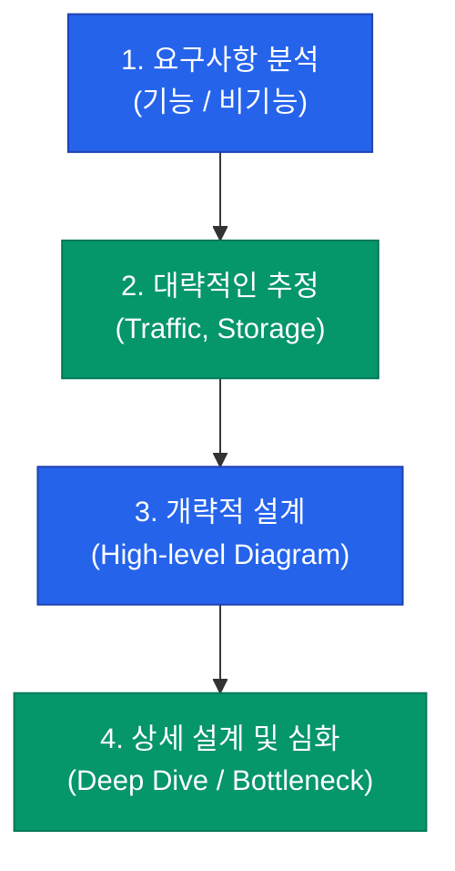

시스템 설계는 단순히 어떤 기술을 쓰느냐의 문제가 아닙니다. 주어진 비즈니스 문제를 해결하기 위해 **제한된 자원** 속에서 최선의 **트레이드오프**(Trade-off)를 선택하는 과정입니다. 복잡한 시스템을 마주했을 때 엔지니어가 가져야 할 사고 프레임워크를 정리해요.

## 1단계: 요구사항과 제약 조건 확인

설계를 시작하기 전, 우리가 무엇을 만들어야 하는지 명확히 해야 합니다.

- **Functional Requirements**: 시스템이 무엇을 해야 하는가? (예: "사용자는 트윗을 올릴 수 있어야 한다")
- **Non-functional Requirements**: 시스템이 어떻게 작동해야 하는가? (예: "트래픽이 몰려도 응답은 200ms 이내여야 한다", "데이터는 절대 유실되면 안 된다")

특히 **사용자 수(DAU)**, **초당 요청 수(QPS)**, **데이터 보관 기간**과 같은 수치적 제약 조건이 설계의 방향을 결정짓습니다.

## 2단계: 트레이드오프의 축

모든 것을 다 가질 수는 없습니다. 하나를 얻으면 하나를 포기해야 하는 세 가지 핵심 축입니다.

| 축 | 대립되는 가치 | 고민 지점 |
|---|---|---|
| **일관성 vs 가용성** | 정합성(Consistency) vs 응답성(Availability) | 데이터가 조금 늦게 반영되어도 되는가? |
| **지연 시간 vs 비용** | 속도(Latency) vs 예산(Cost) | 비싼 메모리 캐시를 얼마나 많이 쓸 것인가? |
| **단순함 vs 확장성** | 생산성 vs 확장 가능성 | 처음부터 MSA로 짤 것인가, 모놀리식으로 시작할 것인가? |

## 3단계: 설계 프레임워크 (Framework)

실제 설계나 면접에서 활용할 수 있는 단계별 접근법입니다.

1. **추정 (Estimation)**: "한 달에 데이터가 10TB씩 쌓인다면 어떤 DB가 유리할까?"와 같은 산술적인 감각이 필요합니다.
2. **개략적 설계**: 로드밸런서, 서버, DB, 캐시의 전체적인 흐름을 그립니다.
3. **상세 설계**: 특정 컴포넌트의 장애 대응, 데이터 샤딩 전략 등 병목 구간을 집중적으로 파고듭니다.

  
핵심 인사이트: 완벽한 시스템은 없습니다

  시니어 엔지니어의 답변에는 항상 <b>"상황에 따라 다릅니다(It depends)"</b>라는 말이 따라붙습니다. 특정 기술이 좋아서 쓰는 것이 아니라, 그 기술이 가진 단점을 우리가 감당할 수 있기 때문에 선택하는 것이어야 합니다.

## 정리

- 시스템 설계는 **요구사항 분석**에서 시작하여 **트레이드오프**로 완성됩니다.
- 기능(What)보다 성능과 신뢰성(How)에 대한 제약을 먼저 파악하세요.
- 일관성, 가용성, 지연 시간 사이의 균형을 잡는 것이 설계자의 역할입니다.
- 큰 그림에서 시작하여 점진적으로 상세한 부분으로 나아가세요.

다음 글에서는 늘어나는 트래픽을 감당하기 위한 **확장성과 부하 분산** 기술에 대해 알아봐요.
