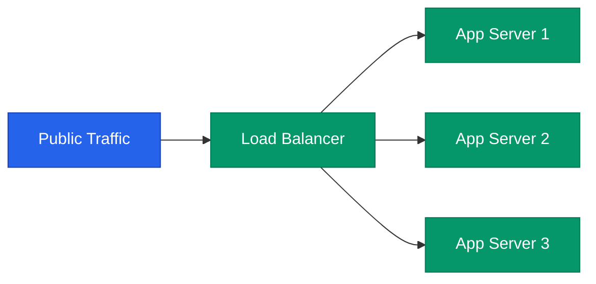

사용자가 수만 명에서 수천만 명으로 늘어날 때, 시스템이 무너지지 않고 버틸 수 있는 능력을 **확장성**(Scalability)이라고 합니다. 이를 실현하기 위해 부하를 어떻게 물리적 서버들에 효과적으로 나누는지, 그리고 서버 자체를 어떻게 확장하는지 핵심 전략을 정리해요.

## 두 가지 확장 방식: Vertical vs Horizontal

| 방식 | 설명 | 장점 | 단점 |
|---|---|---|---|
| **Vertical (Scale-up)** | CPU, RAM 등 서버 자체 사양을 높임 | 구현이 매우 단순함 | 물리적 한계 존재, 비용 비효율적 |
| **Horizontal (Scale-out)** | 저렴한 서버 여러 대를 병렬로 추가 | 물리적 한계 없음, 고가용성 확보 | 시스템 복잡도 증가, 데이터 동기화 문제 |

현대적인 웹 시스템은 언제나 **Scale-out**을 기본 원칙으로 합니다.

## 부하 분산의 핵심: 로드밸런서 (Load Balancer)

로드밸런서는 트래픽을 여러 서버로 나누어 전달하는 교통 경찰 역할을 합니다.

- **L4 로드밸런서**: IP 주소와 포트 번호 기반으로 부하를 나눕니다. 속도가 매우 빠르고 데이터 내용은 보지 않습니다.
- **L7 로드밸런서**: HTTP 헤더, 쿠키, URL 경로 기반으로 정교한 라우팅을 수행합니다. (예: `/api`는 API 서버로, `/static`은 정적 서버로)

## 지연 시간을 줄이는 CDN (Content Delivery Network)

모든 요청이 메인 서버까지 올 필요는 없습니다. 전 세계 곳곳에 흩어진 **엣지 서버**(Edge Server)에 이미지, JS, CSS 같은 정적 파일을 복제해두면 사용자는 가장 가까운 곳에서 데이터를 받아갈 수 있습니다.

- **장점**: 메인 서버의 부하를 획기적으로 줄이고, 사용자 응답 속도(Latency)를 극대화합니다.

  
핵심 인사이트: Stateless 아키텍처

  수평 확장이 가능하려면 서버가 <b>상태(State)를 가지지 않아야</b> 합니다. 로그인 정보(Session)를 특정 서버 메모리에 저장하면(Sticky Session), 다음 요청이 다른 서버로 갔을 때 로그인이 풀리게 됩니다. 세션 정보는 Redis 같은 공용 저장소로 분리하여 서버를 언제든 늘리고 줄일 수 있게 설계하세요.

## 정리

- **Scale-out**은 지속 가능한 성장을 위한 필수 선택입니다.
- **로드밸런서**는 가용성을 높이고 트래픽 병목을 방지하는 관문입니다.
- **CDN**을 활용하여 지리적 거리에 따른 성능 한계를 극복하세요.
- 확장 가능한 시스템의 전제 조건은 서버의 **무상태성**(Stateless)입니다.

다음 글에서는 분산 시스템의 최대 난제인 **데이터 일관성과 CAP 정리**에 대해 알아봐요.
