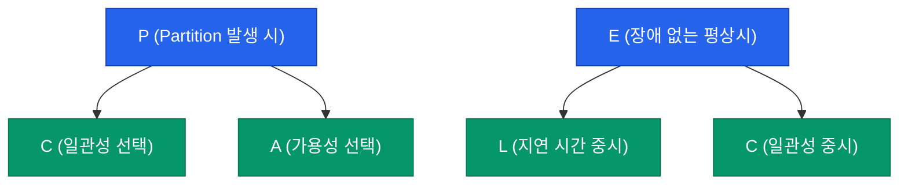

여러 대의 서버와 데이터베이스가 흩어져 있는 분산 시스템에서 모든 노드가 동일한 최신 데이터를 유지하는 것은 불가능에 가깝습니다. 데이터가 복제되는 동안의 틈을 어떻게 관리할 것인가에 대한 이론적인 가이드라인인 **CAP 정리**와 **PACELC**를 정리해요

## CAP 정리: 세 마리 토끼를 다 잡을 수 없다

분산 시스템은 다음 세 가지 가치 중 최대 두 가지만 동시에 만족할 수 있습니다

- **Consistency (일관성)**: 어떤 노드에 접속하든 똑같은 최신 데이터를 읽어야 합니다
- **Availability (가용성)**: 일부 노드에 장애가 생겨도 모든 요청은 응답을 받아야 합니다
- **Partition Tolerance (분할 내성)**: 노드 간의 네트워크 통신이 끊겨도 시스템이 동작해야 합니다

실제 분산 환경에서는 네트워크 단절(**P**)이 언제든 발생할 수 있다고 전제해야 하므로, 사실상 **CP**와 **AP** 중 하나를 선택하는 문제로 귀결됩니다

## PACELC: 장애가 없을 때도 생각하기

CAP 정리는 네트워크 장애(Partition) 상황에만 집중합니다. 이를 보완하기 위해 장애가 없는 평상시(Else)의 지연 시간(Latency) 트레이드오프까지 포함한 것이 **PACELC**입니다

- **P-A-E-L**: 장애 시 가용성을, 평상시에는 속도를 중시 (예: DynamoDB, Cassandra)
- **P-C-E-C**: 어떤 상황에서도 데이터 정합성을 중시 (예: MySQL, PostgreSQL)

## 일관성 모델의 종류

| 모델 | 설명 | 특징 |
|---|---|---|
| **Strong** | 쓰기 완료 즉시 모든 읽기 요청에 반영됨 | 가장 안전하지만 매우 느림 |
| **Eventual** | 시간이 흐르면 결국 일관된 상태가 됨 | 가장 빠르고 확장성이 좋음 (SNS 좋아요 등) |
| **Causal** | 인과 관계가 있는 데이터끼리만 순서를 보장 | 댓글과 답글의 관계 등 |

  
핵심 인사이트: 최종 일관성 (Eventual Consistency)

  글로벌 서비스를 설계할 때 모든 데이터의 즉각적인 일관성을 고집하면 시스템은 확장될 수 없습니다. <b>비즈니스 영향도가 낮은 데이터</b>(SNS 알림, 추천 목록 등)는 최종 일관성을 수용하고, <b>결제나 개인정보</b> 같은 데이터만 강한 일관성을 유지하는 분리된 접근이 필요합니다

## 정리

- **CAP 정리**는 분산 시스템 설계의 근본적인 제약을 설명합니다
- **P**를 기본으로 깔고, 서비스의 성격에 따라 **C**와 **A**를 선택하세요
- **PACELC**를 통해 평상시의 성능과 정합성 균형까지 고려해야 합니다
- 모든 데이터에 완벽한 정합성을 요구하는 것은 확장성을 포기하는 것과 같습니다

다음 글에서는 방대한 데이터를 효율적으로 관리하는 **데이터 저장과 캐시 전략**에 대해 알아봐요
