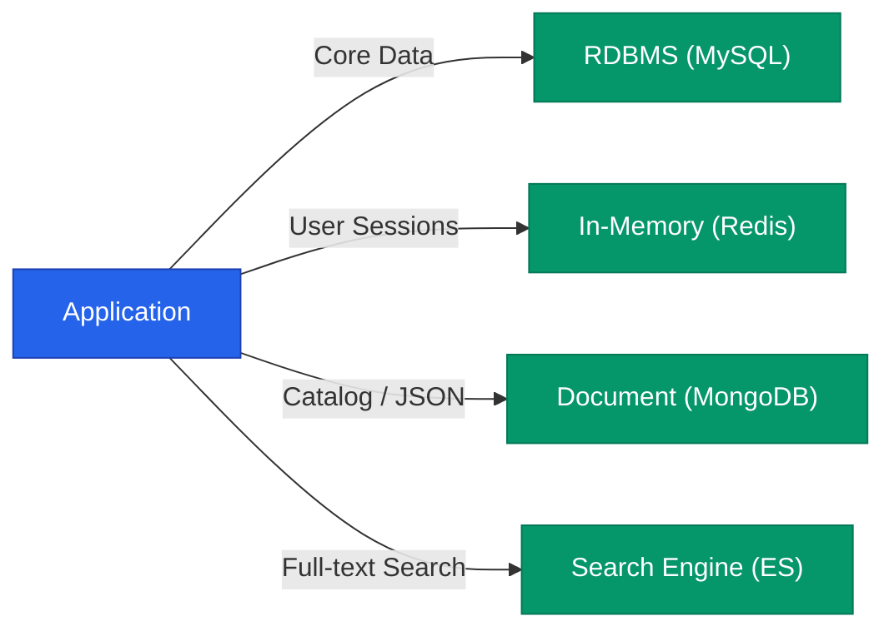

현대적인 대규모 시스템에서 하나의 데이터베이스로 모든 요구사항을 충족하는 것은 불가능합니다. 트랜잭션 처리에 최적화된 DB부터 방대한 로그를 분석하는 DB까지, 각 목적에 맞는 저장소를 배치하고 데이터를 흐르게 하는 전략이 필요합니다.

## 온라인 처리 vs 분석 처리 (OLTP vs OLAP)

| 구분 | OLTP (Transactional) | OLAP (Analytical) |
|---|---|---|
| **목적** | 현재 데이터의 CRUD (주문, 결제) | 과거 데이터 분석 (통계, 매출 분석) |
| **핵심** | 빠른 응답 속도, 강한 정합성 | 대량 데이터 처리, 복잡한 쿼리 |
| **대표 도구** | MySQL, PostgreSQL, Oracle | BigQuery, ClickHouse, Redshift |

운영 환경의 데이터를 **ETL**(Extract, Transform, Load) 프로세스를 통해 데이터 웨어하우스(OLAP)로 주기적으로 옮겨 분석에 활용합니다.

## 폴리글랏 퍼시스턴스 (Polyglot Persistence)

데이터의 성격에 따라 가장 적합한 저장소를 혼합하여 사용하는 방식입니다.

- **RDBMS**: 정합성이 중요한 핵심 비즈니스 데이터
- **NoSQL**: 유연한 스키마와 대량의 읽기/쓰기가 필요한 데이터
- **Elasticsearch**: 복잡한 조건의 텍스트 검색 및 필터링

## 다중 계층 캐싱 (Layered Caching)

응답 속도를 높이기 위해 시스템 곳곳에 캐시 계층을 배치합니다.

1. **Browser Cache**: 정적 자원을 사용자 로컬에 저장
2. **CDN Cache**: 전 세계 엣지 노드에 파일 복제
3. **Application Cache**: 로컬 메모리(Guava, Caffeine)나 원격 메모리(Redis) 활용
4. **Database Cache**: DB 내부의 버퍼 풀(Buffer Pool) 활용

  
핵심 인사이트: Cache-aside 패턴

  가장 대중적인 전략은 <b>Cache-aside</b>입니다. 앱이 먼저 캐시를 확인하고, 데이터가 없으면 DB에서 가져와 캐시에 채워넣는 방식입니다. 이는 캐시 시스템에 장애가 생겨도 서비스가 중단되지 않고 DB로 직접 대응할 수 있게 해주는 안정적인 설계입니다.

## 정리

- **OLTP**와 **OLAP**를 분리하여 서비스 성능과 분석 효율을 동시에 잡으세요.
- 데이터의 성격(관계, 검색, 세션 등)에 맞는 **적정 저장소**를 선택하세요.
- **캐싱**은 지연 시간을 줄이는 가장 강력한 도구이지만, 데이터 정합성 문제(Cache Invalidation)를 항상 고민해야 합니다.
- 시스템 전체의 데이터 흐름을 설계하는 것이 개별 컴포넌트의 성능보다 중요합니다.

System Design 시리즈를 통해 설계 사고법부터 확장성, 일관성, 그리고 저장소 전략까지 살펴보았습니다. 복잡한 시스템은 수많은 트레이드오프의 결과물이며, 정답이 아닌 '최선의 선택'을 찾는 과정임을 잊지 마세요.
