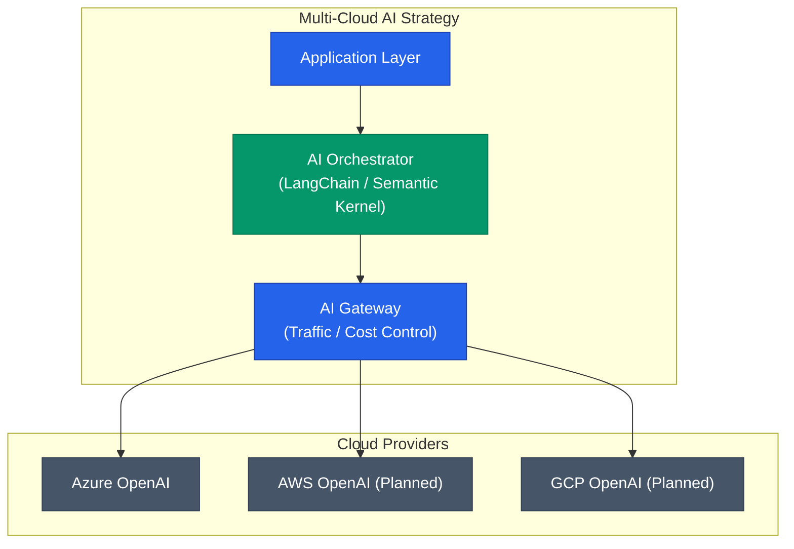

특정 벤더에 종속되지 않는 전략은 모든 엔지니어링 아키텍처의 숙원 사업입니다. 특히 생성형 AI의 폭발적 성장기에 마이크로소프트(MS)와 OpenAI의 긴밀한 독점 관계는 Azure를 엔터프라이즈 AI의 유일한 관문으로 만들었습니다. 하지만 최근 양사의 파트너십이 비독점으로 전환되면서 'Post-Azure' 시대가 열렸습니다. 이번 변화의 배경과 아키텍처 관점의 의미를 정리합니다

## 파트너십 재구성의 배경

2026년 4월 27일, MS와 OpenAI는 2032년까지의 라이선스 계약을 유지하면서도 그 성격을 **비독점(Non-exclusive)**으로 전환했습니다

| 항목 | 이전 (독점) | 변경 (비독점) |
|---|---|---|
| **라이선스 권한** | MS가 독점적 상업화 권리 보유 | OpenAI가 타 클라우드 배포 권리 확보 |
| **인프라 파트너** | Azure가 유일한 호스팅 환경 | Azure는 '우선 파트너' 지위로 변경 |
| **비용 정산** | MS의 매출 셰어 방식 | 상한선 내 정해진 라이선스료 지급 |

이러한 변화는 아마존(Amazon)과의 500억 달러 규모 호스팅 계약을 둘러싼 법적 분쟁을 해소하고, OpenAI가 더 넓은 인프라 자원을 확보하기 위한 전략적 선택으로 풀이됩니다

## 'Post-Azure' 시대의 서막

비독점 전환은 더 이상 OpenAI 모델을 쓰기 위해 Azure를 강제하지 않아도 된다는 뜻입니다. 이는 인프라 아키텍처에 세 가지 큰 변화를 가져옵니다

### 1. 클라우드 벤더 선택의 자율성
OpenAI의 최신 모델을 AWS Bedrock이나 Google Cloud Vertex AI에서도 만날 수 있는 길이 열렸습니다. 기업은 기존에 구축된 인프라(VPC, IAM 등)를 유지하면서 최상위 모델을 결합할 수 있습니다

### 2. 하이퍼스케일러 간의 경쟁 가속
Azure가 가졌던 독점적 우위가 사라지면서, 이제 모델 성능이 아닌 **인프라 비용과 서빙 안정성**이 경쟁의 핵심이 되었습니다. 이는 결과적으로 기업의 추론(Inference) 비용 감소로 이어질 가능성이 높습니다

### 3. 멀티 모델 아키텍처의 확산
Anthropic(Claude), Google(Gemini), OpenAI(GPT) 등 모든 프론티어 모델을 단일 클라우드 플랫폼에서 오케스트레이션할 수 있게 되어, 가용성과 성능을 고려한 멀티 모델 전략이 더 수월해집니다

## 아키텍처 설계의 새로운 고민

독점 체제에서는 Azure의 기술 스택에 맞추는 것이 유일한 길이었지만, 이제는 **상호운용성(Interoperability)**이 중요해졌습니다

- **AI Gateway 도입**: 클라우드별 API 호출을 추상화하고 비용을 통제하는 게이트웨이 레이어가 필수 아키텍처 컴포넌트로 부상합니다
- **데이터 국지성(Data Locality)**: 데이터가 위치한 클라우드에서 바로 추론을 수행함으로써 데이터 전송 비용과 지연 시간을 줄이는 설계가 가능해집니다

  
핵심 차이: Lock-in에서 Strategy로

  이제 AI 도입은 특정 클라우드를 따라가는 것이 아니라, 비즈니스 요구사항에 맞춰 모델과 인프라를 조합하는 <b>'전략적 선택'</b>의 영역으로 들어왔습니다

## 정리

- MS와 OpenAI의 비독점 전환으로 OpenAI 모델의 멀티클라우드 배포가 가능해졌습니다
- Azure는 우선적 파트너 지위를 유지하지만, 기업은 인프라 선택의 자유를 얻었습니다
- 이제 아키텍처 설계 시 단일 벤더 종속을 피하고, 상호운용성을 보장하는 추상화 레이어를 고민해야 합니다

다음 글에서는 이러한 인프라 유연성을 바탕으로 실제로 **어떤 클라우드에서도 자유로운 AI 서비스를 구축하기 위한 아키텍처 설계 패턴**을 구체적으로 알아봅니다
