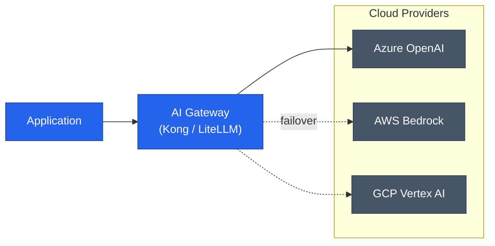

OpenAI와 마이크로소프트의 비독점 전환으로 이제 '어디서 모델을 돌릴 것인가'보다 **'어떻게 모델을 추상화할 것인가'**가 아키텍처의 핵심 과제가 되었습니다. 특정 클라우드의 SDK에 의존하는 방식은 변화의 속도를 따라가기 어렵게 만듭니다. 벤더 종속성(Lock-in)을 해결하고 유연한 AI 서비스를 구축하기 위한 3가지 설계 패턴을 정리합니다

## 패턴 1: 통합 AI 게이트웨이 (Unified AI Gateway)

클라이언트가 각 클라우드의 개별 API 엔드포인트에 직접 연결하는 대신, 중앙의 게이트웨이를 거치는 방식입니다

| 요소 | 역할 | 비고 |
|---|---|---|
| **추상화** | OpenAI, AWS, GCP의 서로 다른 API 규격을 하나로 통일 | 주로 OpenAI API 규격으로 표준화 |
| **거버넌스** | API 키 관리, 속도 제한(Rate Limiting), 비용 추적 | 중앙 집중형 제어 가능 |
| **복원력** | 특정 지역이나 클라우드 장애 시 다른 곳으로 자동 페일오버 | 가용성 극대화 |



이 패턴은 클라우드 환경이 바뀌어도 애플리케이션 코드를 수정할 필요가 없다는 것이 가장 큰 장점입니다

## 패턴 2: 지능형 모델 라우팅 (Intelligent Model Routing)

단일 모델에 의존하지 않고, 요청의 성격이나 클라우드 상태에 따라 최적의 모델로 경로를 지정하는 패턴입니다

- **비용 최적화**: 단순 요약은 저렴한 모델로, 복잡한 추론은 고성능 모델로 라우팅합니다
- **지연 시간 최적화**: 사용자와 가장 가까운 리전이나 현재 대기 시간이 짧은 클라우드를 선택합니다
- **모델 폴백(Fallback)**: GPT-4o 호출이 실패하면 즉시 Claude 3.5 Sonnet으로 전환하여 서비스 연속성을 보장합니다

## 패턴 3: 데이터 로컬리티 기반 추론 (Localized Inference)

데이터가 있는 곳에서 추론을 수행하여 데이터 유출 위험과 전송 비용을 최소화하는 방식입니다

```mermaid
flowchart TD
    subgraph region_us [US Region (AWS)]
        S3["Customer Data"]
        Inference_AWS["Inference Service"]
    end
    subgraph region_eu [EU Region (Azure)]
        Blob["Customer Data"]
        Inference_AZ["Inference Service"]
    end

    S3 --> Inference_AWS
    Blob --> Inference_AZ

    classDef neutral fill:#475569,stroke:#334155,color:#ffffff
    class DB,S3,Blob neutral
```

유럽(EU)의 GDPR과 같은 데이터 규제가 엄격한 경우, 데이터를 외부 클라우드로 전송하지 않고 로컬에 배포된 OpenAI 모델(또는 타 모델)을 사용함으로써 컴플라이언스 문제를 우아하게 해결할 수 있습니다

## 구현 시 고려해야 할 추상화 레이어

아키텍처의 유연성을 확보하기 위해서는 개발 단계부터 프레임워크를 활용하는 것이 유리합니다

1. **프레임워크 수준**: LangChain이나 Semantic Kernel을 사용하여 모델 호출 로직을 추상화합니다
2. **인프라 수준**: Terraform이나 Pulumi로 여러 클라우드의 AI 자원을 코드로 관리(IaC)합니다
3. **운영 수준**: 모델별 성능과 비용을 통합 모니터링할 수 있는 대시보드(LlamaIndex, Arize Phoenix 등)를 구축합니다

<div class="callout why">
  <div class="callout-title">핵심 차이: 정적 연결에서 동적 결합으로</div>
  과거의 아키텍처가 특정 벤더와의 <b>'정적 연결'</b>이었다면, 미래의 AI 아키텍처는 비즈니스 상황에 따라 벤더를 갈아끼울 수 있는 <b>'동적 결합'</b> 구조여야 합니다
</div>

## 정리

- **통합 게이트웨이**를 통해 API 규격을 표준화하고 가용성을 확보하세요
- **지능형 라우팅**으로 비용과 성능의 균형을 잡으세요
- **데이터 로컬리티**를 고려하여 보안과 전송 효율을 극대화하세요

이러한 패턴들을 적용하면 OpenAI 모델이 어느 클라우드에 있든 상관없이, 비즈니스 가치에만 집중할 수 있는 진정한 'AI 플랫폼'을 구축할 수 있습니다

---

마이크로소프트와 OpenAI의 파트너십 변화로부터 시작된 아키텍처 전략 시리즈를 마칩니다. 다음 시리즈에서는 엔지니어링 효율을 극대화하는 **NVIDIA의 Hybrid MoE 아키텍처**에 대해 심층 분석합니다
