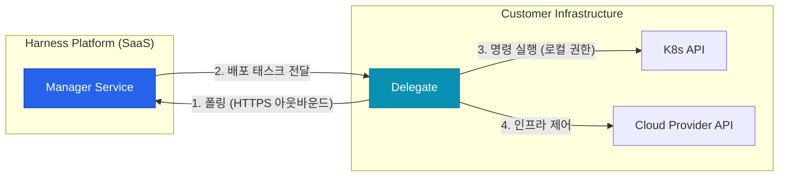

## 플랫폼의 고민: 보안과 제어의 트레이드오프

SaaS 기반의 배포 플랫폼을 도입할 때 보안 팀이 가장 먼저 던지는 질문은 **"우리 클러스터의 권한을 외부에 넘겨줘도 안전한가?"**입니다. 일반적인 SaaS 도구는 외부에서 내부로 접속하는 인바운드 방화벽을 열거나, 강력한 권한을 가진 API 키를 SaaS 서버에 저장해야 합니다

OpenAI 역시 전 세계에 분산된 거대 GPU 클러스터와 다중 클라우드를 운영하며 이 보안 문제를 해결해야 했습니다. Harness는 **Delegate**라는 독특한 에이전트 아키텍처를 통해 이 문제를 우아하게 해결합니다

## Harness Delegate: 아웃바운드 기반의 실행기

Harness Delegate는 고객의 인프라(Kubernetes 클러스터, VM 등) 내부에 설치되는 경량 에이전트입니다. 이 에이전트가 Harness 플랫폼의 '뇌' 역할을 하는 SaaS 서버와 통신하며 실제 배포 명령을 수행합니다

### 핵심 동작 원리

1. **아웃바운드 전용**: Delegate는 항상 내부에서 외부(Harness SaaS)로만 연결을 시도합니다. 인바운드 방화벽 포트를 하나도 열 필요가 없습니다
2. **폴링(Polling) 방식**: Delegate가 SaaS 서버에 "수행할 작업이 있는가?"를 주기적으로 묻고, 작업이 있으면 가져와서 실행합니다
3. **로컬 실행**: 실제 `kubectl`, `helm`, `terraform` 명령은 Delegate가 설치된 로컬 환경에서 실행됩니다. 클러스터 접근 권한(Kubeconfig 등)이 인프라 외부로 절대 유출되지 않습니다

## OpenAI가 Delegate를 활용하는 방식

OpenAI는 수천 개의 Delegate 인스턴스를 활용해 하이브리드 환경을 통합 관리합니다

- **격리된 네트워크 지원**: 인터넷 연결이 제한된 VPC 내부에서도 프록시를 통해 Delegate만 연결되면 배포가 가능합니다
- **권한 최소화 (Least Privilege)**: 각 Delegate에 특정 네임스페이스나 클러스터에 대한 권한만 부여하여, 보안 사고 시 피해 범위를 최소화합니다
- **확장성**: 대규모 배포가 몰릴 때 Delegate를 오토스케일링하여 처리량을 유연하게 조절합니다

## 거버넌스의 핵심: Policy as Code (OPA)

아키텍처 관점에서 Harness의 또 다른 강점은 **중앙 집중형 정책 엔진**입니다. OpenAI는 모든 Delegate가 수행하는 명령이 전사 보안 정책을 준수하는지 실시간으로 검증합니다

- **OPA 통합**: `regal` 언어를 사용하여 배포 전 검증 로직을 작성합니다
- **자동 차단**: 예를 들어 "Resource Limit이 설정되지 않은 컨테이너"나 "Public 로드밸런서"가 포함된 배포는 Delegate 단계에서 차단됩니다

## 정리

Harness Engineering의 아키텍처는 **"보안을 포기하지 않으면서도 SaaS의 생산성을 누릴 수 있는 방법"**을 제시합니다. OpenAI가 전 세계 인프라를 하나의 플랫폼에서 제어할 수 있는 비결은 바로 이 Delegate 아키텍처에 있습니다

다음 글에서는 실제 개발자가 체감하는 변화인 **Harness IDP(Internal Developer Portal)를 통한 셀프 서비스 엔지니어링**에 대해 다룹니다
