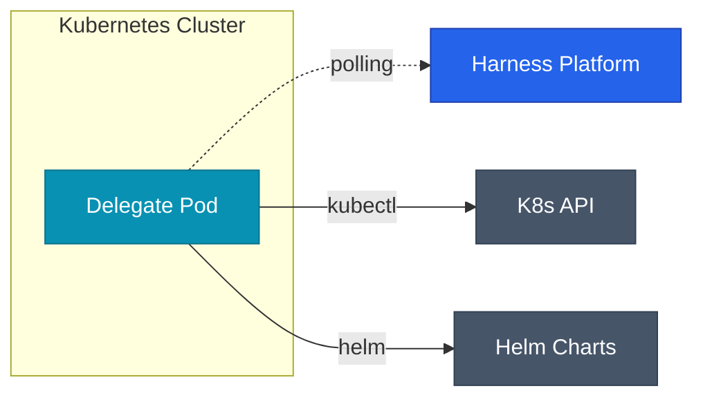

## Delegate란 무엇인가

Harness는 SaaS 플랫폼이지만, 실제 배포 명령은 사용자 인프라 안에서 실행됩니다. 이 역할을 하는 게 **Delegate**입니다.

Delegate는 Kubernetes Pod 또는 VM에 설치되는 경량 에이전트로, Harness 플랫폼과 **아웃바운드 HTTPS 연결**만 유지합니다. 인바운드 포트를 열 필요가 없어서 네트워크 보안 정책을 그대로 유지할 수 있습니다.



Delegate가 Harness로부터 태스크를 받으면, 실제 인프라에 kubectl·helm·terraform 등의 명령을 실행하고 결과를 다시 플랫폼으로 전송합니다.

## 사전 요구사항

| 항목 | 요구 사양 |
|------|-----------|
| Kubernetes | 1.24 이상 |
| Helm | 3.x |
| Delegate Pod CPU | 최소 0.5 vCPU, 권장 1 vCPU |
| Delegate Pod Memory | 최소 768Mi, 권장 2Gi |
| 아웃바운드 연결 | `app.harness.io:443`, `storage.googleapis.com:443` |
| 클러스터 권한 | `cluster-admin` 또는 커스텀 RBAC |

## 1단계: Harness 계정 준비

`app.harness.io` 에서 계정을 생성합니다. Free Plan은 제한이 있지만 PoC에는 충분합니다.

설치에 필요한 두 가지 값을 미리 확인합니다.

- **Account ID**: `Account Settings > Overview`
- **Delegate Token**: `Account Settings > Delegates > Tokens > New Token`

<div class="callout why">
  <div class="callout-title">Token vs Account Secret</div>
  Delegate Token은 Delegate 전용 인증 토큰입니다. Account Secret과 별개로 관리되고, Delegate별로 다른 토큰을 발급해 권한을 분리할 수 있습니다. 프로덕션 환경과 스테이징 환경의 Delegate는 토큰을 분리하는 걸 권장합니다.
</div>

## 2단계: Kubernetes Delegate 설치

### Helm 레포지토리 추가

```bash
helm repo add harness https://app.harness.io/storage/harness-download/harness-helm-charts/
helm repo update
```

### Delegate 설치

```bash
helm install harness-delegate harness/harness-delegate-ng \
  --namespace harness-delegate \
  --create-namespace \
  --set delegateName=k8s-prod-delegate \
  --set accountId=YOUR_ACCOUNT_ID \
  --set delegateToken=YOUR_DELEGATE_TOKEN \
  --set managerEndpoint=https://app.harness.io \
  --set delegateDockerImage=harness/delegate:24.10.84200 \
  --set replicas=2 \
  --set upgrader.enabled=true
```

- `replicas=2`: Delegate HA 구성. 최소 2개 이상을 권장합니다.
- `upgrader.enabled=true`: Delegate 자동 업그레이드 활성화.

### 설치 확인

```bash
kubectl get pods -n harness-delegate

# 정상 출력
NAME                                    READY   STATUS    RESTARTS   AGE
k8s-prod-delegate-7d9f8b6c4-xk2jm      1/1     Running   0          2m
k8s-prod-delegate-7d9f8b6c4-zp8nq      1/1     Running   0          2m
```

Harness UI에서도 확인합니다: `Account Settings > Delegates` 에서 `CONNECTED` 상태인지 확인합니다.

### Delegate RBAC 커스터마이징

기본 설치는 `cluster-admin` 을 사용합니다. 최소 권한을 적용하려면 배포 대상 리소스(Deployment·Service·ConfigMap·Secret·Ingress 등)와 `apps/*` 에 대해 `get/list/watch/create/update/patch/delete` 만 부여하는 ClusterRole을 만들어 Delegate ServiceAccount에 바인딩합니다.

## 3단계: Connector 등록

Connector는 외부 서비스와의 인증 정보를 저장합니다. 한 번 등록하면 모든 파이프라인에서 재사용합니다. 공통 원칙은 **토큰·키를 YAML에 직접 쓰지 않고 `*Ref` 필드로 Secret Manager를 참조**하는 것입니다.

| Connector 타입 | 주요 용도 | 필수 참조 |
|----------------|-----------|-----------|
| `Github` | 코드 체크아웃·Webhook 트리거 | `tokenRef`, `apiAccess.tokenRef` |
| `Gcp` | GKE·Artifact Registry·Secret Manager | `secretKeyRef` (SA key) |
| `GcpContainerRegistry` | GAR 이미지 pull/push | `usernameRef`, `passwordRef` |
| `Kubernetes` | 클러스터 API 호출 | `credentialsRef` (kubeconfig·SA) |
| `AwsConnector` | ECS·EKS·S3 | `accessKeyRef`, `secretKeyRef` 또는 IRSA |

대표 예시로 GitHub Connector의 핵심 필드만 보면 구조는 이런 식입니다.

```yaml
connector:
  name: github-main
  type: Github
  spec:
    url: https://github.com/your-org
    authentication:
      spec:
        spec:
          tokenRef: account.github_pat   # Secret Manager 참조
    apiAccess:
      spec:
        tokenRef: account.github_pat
```

## 4단계: Secret Manager 설정

Harness는 기본 내장 Secret Manager를 제공하지만, 프로덕션에서는 GCP Secret Manager·AWS Secrets Manager·HashiCorp Vault 중 하나를 연결하는 걸 권장합니다. 외부 Secret Manager를 **기본값(`isDefault: true`)** 으로 두면 이후 생성하는 모든 시크릿이 그쪽에 저장됩니다.

시크릿을 정의할 때는 값을 복사해 붙여넣지 않고 **참조형(`valueType: Reference`)** 로 외부 경로만 지정합니다.

```yaml
secret:
  name: github-pat
  type: SecretText
  spec:
    secretManagerIdentifier: gcp_sm_prod
    valueType: Reference
    value: projects/your-project/secrets/github-pat/versions/latest
```

## 5단계: Environment와 Infrastructure 정의

Environment는 **논리적 환경**(Production·Staging·Dev), Infrastructure는 그 아래 연결되는 **실제 클러스터·네임스페이스**입니다. 하나의 Environment에 여러 Infrastructure를 붙여 리전별·클러스별로 분리할 수 있습니다.

Infrastructure의 핵심은 Connector 참조와 네임스페이스, 그리고 `releaseName` 입니다.

```yaml
infrastructureDefinition:
  name: k8s-prod-cluster
  environmentRef: production
  deploymentType: Kubernetes
  spec:
    type: KubernetesDirect
    spec:
      connectorRef: account.gcp_prod
      namespace: production
      releaseName: release-<+INFRA_KEY>
```

`<+INFRA_KEY>` 는 Harness가 자동 생성하는 인프라 식별자로, 같은 클러스터에 여러 서비스를 배포할 때 Helm 릴리즈 이름 충돌을 방지합니다.

## Delegate 운영 팁

| 항목 | 권장 |
|------|------|
| 버전 차이 | Platform과 최대 3 minor 이내 |
| 자동 업그레이드 | Helm values `upgrader.enabled=true` |
| 로그 수집 | `kubectl logs -f -l app=harness-delegate` 또는 Loki·CloudLogging 연결 |
| Selector 전략 | Helm `delegateTags` 로 라벨 부여, 파이프라인 `delegateSelectors` 로 고정 |

Selector는 **프로덕션 Delegate만 프로덕션 파이프라인을 받게** 하는 단순 제약이지만, 설정 실수로 인한 크로스 환경 실행을 막아주는 방어선입니다.

다음 글에서는 이 환경 위에 실제 CI/CD 파이프라인을 설계하고 Canary 배포를 구현합니다.
