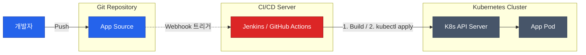
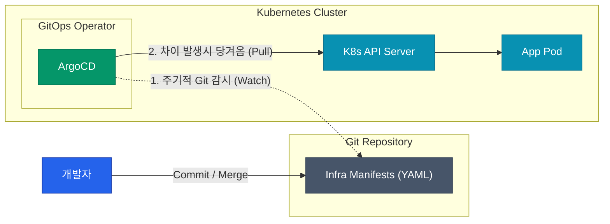

대부분의 제품 개발팀이 애플리케이션 코드는 엄격하게 Git으로 리뷰하며 관리하지만, 인프라나 쿠버네티스의 상태 설정값들은 수동으로 스크립트를 여러 번 돌리거나 콘솔을 통해 UI로 직접 수정하는 경우가 적지 않았습니다. 문제 없이 굴러간다면 상관없지만, 이러면 결국 장애가 발생했을 때 **누가 변경했는지, 어떤 설정이 언제 잘못되었는지 원천적으로 역추적할 수단이 완전히 사라집니다.**

이를 해결하기 위해 등장한 패러다임이 바로 **GitOps**입니다. 단순히 배포 자동화의 범주를 넘어, "인프라의 선언적 목표 상태(Desired State)와 현재 구동 중인 라이브 상태(Live State)를 Git이라는 유일한 진실의 원천(SSOT)에 완벽히 동기화시킨다"는 확고하고 결벽에 가까운 철학을 띱니다

## 기존 Push 방식의 치명적인 한계

보통 우리가 CI/CD를 맨 처음 배울 때 연동하는 Jenkins나 초창기 GitHub Actions처럼, 외부의 CI 도구가 파이프라인 연산 끝에 직접 인프라 환경(ex: Kubernetes)에 명령어나 토큰을 쏘아보내며 업데이트를 찔러넣는 방식을 의도적 밀어내기 방식, 즉 **Push 모델**이라고 부릅니다

이 고전적인 Push 방식은 파이프라인의 구성이 한 파일 안에 직관적이게 들어온다는 장점이 있지만, 치명적인 보안 및 동기화 구멍을 남겨버립니다

| 단점 구분 | 발생 양상 | 위험도 |
|-----------|-----------|--------|
| **SPOF 보안 위협** | 통신을 위해 외부에 노출된 대규모 CI 서버가 내부 프로덕션 인프라의 최고 권한(Admin Token)을 영구적으로 쥐고 있어야 열립니다. 해커가 외부 CI 서버를 털면 사내망 인프라 전체가 프리패스로 뚫립니다. | 🔴 매우 높음 |
| **운영 동기화 이탈 (Drift)** | 누군가 심야 장애 급조 처리를 위해 터미널에서 `kubectl edit`으로 직접 수치를 바꿀 경우, Git의 설정 코드와 라이브 상태가 영원히 어긋나버립니다. | 🟠 높음 |
| **롤백(Rollback) 파편화** | 이전 상태로 되돌리기 위해선 CI 파이프라인의 수많은 과거 트리거 기록을 뒤져서 수동 버튼으로 강제로 다시 밀어넣어야 하는 고역이 생깁니다. | 🟡 중간 |

## 새로운 패러다임, Pull 모델 기반의 GitOps

이러한 문제를 구조적으로 극복하기 위해 천재적으로 접근을 뒤집어 버린 개념이 **Pull 모델**입니다. 외부 보안망 바깥에서 찌르지 않고, 안전한 내부망 클러스터 속에 영리한 스파이 에이전트를 심어둔 뒤에 이 요원이 거꾸로 외부의 Git을 주기적으로 쳐다보게 관찰만 시키는 것입니다. 이 에이전트 역할을 대신해주는 컨트롤러가 바로 `ArgoCD`나 `FluxCD`입니다

이 체계에서는 보안 계정이나 내부망 진입 터널을 바깥에 던져줄 필요가 전혀 없습니다. 방화벽 안쪽의 오퍼레이터가 단순히 public/private Git의 읽기(Read) 전용 권한만 쥐고 주기적으로 문서를 감시하며 스크래핑해오기만 하면 해결되기 때문입니다!

## GitOps 핵심 원칙 4가지

GitOps 창시 커뮤니티가 정의한 네 가지 절대적인 대원칙은 실무에서 타협하지 않아야 하는 가이드라인으로 쓰입니다

| 철학 원칙 | 실무적 의미 |
|-----------|-------------|
| **선언형 기술 (Declarative)** | "이 순서대로 컨테이너를 띄우자" 식의 프로그래밍이 아니라, "팟은 무조건 3개가 실행중이어야 한다(YAML)" 라는 결과적 상태 규격만 명시해야 합니다. |
| **시스템 불변성 (Versioned)** | 코드가 곧 인프라이므로, Git 커밋 해시(Hash) 아이디 하나면 과거이든 언제든 한순간에 그 시점 인프라로 즉시 완전 롤백이 수학적으로 보장됩니다. |
| **자동 갱신 (Pulled)** | 변경사항 통보 패킷이 외부에서 뚫고 들어오지 않으며 내부 오퍼레이터에 의해 알아서 당겨와 집니다. |
| **지속적 조정 (Reconciled)** | 누군가 수동으로 값을 바꾸면 오퍼레이터가 이를 오작동(버그)으로 간주하고 즉시 Git 상태로 냉정하게 리셋시켜 버립니다. |

  
안전장치 없는 수동 핫픽스 개입의 원천 차단

  마지막 Reconciled 원칙인 **지속적 자가 치유** 때문에, 개발팀 누군가 당장의 장애 알람을 끄려고 `kubectl scale replicas=10` 이라고 임의 다이렉트 조작을 하더라도, ArgoCD가 "Git 명세서 리포지토리에는 3개로 되어있는데? 버그가 났군, 원상 복구한다!" 라며 **단 몇 초만에** 타노스처럼 리소스를 도로 깨부숴서 다시 원래 3개로 낮춰버립니다. 처음에 겪으면 상당히 화가 나고 불편할 수 있지만, 장기적으론 이 치명적인 철벽 덕분에 **모든 인프라 변경은 반드시 팀원들의 Git 리뷰(PR) 승인을 통과하게끔 강제**하는 탄탄한 조직 문화의 무서운 무기가 되어 줍니다

## 정리

| 구분 | Push 모델의 한계 | Pull (GitOps) 모델의 혁신 |
|------|------------------|---------------------------|
| **안보/보안 구조** | 공격받기 쉬운 외부 CI 서버가 클러스터 인증서를 보관 | 오퍼레이터가 내부망에서 작동해, 외부 침투 노출 반경 제로화 |
| **환경 감시 주체** | 외부 알람 파이프라인이 멈추면 상태 불일치(Drift) 감지 영영 불가 | K8s 내부에 탑재된 에이전트가 365일 실시간 차이 비교 및 복구 진행 |
| **주요 도구 예시** | Jenkins Pipeline의 빌드 끝단, Spinnaker | ArgoCD, FluxCD |

결과적으로 CI(지속적 통합/코드 빌드) 파이프라인은 기존 통제 전용 도구가 전담하게 분리 구성하고, 오직 CD(배포와 라이브 상태 동기화) 단을 쪼개내서 클러스터 내부 시스템으로 숨겨버리는 **CI / CD 물리 디커플링(Decoupling)** 방식이 현대 엔터프라이즈 아키텍처의 완전한 정답으로 자리잡았습니다 

그렇다면 다음 글에서는 이 패러다임을 실제로 우리 눈앞에 구현해 줄 실체이자 최강자 도구, **ArgoCD의 핵심 컴포넌트 아키텍처 구조**를 세밀하게 열어보겠습니다
