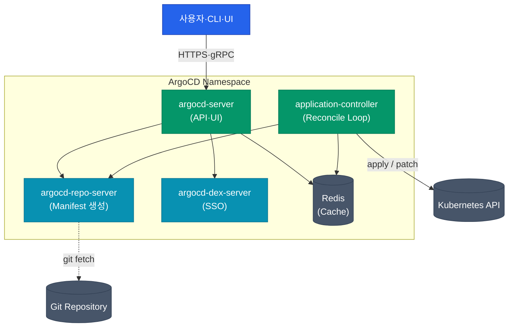
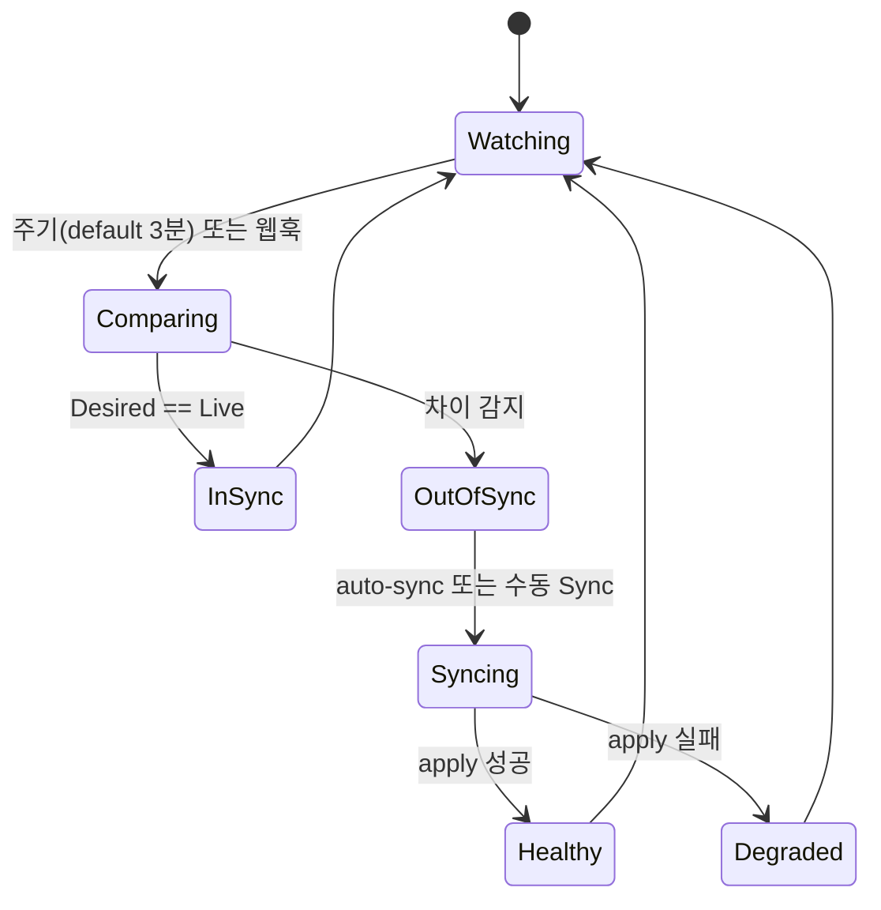
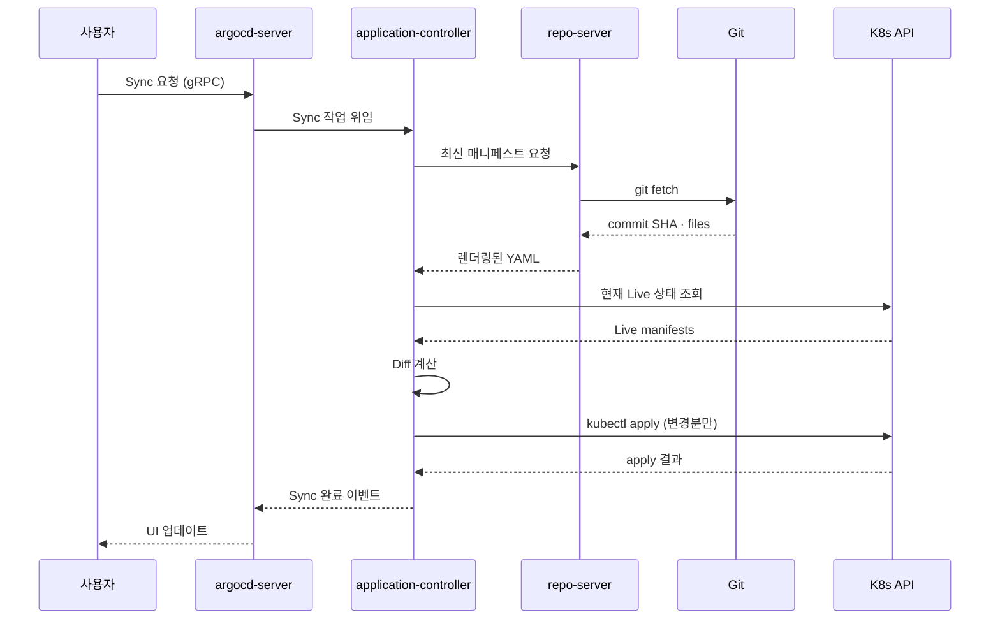

01편에서 GitOps의 Pull 모델을 살펴봤습니다. 이제 이 패러다임을 실제로 돌리는 엔진인 ArgoCD의 내부를 열어볼 차례입니다. 겉보기엔 단일 제품이지만 안에는 각자 다른 일을 맡은 **5개의 컴포넌트가 협업**합니다. 각 컴포넌트가 왜 분리됐는지, 어디에서 병목이 생기는지 이해해두면 장애 대응이나 스케일링 설계가 훨씬 쉬워집니다.

## 전체 그림

요청 흐름은 크게 두 갈래입니다. **사용자 흐름**은 `argocd-server`를 거쳐 UI·CLI를 처리하고, **조정 흐름**은 `application-controller`가 주기적으로 `repo-server`에서 매니페스트를 뽑아 클러스터 상태와 비교합니다. Redis는 양쪽이 공유하는 캐시 레이어입니다.

## 컴포넌트별 역할

| 컴포넌트 | 핵심 책임 | 주요 장애 증상 |
|---|---|---|
| **argocd-server** | REST·gRPC API, Web UI, 인증 프록시 | UI 접속 불가, CLI 타임아웃 |
| **argocd-repo-server** | Git clone, Helm·Kustomize 렌더링 | Sync 시 "manifest generation failed" |
| **application-controller** | Desired vs Live 비교, Sync 실행 | OutOfSync 상태가 해소되지 않음 |
| **argocd-dex-server** | OIDC·SAML·LDAP SSO 브로커 | SSO 로그인 실패 (로컬 로그인은 가능) |
| **redis** | 세션·매니페스트 캐시 | 전반적 응답 느려짐, 반복 git fetch |

### argocd-server

API 게이트웨이이자 UI 호스트입니다. 자체적으로 권한 검사(RBAC)를 수행하고, 뒤에 있는 controller·repo-server로 요청을 중계합니다. **stateless**해서 수평 확장이 자유로운 유일한 컴포넌트입니다. 트래픽이 많으면 Deployment의 `replicas`만 늘리면 됩니다.

### argocd-repo-server

Git 리포지토리를 clone해서 최종 매니페스트를 만드는 **빌더 역할**입니다. Helm chart 렌더링, Kustomize overlay 적용, plain YAML 추출까지 전부 여기서 처리합니다. 무거운 연산이 집중되므로 대규모 환경에서는 이 컴포넌트가 가장 먼저 병목이 됩니다.

  
왜 controller가 직접 git clone하지 않을까

  관심사 분리입니다. repo-server는 "소스를 렌더링된 YAML로 바꾸는" 순수 함수에 가까운 역할만 맡고, controller는 "비교와 조정"에 집중합니다. 덕분에 렌더링이 느린 Helm 차트가 있어도 reconcile 주기 자체는 영향을 덜 받고, repo-server만 독립적으로 스케일 아웃할 수 있습니다.

### application-controller

ArgoCD의 **심장**입니다. StatefulSet으로 배포되고, 각 Application 리소스를 감시하면서 다음 루프를 무한히 돌립니다.

컨트롤러가 클러스터 kube-apiserver에 실제로 변경을 가하는 **유일한 주체**라는 점이 중요합니다. server나 repo-server는 쓰기 권한이 없습니다.

### argocd-dex-server

기업 환경에서는 로컬 계정 대신 Google Workspace·Okta·Keycloak 같은 IdP를 붙이는 게 일반적인데, 그걸 중계하는 어댑터입니다. **SSO를 안 쓰면 꺼도 되는 유일한 컴포넌트**입니다.

### Redis

세션 토큰, git 매니페스트 캐시, 애플리케이션 상태 캐시를 담습니다. controller와 server가 직접 Kubernetes API를 반복 호출하지 않도록 완충하는 역할입니다. **HA 구성에서는 Redis도 Sentinel·Cluster 모드로 이중화**해야 합니다 — 여기가 단일 장애점이 되면 전체 UI·CLI가 먹통이 됩니다.

## 데이터 흐름으로 다시 보기

사용자가 UI에서 "Sync" 버튼을 눌렀을 때 내부에서 벌어지는 일을 시간 순으로 따라가 보겠습니다.

여기서 눈여겨볼 점은 `argocd-server`가 직접 변경을 가하지 않고 controller에 **위임만 한다**는 것입니다. 이 분리 덕분에 server가 재시작되어도 진행 중인 Sync는 controller에서 그대로 이어집니다.

## HA 구성 시 주의점

프로덕션에서는 기본 설치 매니페스트만으론 부족합니다. 각 컴포넌트마다 확장 전략이 달라서, 한 곳만 늘려도 병목이 다른 데로 옮겨갑니다.

| 컴포넌트 | 확장 방식 | 주의점 |
|---|---|---|
| argocd-server | Deployment replicas 증가 | stateless라 자유로움 |
| repo-server | Deployment replicas 증가 | 대형 Helm 차트가 있으면 메모리 여유 필요 |
| application-controller | **Sharding** (0.9+) | replicas만 늘리면 안 됨, `controller.sharding.replicas` 설정 |
| redis | HA 모드 (Sentinel) | 단일 노드면 SPOF |

  
Controller는 replicas로 늘리면 안 돼요

  application-controller는 기본적으로 모든 Application을 하나의 인스턴스가 담당합니다. Deployment 대신 StatefulSet으로 구성되는 이유도 여기에 있습니다. 0.9 버전부터 추가된 **샤딩(sharding)** 기능을 쓰면 Application을 해시 분할해서 여러 인스턴스가 나눠 담당할 수 있습니다. 그냥 replicas를 2로 올리면 두 인스턴스가 같은 Application을 중복으로 조정해서 레이스 컨디션이 발생합니다.

## 정리

ArgoCD의 컴포넌트 구성은 "누가 읽고, 누가 쓰고, 누가 결정하는가"를 철저히 분리한 설계입니다. 이 분리 덕분에 특정 컴포넌트가 느려지거나 죽어도 전체 기능이 한꺼번에 멈추지 않습니다.

- **argocd-server**: 외부 창구 (stateless)
- **repo-server**: 매니페스트 빌더 (scale-out 대상)
- **application-controller**: 조정 엔진 (sharding 필요)
- **dex-server**: SSO 선택 컴포넌트
- **redis**: 공유 캐시 (HA 필수)

다음 글에서는 이 아키텍처 위에서 실제 배포 단위인 **Application 리소스와 동기화 전략**을 다룹니다. manual·auto sync, self-heal, sync wave 같은 옵션들이 어떻게 맞물리는지 보여드릴게요.
